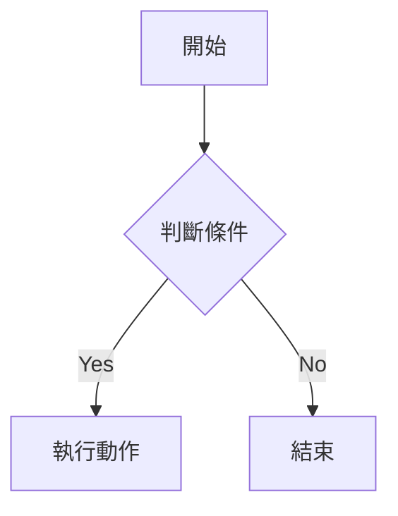

# 📓 Notebook

個人學習筆記，以 Markdown 格式記錄各種技術主題。

## 📁 目錄結構

```
notebook/
├── architecture/   # 架構圖筆記
├── flowchart/      # 流程圖筆記
├── commands/       # 常用指令筆記
└── README.md
```

## 📝 筆記格式

每個主題建立獨立的 `.md` 檔案，依學習的 component 分類。

### 架構圖（architecture/）
記錄系統架構設計，可使用 Mermaid 語法繪製。

### 流程圖（flowchart/）
記錄業務流程或技術流程，可使用 Mermaid 語法繪製。

### 常用指令（commands/）
記錄各工具、框架的常用指令與參數。

## 🔧 Mermaid 範例



## 🤖 Copilot CLI Agents

本 repo 備份了兩個自訂 Copilot CLI agents，存放於 `agents/` 目錄。

### Agents 列表

| Agent | 用途 |
|-------|------|
| `@coder` | 程式碼分析、架構設計、debug、開發 |
| `@note-taker` | 將學習內容整理為筆記並上傳到此 repo |

### 還原方式

若 superpowers plugin 更新後 agents 消失，執行以下指令還原：

```bash
AGENTS_DIR=~/.copilot/installed-plugins/superpowers-marketplace/superpowers/agents
cp agents/coder.md $AGENTS_DIR/
cp agents/note-taker.md $AGENTS_DIR/
```
