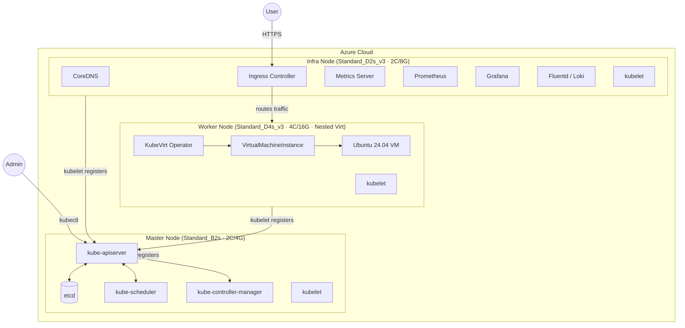
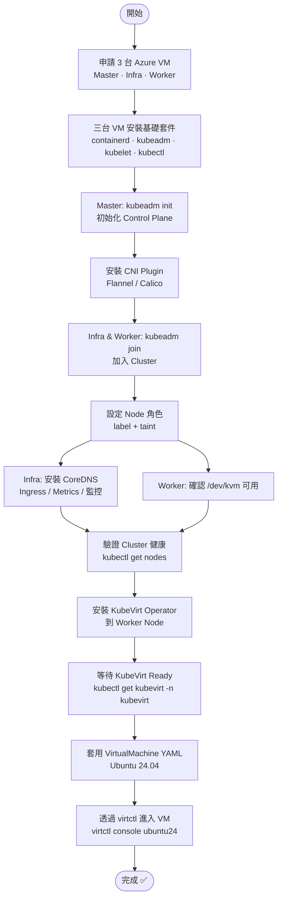

# K8s 三節點架構：Master / Infra / Worker + KubeVirt

> 建立日期：2026-04-10  
> 分類：architecture

## 概述

使用三台 x86 VM 在 Azure 上架設 Kubernetes Cluster，節點角色分為 Master（控制面）、Infra（基礎設施服務）、Worker（使用者 Workload），並在 Worker 上部署 KubeVirt 以產生 Ubuntu 24.04 VM。

---

## 架構圖



---

## 元件分配表

### Master Node — 只跑 Control Plane

| 元件 | 功能 | 備註 |
|------|------|------|
| `kube-apiserver` | Cluster 唯一 API 入口 | 所有操作必經 |
| `etcd` | 儲存全部 Cluster 狀態 | 磁碟 I/O 密集，需獨立 |
| `kube-scheduler` | 決定 Pod 排程到哪個 Node | 持續和 apiserver 通訊 |
| `kube-controller-manager` | 維護期望狀態（RS/Node/SA） | 控制面核心邏輯 |
| `kubelet` | 管理 Master 上的 Pod | 每個 Node 都需要 |

```bash
# 防止使用者 Pod 被排到 Master
kubectl taint nodes master node-role.kubernetes.io/master=:NoSchedule
```

### Infra Node — 跑 Cluster 基礎設施服務

| 元件 | 功能 | 備註 |
|------|------|------|
| `CoreDNS` | Cluster 內部 DNS | 所有 Pod 依賴 |
| `Ingress Controller` | 管理外部流量進入 | nginx / traefik |
| `Metrics Server` | 提供 HPA/VPA metrics | 輕量但關鍵 |
| `Prometheus` | Cluster 監控 | 資源消耗大，需獨立 |
| `Grafana` | 監控視覺化儀表板 | 搭配 Prometheus |
| `Fluentd / Loki` | Log 收集與彙整 | I/O 密集型 |

```bash
# 標記 Infra 角色
kubectl label nodes infra node-role.kubernetes.io/infra=
kubectl taint nodes infra node-role.kubernetes.io/infra=:NoSchedule
```

### Worker Node — 跑使用者 Workload + KubeVirt

| 元件 | 功能 | 備註 |
|------|------|------|
| `KubeVirt Operator` | 管理 VM 生命週期 | 需 /dev/kvm |
| `VirtualMachineInstance` | K8s 原生 VM 物件 | KubeVirt CRD |
| `Ubuntu 24.04 VM` | 目標 VM | 透過 KubeVirt 建立 |

> ⚠️ Worker 必須選支援 **Nested Virtualization** 的 Azure VM（Dv3/Dv4/Dv5 系列）

---

## 架設流程圖



---

## 關鍵指令速查

### 初始化 Cluster

```bash
# Master: 初始化
kubeadm init \
  --pod-network-cidr=10.244.0.0/16 \
  --apiserver-advertise-address=<MASTER_IP>

# 設定 kubectl
mkdir -p $HOME/.kube
cp /etc/kubernetes/admin.conf $HOME/.kube/config

# 安裝 Flannel CNI
kubectl apply -f https://github.com/flannel-io/flannel/releases/latest/download/kube-flannel.yml

# Infra & Worker: 加入 Cluster
kubeadm join <MASTER_IP>:6443 --token <TOKEN> \
  --discovery-token-ca-cert-hash sha256:<HASH>
```

### 設定 Node 角色

```bash
# Infra node
kubectl label nodes infra node-role.kubernetes.io/infra=
kubectl taint nodes infra node-role.kubernetes.io/infra=:NoSchedule

# Master taint（通常 kubeadm init 已自動加）
kubectl taint nodes master node-role.kubernetes.io/master=:NoSchedule
```

### 安裝 KubeVirt

```bash
export VERSION=$(curl -s https://api.github.com/repos/kubevirt/kubevirt/releases/latest \
  | grep tag_name | cut -d '"' -f4)

kubectl apply -f https://github.com/kubevirt/kubevirt/releases/download/${VERSION}/kubevirt-operator.yaml
kubectl apply -f https://github.com/kubevirt/kubevirt/releases/download/${VERSION}/kubevirt-cr.yaml

# 等待就緒
kubectl wait --for=condition=Available kubevirt/kubevirt -n kubevirt --timeout=5m
```

### 建立 Ubuntu 24.04 VM

```yaml
apiVersion: kubevirt.io/v1
kind: VirtualMachine
metadata:
  name: ubuntu24
spec:
  running: true
  template:
    spec:
      domain:
        cpu:
          cores: 2
        memory:
          guest: 4Gi
        devices:
          disks:
          - name: containerdisk
            disk:
              bus: virtio
          - name: cloudinitdisk
            disk:
              bus: virtio
      volumes:
      - name: containerdisk
        containerDisk:
          image: quay.io/containerdisks/ubuntu:24.04
      - name: cloudinitdisk
        cloudInitNoCloud:
          userData: |
            #cloud-config
            password: ubuntu
            chpasswd: { expire: False }
            ssh_pwauth: True
```

```bash
# 套用並連線
kubectl apply -f ubuntu24-vm.yaml
virtctl console ubuntu24
```

---

## 節點資源規劃

| 節點 | Azure Size | vCPU | RAM | 特殊需求 | 月費(約) |
|------|-----------|------|-----|----------|---------|
| Master | Standard_B2s | 2 | 4GB | — | ~$30 USD |
| Infra | Standard_D2s_v3 | 2 | 8GB | — | ~$70 USD |
| Worker | Standard_D4s_v3 | 4 | 16GB | Nested Virtualization | ~$140 USD |

---

## 參考資料

- [Kubernetes 官方文件](https://kubernetes.io/docs/)
- [KubeVirt 官方文件](https://kubevirt.io/user-guide/)
- [Azure VM Sizes](https://learn.microsoft.com/en-us/azure/virtual-machines/sizes)
- [Flannel CNI](https://github.com/flannel-io/flannel)
