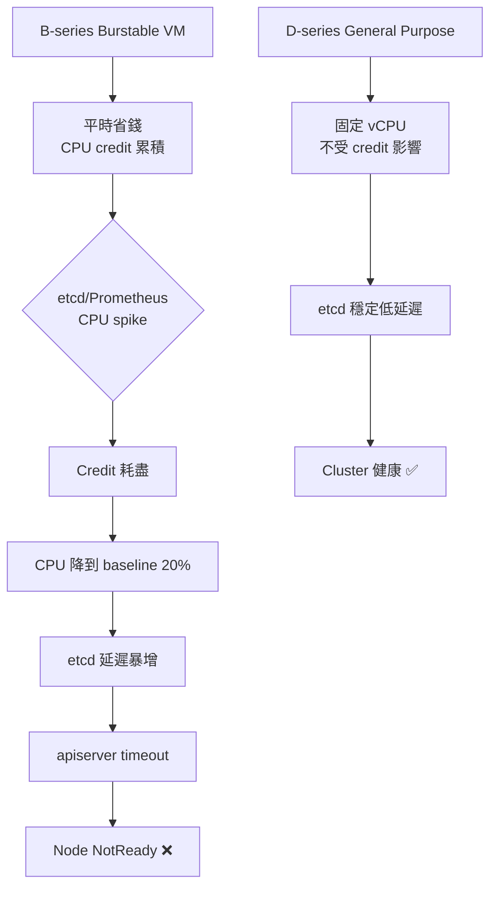

# K8s 三節點 Azure VM 規格建議

> 建立日期：2026-04-10  
> 分類：architecture

## 概述

針對 Master / Infra / Worker 三節點架構，分析各節點的 CPU 資源需求，並給出 Azure VM 規格建議。

---

## CPU 需求分析

### Master Node — Control Plane

| 元件 | CPU 消耗 | 說明 |
|------|---------|------|
| `kube-apiserver` | 0.1–0.5 vCPU（burst 可到 1+） | TLS 加解密 + JSON 序列化是主要消耗 |
| `etcd` | 0.1–0.3 vCPU | I/O 密集為主，但 Raft consensus 需要穩定 CPU（**不適合 Burstable**） |
| `kube-scheduler` | <0.05 vCPU | 事件驅動，大多時間空閒 |
| `kube-controller-manager` | 0.05–0.2 vCPU | 多個 controller loop，中等負載 |
| **合計** | **~0.5–1.5 vCPU（平均）** | Burst 可到 2 vCPU |

> ⚠️ etcd 對延遲敏感，**不建議用 B-series Burstable**（CPU credit 耗盡時效能劣化）

### Infra Node — 基礎設施服務

| 元件 | CPU 消耗 | 說明 |
|------|---------|------|
| `CoreDNS` | <0.05 vCPU | 極輕量 |
| `Ingress Controller` | 0.1–0.5 vCPU | 隨 HTTP RPS 線性增長 |
| `Metrics Server` | <0.05 vCPU | 輕量 |
| `Prometheus` | **0.5–1.5 vCPU** | 每 15s scrape 全 cluster，查詢時 CPU spike |
| `Grafana` | 0.1–0.3 vCPU | 查詢時才消耗 |
| `Fluentd / Loki` | 0.2–0.5 vCPU | Log 量越大越高 |
| **合計** | **~1–3 vCPU（平均）** | Prometheus 是大戶 |

### Worker Node — KubeVirt + Ubuntu VM

| 層級 | CPU 需求 | 說明 |
|------|---------|------|
| K8s overhead (kubelet + KubeVirt operator) | ~0.5 vCPU | 固定消耗 |
| **Ubuntu 24.04 VM（Guest）** | **2 vCPU** | VM 配置的 vCPU 直接佔用 Host CPU |
| KVM hypervisor overhead | ~5–10% | Nested virt 額外損耗 |
| 緩衝空間 | ≥1 vCPU | 避免 CPU steal |
| **合計** | **≥4 vCPU** | 最少 4，建議 6–8 |

---

## Azure VM 規格建議

### Lab / Dev 環境（省錢優先）

| 節點 | 推薦 VM | vCPU | RAM | 月費(約) | 說明 |
|------|---------|------|-----|---------|------|
| Master | **Standard_D2s_v5** | 2 | 8GB | ~$70 USD | 穩定 CPU，etcd 不怕 credit 耗盡 |
| Infra | **Standard_D2s_v5** | 2 | 8GB | ~$70 USD | Prometheus 偶爾 spike 仍可應付 |
| Worker | **Standard_D4s_v5** | 4 | 16GB | ~$140 USD | 支援 Nested Virt，4C 剛好夠 Ubuntu VM |
| **合計** | | **8 vCPU** | **32GB** | **~$280/月** | |

### Production / 穩定環境（效能優先）

| 節點 | 推薦 VM | vCPU | RAM | 月費(約) | 說明 |
|------|---------|------|-----|---------|------|
| Master | **Standard_D4s_v5** | 4 | 16GB | ~$140 USD | etcd + apiserver 高負載下有餘裕 |
| Infra | **Standard_D4s_v5** | 4 | 16GB | ~$140 USD | Prometheus + Loki 同時重載不擠壓 |
| Worker | **Standard_D8s_v5** | 8 | 32GB | ~$280 USD | 可跑多個 KubeVirt VM |
| **合計** | | **16 vCPU** | **64GB** | **~$560/月** | |

---

## 為什麼選 D-series 而非 B-series（Burstable）？



**結論**：
- `etcd` 需要 consistent low-latency CPU → D-series
- `Dv5` 是第五代，性價比最佳（比 Dv3 快 ~30%，同價位）
- Worker **必須** 選 Dv3/Dv4/Dv5（才支援 Nested Virtualization）

---

## 快速選型指南

```
目標：Lab 測試 + 1 個 KubeVirt VM
→ Master:  Standard_D2s_v5  (2C/8G,  ~$70/月)
→ Infra:   Standard_D2s_v5  (2C/8G,  ~$70/月)
→ Worker:  Standard_D4s_v5  (4C/16G, ~$140/月)
→ 總計: ~$280/月

目標：Production + 多個 KubeVirt VM
→ Master:  Standard_D4s_v5  (4C/16G,  ~$140/月)
→ Infra:   Standard_D4s_v5  (4C/16G,  ~$140/月)
→ Worker:  Standard_D8s_v5  (8C/32G,  ~$280/月)
→ 總計: ~$560/月
```

---

## 參考資料

- [Azure VM Sizes - General Purpose](https://learn.microsoft.com/en-us/azure/virtual-machines/dv5-dsv5-series)
- [Azure VM Sizes - Burstable B-series](https://learn.microsoft.com/en-us/azure/virtual-machines/bv2-series)
- [etcd Hardware Recommendations](https://etcd.io/docs/v3.5/op-guide/hardware/)
- [KubeVirt Resource Requirements](https://kubevirt.io/user-guide/operations/installation/)
