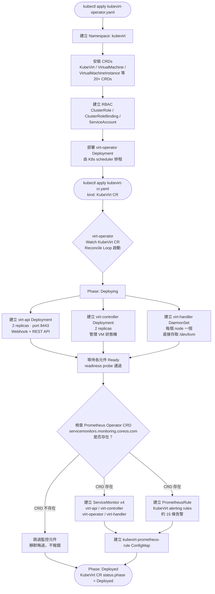

# KubeVirt v1.5.0 — virt-operator 安裝流程與元件建立機制

> 建立日期：2026-04-15  
> 分類：concepts/kubevirt  
> 版本：KubeVirt v1.5.0

---

## 概述

KubeVirt 採用 Operator Pattern 安裝。安裝分兩步：先 apply operator（含 CRD），再 apply KubeVirt CR。virt-operator 監聽 KubeVirt CR 後，自動建立 virt-api、virt-controller、virt-handler，並視叢集是否有 Prometheus Operator 來決定是否建立 ServiceMonitor 與 PrometheusRule。

---

## 安裝順序

```bash
# Step 1：安裝 operator（含 CRD、RBAC、virt-operator Deployment）
kubectl apply -f https://github.com/kubevirt/kubevirt/releases/download/v1.5.0/kubevirt-operator.yaml

# Step 2：等 virt-operator Running 後，apply KubeVirt CR
kubectl wait -n kubevirt deployment/virt-operator --for=condition=Available --timeout=2m
kubectl apply -f https://github.com/kubevirt/kubevirt/releases/download/v1.5.0/kubevirt-cr.yaml

# Step 3：等待完全部署完成
kubectl wait kv kubevirt -n kubevirt --for=condition=Available --timeout=10m
```

> ⚠️ 不能反過來。`kind: KubeVirt` CR 依賴 kubevirt-operator.yaml 裡安裝的 CRD，若先 apply CR 會報錯：`no kind "KubeVirt" is registered`

---

## virt-operator 元件建立流程圖



---

## 元件建立順序說明

### Stage 1：kubevirt-operator.yaml 包含

| 資源 | 說明 |
|------|------|
| Namespace `kubevirt` | 所有 KubeVirt 元件的命名空間 |
| 20+ CRDs | VirtualMachine、VirtualMachineInstance、KubeVirt、DataVolume 等 |
| ClusterRole / ClusterRoleBinding | virt-operator 的 RBAC 權限 |
| ServiceAccount | virt-operator 身份 |
| Deployment `virt-operator` | Operator 本體，啟動後開始監聽 KubeVirt CR |

### Stage 2：apply KubeVirt CR 後，virt-operator reconcile 建立

| 元件 | 類型 | replicas | 功能 |
|------|------|----------|------|
| `virt-api` | Deployment | 2 | 處理 VM/VMI REST API 請求、Webhook |
| `virt-controller` | Deployment | 2 | 管理 VM 生命週期狀態機 |
| `virt-handler` | DaemonSet | 每 node 1 | Node-level KVM agent，直接存取 /dev/kvm |
| `virt-exportproxy` | Deployment | 1 | VM disk export 功能（v1.x 新增）|
| `ServiceMonitor` × 4 | 監控資源 | — | 條件建立（見下節）|
| `PrometheusRule` | 監控資源 | — | 條件建立（見下節）|

---

## ServiceMonitor & PrometheusRule 條件建立機制

### 判斷邏輯

virt-operator 在 reconcile loop 中，呼叫 `IsPrometheusDeployed()` 函式：

```go
// pkg/virt-operator/resource/generate/components/prometheus.go
func IsPrometheusDeployed(clientset kubecli.KubevirtClient) (bool, error) {
    _, err := clientset.ExtensionsClient().
        ApiextensionsV1().CustomResourceDefinitions().
        Get(context.Background(),
            "servicemonitors.monitoring.coreos.com",
            metav1.GetOptions{})
    if errors.IsNotFound(err) {
        return false, nil   // Prometheus Operator 未安裝 → 跳過
    }
    return err == nil, err  // CRD 存在 → 建立監控資源
}
```

| 情境 | CRD 是否存在 | 行為 |
|------|-------------|------|
| 有安裝 `kube-prometheus-stack` | ✅ | 自動建立 ServiceMonitor + PrometheusRule |
| 有安裝 Prometheus Operator（獨立）| ✅ | 自動建立 |
| 只有原生 Prometheus（無 Operator）| ❌ | 靜默跳過，不報錯 |
| 完全沒有 Prometheus | ❌ | 靜默跳過，不報錯 |

> **對本次建置的意義**：Phase 4a 先安裝 kube-prometheus-stack → Phase 5 安裝 KubeVirt 時，ServiceMonitor 會**自動建立**，不需要手動 apply。

---

## Template 來源：內嵌在 Go Source Code

KubeVirt operator **不讀外部檔案**，所有資源 spec 都硬編碼在 source code 裡：

```
kubevirt/
└── pkg/virt-operator/resource/generate/components/
    ├── prometheus.go       ← ServiceMonitor + PrometheusRule template
    ├── deployments.go      ← virt-api + virt-controller Deployment template
    ├── daemonsets.go       ← virt-handler DaemonSet template
    ├── rbac.go             ← ClusterRole / ClusterRoleBinding template
    └── crds.go             ← 所有 KubeVirt CRD template
```

### PrometheusRule 包含的告警規則（部分）

| Alert Name | 說明 |
|------------|------|
| `KubevirtVMIExcessiveMigrationsDetected` | VM 遷移次數過多 |
| `KubevirtNoAvailableNodesToRunVMs` | 無可用節點運行 VM |
| `KubevirtVMStuck` | VM 卡在非預期狀態 |
| `KubevirtVmiRunningOutsideGuestInfrastructure` | VMI 在非預期節點運行 |
| `KubevirtOrphanedVirtualMachineInstances` | 孤兒 VMI（無對應 VM 資源）|
| `KubevirtVMHighMemoryUsage` | VM 記憶體使用率過高 |

### prometheus.go 簡化範例

```go
func NewPrometheusRule(namespace string) *promv1.PrometheusRule {
    return &promv1.PrometheusRule{
        ObjectMeta: metav1.ObjectMeta{
            Name:      "kubevirt-prometheus-rule",
            Namespace: namespace,
            Labels:    map[string]string{"prometheus.kubevirt.io": ""},
        },
        Spec: promv1.PrometheusRuleSpec{
            Groups: []promv1.RuleGroup{
                {
                    Name: "kubevirt.rules",
                    Rules: []promv1.Rule{
                        {
                            Alert: "KubevirtNoAvailableNodesToRunVMs",
                            Expr:  intstr.FromString(
                                `sum(kube_node_status_allocatable{resource="devices_kubevirt_io_kvm"}) == 0`,
                            ),
                            For:    &metav1.Duration{Duration: 5 * time.Minute},
                            Labels: map[string]string{"severity": "warning"},
                        },
                    },
                },
            },
        },
    }
}
```

---

## 重點整理

- **安裝順序**：`operator.yaml` → 等 virt-operator Running → `cr.yaml`
- **元件建立**：virt-operator watch KubeVirt CR → Reconcile → 依序建立 virt-api / virt-controller / virt-handler
- **監控資源**：條件建立，檢查 `servicemonitors.monitoring.coreos.com` CRD 是否存在
- **Template 來源**：Go source code 硬編碼在 `pkg/virt-operator/resource/generate/components/`，不讀外部 YAML

---

## 手動補建 ServiceMonitor & PrometheusRule

> 適用情境：  
> 1. 安裝 KubeVirt 時 Prometheus Operator 尚未就緒，導致自動建立被跳過  
> 2. 想要**客製化** labels、selector、alerting rules 而不使用 virt-operator 內建版本

### 前置確認：確認監控資源是否已存在

```bash
kubectl get servicemonitor -n monitoring | grep kubevirt
kubectl get prometheusrule -n monitoring | grep kubevirt
# 若無任何輸出 → 需要手動補建
```

---

### 方法一：刪除 Strategy ConfigMap + 重啟 virt-operator（讓 Operator 自動補建）

**適用**：Prometheus Operator 已安裝、`monitoring` namespace 有 `prometheus-k8s` ServiceAccount、只需要預設版本的監控資源。

```bash
# 1. 刪除舊的 install strategy（讓 virt-operator 重新評估叢集環境）
kubectl delete cm -n kubevirt -l kubevirt.io/install-strategy

# 2. 重啟 virt-operator（重設 OperatorConfig.ServiceMonitorEnabled flag）
kubectl rollout restart deployment/virt-operator -n kubevirt
kubectl rollout status deployment/virt-operator -n kubevirt

# 3. 確認監控資源已建立
kubectl get servicemonitor,prometheusrule -n monitoring
```

**原理**：  
- virt-operator 啟動時做 Layer 1（API Discovery）  
- Strategy ConfigMap 被刪除 → virt-operator 重跑 Layer 2（SA 存在判斷）  
- 兩層都通過 → 自動建立 ServiceMonitor + PrometheusRule

---

### 方法二：手動 apply ServiceMonitor YAML（可客製化 labels）

**適用**：想自訂 labels 讓特定 Prometheus instance 抓取，或整合到自己的 monitoring stack。

```yaml
# kubevirt-service-monitor.yaml
apiVersion: monitoring.coreos.com/v1
kind: ServiceMonitor
metadata:
  name: kubevirt-service-monitor
  namespace: monitoring                  # ← 視實際 serviceMonitorNamespace 調整
  labels:
    prometheus.kubevirt.io: "true"
    k8s-app: kubevirt
    # ▼ 客製化：加入自己的 label 讓特定 Prometheus selector 匹配
    # release: kube-prometheus-stack     # 例如 kube-prometheus-stack 預設用這個 label
spec:
  selector:
    matchLabels:
      prometheus.kubevirt.io: "true"     # 選出 kubevirt namespace 內的所有 metrics Service
  namespaceSelector:
    matchNames:
      - kubevirt
  endpoints:
    - port: metrics
      scheme: https
      tlsConfig:
        insecureSkipVerify: true
      honorLabels: true
      # ▼ 客製化：調整 scrape interval
      # interval: 30s
      # scrapeTimeout: 10s
```

```bash
kubectl apply -f kubevirt-service-monitor.yaml
kubectl get servicemonitor -n monitoring kubevirt-service-monitor
```

> **客製化重點**：若使用 `kube-prometheus-stack`，Prometheus 預設只抓 `release: <helm-release-name>` 的 ServiceMonitor。需在 `metadata.labels` 加入對應 label，或修改 Prometheus CR 的 `serviceMonitorSelector`。

---

### 方法三：手動 apply PrometheusRule YAML（可客製化告警規則）

**適用**：想修改 threshold、severity、annotations，或加入業務告警（例如特定 VM 長時間離線）。

```yaml
# kubevirt-prometheus-rule.yaml
apiVersion: monitoring.coreos.com/v1
kind: PrometheusRule
metadata:
  name: kubevirt-prometheus-rule
  namespace: monitoring
  labels:
    prometheus.kubevirt.io: "true"
    k8s-app: kubevirt
    # ▼ 客製化：同 ServiceMonitor，需匹配 Prometheus CR 的 ruleSelector
    # release: kube-prometheus-stack
spec:
  groups:
    - name: kubevirt.rules
      rules:
        # ── 官方規則（保留、可調整 threshold）──
        - alert: KubevirtNoAvailableNodesToRunVMs
          expr: |
            sum(kube_node_status_allocatable{resource="devices_kubevirt_io_kvm"}) == 0
          for: 5m
          labels:
            severity: warning
          annotations:
            summary: "沒有可用節點運行 VM"
            description: "叢集中無任何節點有可用的 KVM 資源"

        - alert: KubevirtVMStuck
          expr: |
            kubevirt_vm_error_status_last_transition_timestamp_seconds > 0
          for: 10m
          labels:
            severity: critical
          annotations:
            summary: "VM 卡在 Error 狀態超過 10 分鐘"
            description: "VM {{ $labels.name }} 在 namespace {{ $labels.namespace }} 處於錯誤狀態"

        - alert: KubevirtVMIExcessiveMigrations
          expr: |
            kubevirt_migrate_vmi_migration_count > 12
          for: 1h
          labels:
            severity: warning
          annotations:
            summary: "VMI 在 1 小時內遷移次數過多"

        # ── 客製化規則（範例）──
        - alert: KubevirtVMNotRunning
          expr: |
            kubevirt_vm_running_status_last_transition_timestamp_seconds == 0
          for: 15m
          labels:
            severity: warning
            team: platform
          annotations:
            summary: "VM {{ $labels.name }} 長時間未在 Running 狀態"
```

```bash
kubectl apply -f kubevirt-prometheus-rule.yaml
kubectl get prometheusrule -n monitoring kubevirt-prometheus-rule
```

> **取得完整官方規則清單**（再自行修改）：  
> ```bash
> # 從 GitHub 取得 v1.5.0 所有告警規則
> curl -sL https://raw.githubusercontent.com/kubevirt/kubevirt/v1.5.0/pkg/monitoring/rules/alerts/vms.go
> ```

---

### 三種方法比較

| 方法 | 適用情境 | 難度 | 結果 |
|------|---------|------|------|
| **方法一**：刪 CM + 重啟 virt-operator | 只要用預設版本、Prometheus 已補裝 | ⭐ 最簡單 | 與 virt-operator 內建完全一致 |
| **方法二**：手動 apply ServiceMonitor | 需要自訂 labels/selector | ⭐⭐ | 可客製化抓取設定 |
| **方法三**：手動 apply PrometheusRule | 需要自訂告警 threshold/rules | ⭐⭐ | 可客製化告警邏輯 |

> ⚠️ **注意**：若之後升級 KubeVirt 版本（`virt-operator` 更新），手動 apply 的資源不會被自動更新，需要手動重新 apply 新版 YAML。方法一的資源由 virt-operator 管理，升級時會自動同步。

---

## 參考資料

- [KubeVirt v1.5.0 Release](https://github.com/kubevirt/kubevirt/releases/tag/v1.5.0)
- [virt-operator source: components/](https://github.com/kubevirt/kubevirt/tree/v1.5.0/pkg/virt-operator/resource/generate/components)
- [prometheus.go](https://github.com/kubevirt/kubevirt/blob/v1.5.0/pkg/virt-operator/resource/generate/components/prometheus.go)
- [KubeVirt Monitoring Docs](https://kubevirt.io/user-guide/monitoring/)
