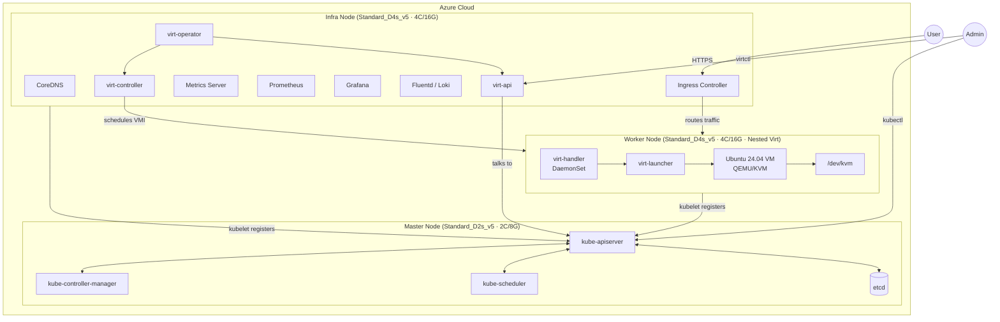

# Option A Docs Realignment Implementation Plan

> **For agentic workers:** REQUIRED SUB-SKILL: Use superpowers:subagent-driven-development (recommended) or superpowers:executing-plans to implement this plan task-by-task. Steps use checkbox (`- [ ]`) syntax for tracking.

**Goal:** Realign the `kubernetes/3node-kubevirt/` documentation set so Option A becomes the default deployment model everywhere, while `architecture.md` still preserves Option B as a reference section.

**Architecture:** Treat the documentation folder as one cohesive system with a single canonical deployment model. Update `architecture.md` first to define the new source of truth, then rewrite `commands.md`, `flowchart.md`, and `buildup.md` so node roles, KubeVirt placement, sizing, and operational steps all match that Option A baseline.

**Tech Stack:** Markdown, Mermaid, Jekyll/Just the Docs, Git, grep

---

## File Structure

- Modify: `kubernetes/3node-kubevirt/architecture.md`
  - Make Option A the primary architecture narrative.
  - Keep Option B as an explicit reference-only section.
- Modify: `kubernetes/3node-kubevirt/commands.md`
  - Make all node-role, label, taint, and KubeVirt placement commands match Option A.
- Modify: `kubernetes/3node-kubevirt/flowchart.md`
  - Make the flow diagram and step table describe Option A.
- Modify: `kubernetes/3node-kubevirt/buildup.md`
  - Update environment summary, step descriptions, and placement guidance to Option A.

### Task 1: Switch `architecture.md` to Option A as the source of truth

**Files:**
- Modify: `kubernetes/3node-kubevirt/architecture.md`

- [ ] **Step 1: Rewrite the title and architecture decision summary**

Replace the top summary so the document leads with Option A instead of Option B.

```md
# K8s 三節點架構：Master / Infra / Worker + KubeVirt（Option A）

> 分類：architecture  
> 架構決策：目前主方案採用 Option A — Master 只承載 K8s Control Plane，Infra 承載基礎設施服務與 KubeVirt 管理面
```

- [ ] **Step 2: Rewrite the overview paragraph**

Replace the existing overview paragraph with this Option A summary.

```md
使用三台 x86 VM 在 Azure 上架設 Kubernetes Cluster。本文目前主採用 **Option A** 架構：Master 只承載 K8s 控制面，Infra 同時承載基礎設施服務與 KubeVirt 管理面，Worker 專責執行 virt-handler、virt-launcher 與 VM workload。
```

- [ ] **Step 3: Replace the primary Mermaid architecture graph**

Update the main graph so:

1. Master only contains Kubernetes control plane components.
2. Infra contains CoreDNS, Ingress, Metrics, Prometheus, Grafana, Fluentd/Loki, `virt-operator`, `virt-api`, `virt-controller`.
3. Worker contains `virt-handler`, `virt-launcher`, Ubuntu VM, `/dev/kvm`.

Use this structure:

````md

````

- [ ] **Step 4: Rewrite the component allocation tables**

Update the tables so:

```md
### Master Node — 只跑 Control Plane
```

and

```md
### Infra Node — Cluster 基礎設施服務 + KubeVirt 管理面
```

The Infra table must include these KubeVirt rows:

```md
| KubeVirt | `virt-operator` | 管理 KubeVirt 自身生命週期 | <0.05 vCPU（平時極輕量） |
| KubeVirt | `virt-api` | 處理 VM/VMI API 請求 | 0.1–0.3 vCPU |
| KubeVirt | `virt-controller` | 管理 VM 狀態機 | 0.1–0.3 vCPU |
```

- [ ] **Step 5: Rewrite the sizing section and decision table**

Make the sizing section title:

```md
## Azure VM 規格建議（Option A）
```

Use these core sizing assumptions:

```md
| Master | **Standard_D2s_v5** | 2 | 8GB |
| Infra | **Standard_D4s_v5** | 4 | 16GB |
| Worker | **Standard_D4s_v5** | 4 | 16GB |
```

Update the decision table heading to:

```md
## 架構決策說明（Option A vs B）
```

and present Option A as the adopted choice.

- [ ] **Step 6: Keep and relabel the Option B section as reference-only**

Rename the existing Option A/Option B retrospective section so it becomes a reference appendix for Option B, for example:

```md
## Option B（保留參考）

> 備註：此方案保留作為 Lab / 對照參考；目前主方案為 **Option A**。
```

- [ ] **Step 7: Verify the architecture document**

Run:

```bash
cd /Users/mansionlai/Documents/code/notebook-sync
grep -n 'Option A\|Option B\|主方案\|保留參考' kubernetes/3node-kubevirt/architecture.md
```

Expected:

- Title and overview lead with Option A.
- A dedicated Option B reference section still exists.

- [ ] **Step 8: Commit the architecture rewrite**

```bash
cd /Users/mansionlai/Documents/code/notebook-sync
git add kubernetes/3node-kubevirt/architecture.md
git commit -m $'docs: switch kubevirt architecture default to option A\n\nCo-authored-by: Copilot <223556219+Copilot@users.noreply.github.com>'
```

### Task 2: Rewrite `commands.md` for Option A node placement

**Files:**
- Modify: `kubernetes/3node-kubevirt/commands.md`

- [ ] **Step 1: Rename the node-role section to Option A**

Change:

```md
## 設定 Node 角色（Option B）
```

to:

```md
## 設定 Node 角色（Option A）
```

- [ ] **Step 2: Replace the label and taint commands**

Use commands that keep Master as control-plane only, place KubeVirt management on Infra, and keep workloads on Worker.

```bash
# Master: 維持 control-plane taint，不讓一般 workload 與 KubeVirt 管理面排入

# Infra: 跑基礎設施 Pod 與 KubeVirt 管理面
kubectl label nodes infra node-role.kubernetes.io/infra=
kubectl label nodes infra kubevirt-management=true
kubectl taint nodes infra node-role.kubernetes.io/infra=:NoSchedule

# Worker: 跑 virt-handler + VM workload
kubectl label nodes worker node-role.kubernetes.io/worker=
kubectl label nodes worker kubevirt-workload=true
```

- [ ] **Step 3: Replace the KubeVirt CR example**

Change the CR example so `infra.nodePlacement.nodeSelector` points to Infra instead of Master.

```yaml
spec:
  infra:
    nodePlacement:
      nodeSelector:
        kubevirt-management: "true"
      tolerations:
      - key: node-role.kubernetes.io/infra
        operator: Exists
        effect: NoSchedule
  workloads:
    nodePlacement:
      nodeSelector:
        kubevirt-workload: "true"
```

- [ ] **Step 4: Rewrite the verification commands**

Use wording and commands that confirm:

```bash
# 確認管理面元件在 Infra
kubectl get pods -n kubevirt -o wide | grep -E 'virt-operator|virt-api|virt-controller'

# 確認 virt-handler 在 Worker
kubectl get pods -n kubevirt -o wide | grep virt-handler
```

The surrounding text must say that `virt-operator` / `virt-api` / `virt-controller` are expected on Infra.

- [ ] **Step 5: Verify the commands document**

Run:

```bash
cd /Users/mansionlai/Documents/code/notebook-sync
grep -n 'Option A\|Option B\|kubevirt-management\|control-plane\|virt-controller' kubernetes/3node-kubevirt/commands.md
```

Expected:

- The section title says Option A.
- No instructions tell the reader to remove the control-plane taint for KubeVirt management.
- KubeVirt management references point to Infra.

- [ ] **Step 6: Commit the commands rewrite**

```bash
cd /Users/mansionlai/Documents/code/notebook-sync
git add kubernetes/3node-kubevirt/commands.md
git commit -m $'docs: move kubevirt management commands to option A\n\nCo-authored-by: Copilot <223556219+Copilot@users.noreply.github.com>'
```

### Task 3: Rewrite `flowchart.md` for Option A

**Files:**
- Modify: `kubernetes/3node-kubevirt/flowchart.md`

- [ ] **Step 1: Update the architecture decision summary**

Replace the summary line with:

```md
> 架構決策：Option A — Master 僅承載 K8s Control Plane，Infra 部署基礎設施服務與 KubeVirt 管理面
```

- [ ] **Step 2: Rewrite the Mermaid flowchart**

Adjust the flow so:

1. The VM sizing line reflects Option A (`Master D2s_v5 · Infra D4s_v5 · Worker D4s_v5`).
2. KubeVirt management is installed on Infra.
3. Worker remains the VM runtime node.

Key lines that should appear:

```md
J["安裝 KubeVirt Operator\n(管理面排到 Infra)\nvirt-operator · virt-api · virt-controller"]
```

and

```md
L[套用 NodeSelector\n確認 virt-handler 在 Worker、管理面在 Infra]
```

- [ ] **Step 3: Rewrite the step table**

Change the table header from:

```md
| 步驟 | 動作 | 執行節點 | Option B 備註 |
```

to:

```md
| 步驟 | 動作 | 執行節點 | Option A 備註 |
```

Then update the step notes so:

- Master sizing is no longer described as carrying KubeVirt management.
- Infra sizing is described as carrying infrastructure services plus KubeVirt management.
- KubeVirt install step says management components go to Infra.

- [ ] **Step 4: Verify the flowchart document**

Run:

```bash
cd /Users/mansionlai/Documents/code/notebook-sync
grep -n 'Option A\|Option B\|Infra\|KubeVirt 管理面' kubernetes/3node-kubevirt/flowchart.md
```

Expected:

- The file leads with Option A.
- KubeVirt management placement is described on Infra.

- [ ] **Step 5: Commit the flowchart rewrite**

```bash
cd /Users/mansionlai/Documents/code/notebook-sync
git add kubernetes/3node-kubevirt/flowchart.md
git commit -m $'docs: align kubevirt flowchart with option A\n\nCo-authored-by: Copilot <223556219+Copilot@users.noreply.github.com>'
```

### Task 4: Rewrite `buildup.md` to match Option A

**Files:**
- Modify: `kubernetes/3node-kubevirt/buildup.md`

- [ ] **Step 1: Update the environment overview table**

Rewrite the role column so it reads:

```md
| mansion-k8s-master | Standard_D2s_v4 (2C/8G) | 10.10.10.10 | K8s CP |
| mansion-k8s-infra | Standard_D4s_v4 (4C/16G) | 10.10.10.11 | Prometheus + OpenSearch + Fluent Bit + KubeVirt 管理面 |
| mansion-k8s-worker | Standard_D4s_v4 (4C/16G) | 10.10.10.12 | KubeVirt VM workload |
```

- [ ] **Step 2: Rewrite all placement guidance**

Search for all references that place KubeVirt management on Master and rewrite them so they place management on Infra instead.

Run:

```bash
cd /Users/mansionlai/Documents/code/notebook-sync
grep -n 'Master.*KubeVirt\|KubeVirt 管理面\|virt-api\|virt-controller\|control-plane taint' kubernetes/3node-kubevirt/buildup.md
```

For each matching section, rewrite the prose so it matches these invariants:

```md
- Master 只跑 Control Plane
- Infra 跑基礎設施服務與 KubeVirt 管理面
- Worker 跑 virt-handler、virt-launcher 與 VM
```

- [ ] **Step 3: Update node label, taint, and KubeVirt CR placement examples**

Wherever the guide shows node-role commands or KubeVirt CR placement, make them match this model:

```yaml
infra:
  nodePlacement:
    nodeSelector:
      kubevirt-management: "true"
    tolerations:
    - key: node-role.kubernetes.io/infra
      operator: Exists
      effect: NoSchedule
workloads:
  nodePlacement:
    nodeSelector:
      kubevirt-workload: "true"
```

- [ ] **Step 4: Update sizing and explanation text**

Make sure any prose that justifies VM size matches Option A:

```md
- Master 使用 D2s_v4 / D2s_v5 作為純 Control Plane 即可
- Infra 需要較高規格，因為同時承載監控、日誌與 KubeVirt 管理面
- Worker 維持 Nested Virtualization 與 VM workload 容量
```

- [ ] **Step 5: Verify the buildup guide**

Run:

```bash
cd /Users/mansionlai/Documents/code/notebook-sync
grep -n 'Option B\|control-plane taint\|KubeVirt 管理面\|virt-controller\|kubevirt-management' kubernetes/3node-kubevirt/buildup.md
```

Expected:

- No leftover Option B-first instructions remain.
- KubeVirt management references point to Infra.

- [ ] **Step 6: Commit the buildup rewrite**

```bash
cd /Users/mansionlai/Documents/code/notebook-sync
git add kubernetes/3node-kubevirt/buildup.md
git commit -m $'docs: align kubevirt buildup guide with option A\n\nCo-authored-by: Copilot <223556219+Copilot@users.noreply.github.com>'
```

### Task 5: Cross-file consistency pass and publish

**Files:**
- Modify: `kubernetes/3node-kubevirt/architecture.md`
- Modify: `kubernetes/3node-kubevirt/commands.md`
- Modify: `kubernetes/3node-kubevirt/flowchart.md`
- Modify: `kubernetes/3node-kubevirt/buildup.md`

- [ ] **Step 1: Run cross-file keyword checks**

```bash
cd /Users/mansionlai/Documents/code/notebook-sync
printf 'OPTION_REFERENCES\n'
grep -RIn 'Option A\|Option B' kubernetes/3node-kubevirt
printf '\nPLACEMENT_REFERENCES\n'
grep -RIn 'kubevirt-management\|virt-api\|virt-controller\|control-plane taint\|node-role.kubernetes.io/infra' kubernetes/3node-kubevirt
```

Expected:

- `architecture.md` contains both Option A and Option B.
- `commands.md`, `flowchart.md`, and `buildup.md` are centered on Option A.

- [ ] **Step 2: Review the final diff**

```bash
cd /Users/mansionlai/Documents/code/notebook-sync
git --no-pager diff -- kubernetes/3node-kubevirt/architecture.md \
  kubernetes/3node-kubevirt/commands.md \
  kubernetes/3node-kubevirt/flowchart.md \
  kubernetes/3node-kubevirt/buildup.md
```

Expected:

- No file still reads as Option B-first except the retained Option B reference section in `architecture.md`.

- [ ] **Step 3: Commit the consistency pass**

```bash
cd /Users/mansionlai/Documents/code/notebook-sync
git add kubernetes/3node-kubevirt/architecture.md \
  kubernetes/3node-kubevirt/commands.md \
  kubernetes/3node-kubevirt/flowchart.md \
  kubernetes/3node-kubevirt/buildup.md
git commit -m $'docs: realign kubevirt docs around option A\n\nCo-authored-by: Copilot <223556219+Copilot@users.noreply.github.com>'
```

- [ ] **Step 4: Push the branch**

```bash
cd /Users/mansionlai/Documents/code/notebook-sync
git push origin main
```
