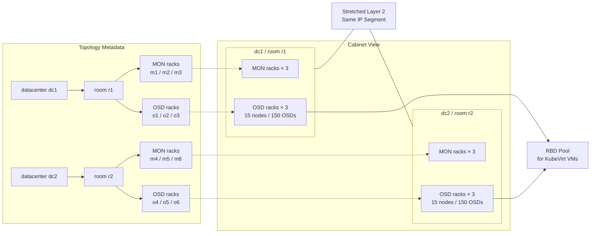

# Ceph Index Cabinet Redesign Implementation Plan

> **For agentic workers:** REQUIRED SUB-SKILL: Use superpowers:subagent-driven-development (recommended) or superpowers:executing-plans to implement this plan task-by-task. Steps use checkbox (`- [ ]`) syntax for tracking.

**Goal:** Simplify `storage/ceph-cross-dc-migration/index.md` into a visual-first landing page with condensed overview text, CRUSH-style topology metadata, and a cabinet-style diagram.

**Architecture:** Limit changes to the landing page only. Replace redundant prose sections with a compact topology tree and a hybrid Mermaid diagram that combines metadata structure and cabinet-oriented DC summaries, while preserving the Reading Guide role of the page.

**Tech Stack:** Markdown, Mermaid, Jekyll/Just-the-Docs, git

---

## File Structure

- Modify: `storage/ceph-cross-dc-migration/index.md`
  - condense Overview / Scenario
  - remove redundant landing-page sections
  - rewrite topology metadata
  - replace the diagram
- Verify: `docs/superpowers/specs/2026-05-12-ceph-index-cabinet-redesign.md`

### Task 1: Rewrite the landing-page content

**Files:**
- Modify: `storage/ceph-cross-dc-migration/index.md`
- Verify: `docs/superpowers/specs/2026-05-12-ceph-index-cabinet-redesign.md`

- [ ] **Step 1: Verify current sections are still present**

Run:

```bash
cd /Users/mansionlai/Documents/code/notebook-sync/.worktrees/ceph-index-cabinet-redesign
grep -nE '^### Rack 命名規範$|^### 遷移策略：Option B$|^### CRUSH 設計原則$' storage/ceph-cross-dc-migration/index.md
```

Expected: all three legacy headings are present before editing.

- [ ] **Step 2: Rewrite the overview and topology content**

Update `index.md` so it follows this content shape:

```md
## 1. Overview / Scenario

### 現況

- **dc1 現有 cluster**：3 台 MON、15 台 OSD nodes（每台 10 顆 OSD disks），現有 RBD pool 服務 KubeVirt 虛擬機
- **dc2 目標硬體**：3 台 MON、15 台 OSD nodes（每台 10 顆 OSD disks）
- **網路拓樸**：dc1 與 dc2 之間有 Layer 2 連通（stretched Layer 2），Server OS 與 Ceph private network 使用相同的 IP segment

### Topology Metadata

```text
datacenter dc1
└─ room r1
   ├─ rack m1 / m2 / m3
   └─ rack o1 / o2 / o3

datacenter dc2
└─ room r2
   ├─ rack m4 / m5 / m6
   └─ rack o4 / o5 / o6
```
```

Requirements while editing:

- remove the separate `Rack 命名規範` section
- remove the separate `遷移策略：Option B` section
- remove the separate `CRUSH 設計原則` section
- remove the unique-IP sentence
- keep the Reading Guide unchanged

- [ ] **Step 3: Replace the architecture diagram**

Replace the current Mermaid block with a hybrid B-style diagram that uses:

```md

```

You may adjust node labels or class styling, but keep the chosen direction:

- left = metadata tree
- right = cabinet grouping
- balanced density only

- [ ] **Step 4: Verify the final page structure**

Run:

```bash
cd /Users/mansionlai/Documents/code/notebook-sync/.worktrees/ceph-index-cabinet-redesign
grep -nE '^### Rack 命名規範$|^### 遷移策略：Option B$|^### CRUSH 設計原則$' storage/ceph-cross-dc-migration/index.md || true
grep -n '所有 IP 位址在兩個 site 間都是唯一' storage/ceph-cross-dc-migration/index.md || true
grep -nE 'datacenter dc1|room r1|rack m1 / m2 / m3|rack o4 / o5 / o6|MON racks × 3|15 nodes / 150 OSDs' storage/ceph-cross-dc-migration/index.md
```

Expected:

- no matches for removed sections
- no match for the unique-IP sentence
- positive matches for the new metadata tree and cabinet-diagram labels

- [ ] **Step 5: Commit the redesign**

```bash
cd /Users/mansionlai/Documents/code/notebook-sync/.worktrees/ceph-index-cabinet-redesign
git add storage/ceph-cross-dc-migration/index.md docs/superpowers/specs/2026-05-12-ceph-index-cabinet-redesign.md docs/superpowers/plans/2026-05-12-ceph-index-cabinet-redesign.md
git commit -m "docs: redesign ceph migration landing page"
```
