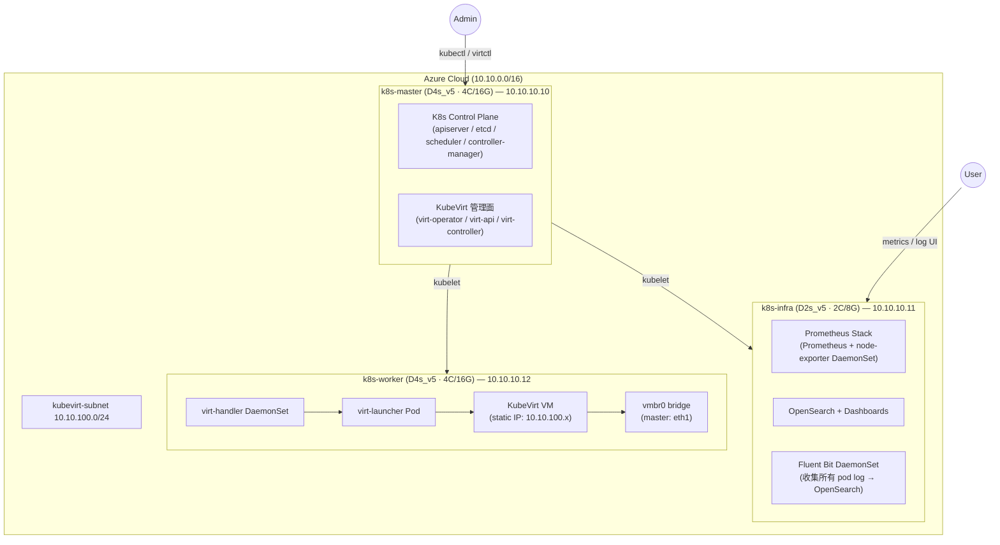

# K8s 3-Node KubeVirt on Azure — 設計文件

> 建立日期：2026-04-12  
> 分類：architecture / kubevirt  
> 狀態：設計確認，待實作

---

## 概述

在 Azure 上建立 3 台 VM，使用 kubeadm 安裝 Kubernetes 叢集，CNI 採用 Cilium + Multus，搭配 KubeVirt 實現在 K8s 上運行 VM workload。Infra 節點負責 Prometheus（含 node-exporter）與 OpenSearch + Dashboards（搭配 Fluent Bit log 收集），KubeVirt 管理面部署在 Master 節點，Worker 節點執行 KubeVirt VM。

---

## 架構

### Azure 網路層

| 資源 | 設定 |
|------|------|
| VNet | `k8s-vnet` — 10.10.0.0/16 |
| K8s Subnet | `k8s-subnet` — 10.10.10.0/24（節點通訊）|
| KubeVirt Subnet | `kubevirt-subnet` — 10.10.100.0/24（VM 專用）|
| NSG | 開放 SSH(22) from your IP；K8s API(6443) from your IP；節點間 all traffic |

### 節點規格（Option B Lab/Dev）

| 節點 | Azure VM | Private IP | Public IP | 角色 |
|------|----------|------------|-----------|------|
| k8s-master | Standard_D4s_v5 (4C/16G) | 10.10.10.10 | ✅ Static | K8s CP + KubeVirt 管理面 |
| k8s-infra | Standard_D2s_v5 (2C/8G) | 10.10.10.11 | ✅ Static | Prometheus + OpenSearch + Fluent Bit |
| k8s-worker | Standard_D4s_v5 (4C/16G) | 10.10.10.12 | ✅ Static | KubeVirt VM workload |

> Worker 額外掛一張 NIC（eth1）進 `kubevirt-subnet`，並在 Azure Portal 開啟 **IP Forwarding**

### 架構圖



---

## 安裝 Phase 計劃

| Phase | 內容 | 備註 |
|-------|------|------|
| **0** | Azure VM 建立（Portal GUI）+ NSG + Static IP + Worker 2nd NIC | 手動操作 |
| **1** | OS 基礎 + kubeadm + Cilium CNI | 三台執行 |
| **2** | Multus CNI（meta-plugin）| k8s-master apply |
| **3** | local-path-provisioner StorageClass | k8s-master apply |
| **4a** | kube-prometheus-stack Helm（含 node-exporter）| Pin → infra |
| **4b** | OpenSearch + OpenSearch Dashboards Helm | Pin → infra |
| **4c** | Fluent Bit Helm DaemonSet → OpenSearch | 所有 node |
| **5** | KubeVirt Operator + CR + NAD + multus-networkpolicy | KubeVirt 管理面 on master |

---

## 排程策略

| 工作負載 | 目標 Node | 機制 |
|---------|-----------|------|
| Prometheus / OpenSearch / Dashboards | k8s-infra | `nodeSelector: role=infra` |
| Fluent Bit | 所有 node | DaemonSet（無限制）|
| node-exporter | 所有 node | DaemonSet（kube-prometheus-stack 內建）|
| KubeVirt 管理面（virt-operator/api/controller）| k8s-master | toleration for `node-role.kubernetes.io/control-plane:NoSchedule` |
| KubeVirt virt-handler | 所有 node | DaemonSet |
| KubeVirt VMI | k8s-worker | `nodeSelector: role=worker` |

---

## 存儲設計

**StorageClass：** `local-path`（rancher/local-path-provisioner）

| 服務 | PVC 大小 | 存放路徑 | Node |
|------|---------|---------|------|
| Prometheus TSDB | 10Gi | `/opt/local-path-provisioner/` | k8s-infra |
| OpenSearch data | 10Gi | `/opt/local-path-provisioner/` | k8s-infra |
| OpenSearch Dashboards | 無 PVC（stateless）| — | k8s-infra |

> ⚠️ local-path 資料存在節點本機，適合 Lab 環境，不適合生產

---

## KubeVirt VM 網路設計

### 網段分離

```
Azure VNet 10.10.0.0/16
├── k8s-subnet        10.10.10.0/24   ← K8s 節點通訊（eth0）
└── kubevirt-subnet   10.10.100.0/24  ← KubeVirt VM 專用（eth1 on worker）
```

### Worker 第二 NIC 設定

1. Azure Portal → Worker VM → Networking → Attach NIC → 選 `kubevirt-subnet`
2. Azure Portal → NIC（eth1）→ IP Configurations → **Enable IP Forwarding**
3. Worker OS 層（開機後）：

```bash
# 建立 bridge vmbr0，將 eth1 加入
sudo ip link add vmbr0 type bridge
sudo ip link set eth1 master vmbr0
sudo ip link set vmbr0 up
sudo ip link set eth1 up
```

### Multus NetworkAttachmentDefinition

```yaml
apiVersion: "k8s.cni.cncf.io/v1"
kind: NetworkAttachmentDefinition
metadata:
  name: vmnet-100
  namespace: default
spec:
  config: '{
    "cniVersion": "0.3.1",
    "name": "vmnet-100",
    "type": "bridge",
    "bridge": "vmbr0"
  }'
```

> **IP 管理：** KubeVirt VMI 使用 static IP（在 VMI spec 內設定）

### multus-networkpolicy

- 安裝 `k8snetworkplumbingwg/multus-networkpolicy`
- 讓 KubeVirt VM 的 `vmnet-100` 網路也受 K8s NetworkPolicy 管控

---

## CNI 架構

```
Cilium（主 CNI）
└── Pod 網路：10.244.0.0/16
└── K8s Service/Policy
Multus（meta-plugin）
└── 允許每個 Pod/VMI 掛多個 NIC
└── vmnet-100 NAD → bridge vmbr0 → KubeVirt VM
```

---

## 版本規劃

| 元件 | 版本 |
|------|------|
| Ubuntu | 24.04 LTS |
| Kubernetes | v1.32.x（kubeadm）|
| Cilium | v1.19.x |
| Multus | v4.x |
| KubeVirt | v1.x（latest stable）|
| kube-prometheus-stack | latest |
| OpenSearch | v2.x |
| Fluent Bit | v3.x |

---

## 參考資料

- [KubeVirt Architecture](https://kubevirt.io/user-guide/architecture/)
- [Multus CNI](https://github.com/k8snetworkplumbingwg/multus-cni)
- [multus-networkpolicy](https://github.com/k8snetworkplumbingwg/multus-networkpolicy)
- [kube-prometheus-stack](https://github.com/prometheus-community/helm-charts/tree/main/charts/kube-prometheus-stack)
- [OpenSearch Helm](https://opensearch-project.github.io/helm-charts/)
- [local-path-provisioner](https://github.com/rancher/local-path-provisioner)
- [Azure Dv5 Series](https://learn.microsoft.com/en-us/azure/virtual-machines/dv5-dsv5-series)
