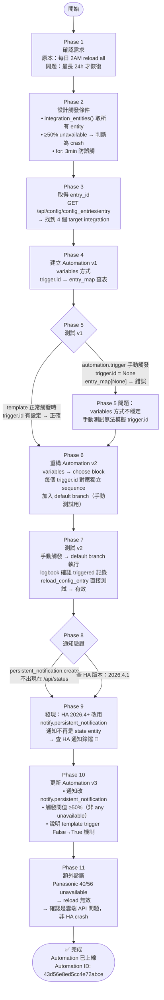

# Home Assistant Integration Watchdog — 建置流程

> 建立日期：2026-04-11
> 分類：homeassistant-integration-watchdog

---

## 流程圖



---

## 測試手法與結果紀錄

### Test 1：template 正確性驗證

**目的**：確認 `integration_entities()` domain 名稱正確，template 能取到實體

```
POST /api/template
{"template": "{{ integration_entities('panasonic_smart_app') | count }}"}
```

| Domain | Entity 數 | 結果 |
|--------|-----------|------|
| panasonic_smart_app | 56 | ✅ |
| lg_thinq | 10 | ✅ |
| smartthings | 21 | ✅ |
| xiaomi_miot | 14 | ✅ |

---

### Test 2：Automation v1 手動觸發

**問題**：`automation.trigger` 不帶 `trigger.id`，導致 `entry_map[None]` KeyError

```
automation.trigger → trigger.id = None
→ entry_map[None] → 錯誤，action 中止
→ notify 未執行
→ logbook 顯示 triggered，但無後續 action 記錄
```

**結論**：`variables` 方式不夠穩健 → 改用 `choose` block

---

### Test 3：reload_config_entry 直接測試

**目的**：確認 service 本身有效

```
POST /api/services/homeassistant/reload_config_entry
{"entry_id": "01JV59P8J1RJ9H2DVCV3J53CQH"}
→ HTTP 200 ✅
→ Panasonic 重啟（但 40/56 仍 unavailable → 確認為雲端問題）
```

---

### Test 4：Automation v2 手動觸發（choose block）

**預期**：走 `default` branch，出現通知

```
automation.trigger → default branch 執行
→ notify.persistent_notification 呼叫 HTTP 200
→ /api/states 查不到通知 entity
```

**發現**：HA 2026.4.1 通知不再是 state entity → 查 HA 通知鈴鐺

---

### Test 5：Logbook 確認 Automation 正常執行

```
2026-04-11T13:56:10 | triggered  ← Test 2
2026-04-11T13:57:47 | (state change) × 2
2026-04-11T13:58:05 | triggered  ← Test 4
2026-04-11T14:01:24 | (state change) × 2
2026-04-11T14:01:27 | triggered  ← Test 5 (v3)
```

automation 確認每次都有觸發並執行 action ✅

---

## 關鍵學習點

| 發現 | 說明 |
|------|------|
| `variables` vs `choose` | `variables` 在手動觸發時 `trigger.id` 為 None 會 KeyError；`choose` + `condition: trigger` 是更穩健的方式 |
| HA 2026.4+ 通知 | `persistent_notification.create` 廢棄，改用 `notify.persistent_notification`；通知不在 `/api/states` |
| template trigger 行為 | 只在 False → True 轉換觸發，已是 True 狀態時重啟 automation 不會立即觸發 |
| ≥50% 閾值設計 | 避免雲端不穩或單一設備斷線誤觸 reload |
| `automation.trigger` 限制 | 手動觸發不帶 `trigger.id`，只能測試 default branch，無法模擬真實 template 觸發情境 |
