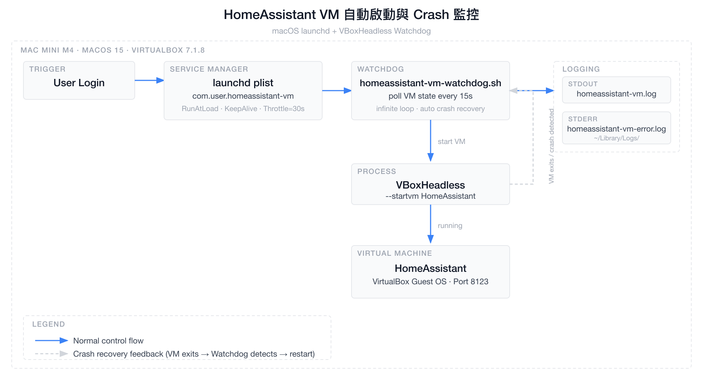

# VirtualBox HomeAssistant VM 自動啟動與 Crash 監控架構

> 建立日期：2026-04-11  
> 分類：architecture  
> 環境：macOS 15 · VirtualBox 7.1.8 · Apple M4

## 概述

在 Mac Mini 上使用 macOS 原生的 `launchd` 服務管理 VirtualBox HomeAssistant VM，取代 Login Items `.app` 方案。透過 `VBoxHeadless`（無頭模式）持續持有 VM 行程，搭配 Watchdog Shell Script 實現：開機自動啟動、VM crash 自動重啟、完整 Log 紀錄。

---

## 架構圖



> 圖片原始檔：[architecture-notion.svg](architecture-notion.svg)

---

## 元件說明

### launchd plist（`com.user.homeassistant-vm.plist`）

| 設定 | 值 | 說明 |
|------|-----|------|
| `RunAtLoad` | `true` | 用戶登入後立即啟動 Watchdog |
| `KeepAlive` | `true` | Watchdog 腳本 crash 時自動重啟 |
| `ThrottleInterval` | `30s` | 防止 Watchdog 快速 crashloop |
| `StandardOutPath` | `~/Library/Logs/homeassistant-vm.log` | 正常 log |
| `StandardErrorPath` | `~/Library/Logs/homeassistant-vm-error.log` | 錯誤 log |

### Watchdog Script（`homeassistant-vm-watchdog.sh`）

| VM State | Watchdog 行為 |
|----------|-------------|
| `running` / `starting` / `restoring` | sleep 15s，繼續輪詢 |
| `stopped` / `aborted` / `poweroff` / `saved` | 呼叫 `VBoxHeadless --startvm` |
| 查詢失敗（VBox 未就緒） | sleep 15s 後重試 |

### VBoxHeadless vs VBoxManage startvm

| | `VBoxHeadless` | `VBoxManage startvm` |
|--|:-:|:-:|
| 行程持續運行 | ✅ VM 結束才退出 | ❌ 啟動後立刻退出 |
| launchd 可監控 | ✅ | ❌ |
| Crash 可偵測 | ✅ | ❌ |
| 無頭（不顯示視窗） | ✅ | 需加 `--type headless` |

---

## 與舊方案比較

| 功能 | `.app` Login Items | launchd + Watchdog |
|------|:-:|:-:|
| 開機自動啟動 | ✅ | ✅ |
| VM crash 自動重啟 | ❌ | ✅ |
| 無頭模式（headless） | 視腳本而定 | ✅ |
| Log 紀錄 | ❌ | ✅ |
| 指令管理（start/stop） | ❌ | ✅ |
| Watchdog 本身 crash 重啟 | ❌ | ✅ |
| 需要圖形介面登入 | ✅ | ✅（LaunchAgent） |

> 💡 若想不需登入就啟動（純 headless server），可改用 `/Library/LaunchDaemons/`（需 root），但 VirtualBox 需額外設定。

---

## 檔案位置

```
~/
├── .local/bin/
│   └── homeassistant-vm-watchdog.sh     # Watchdog 主腳本
├── Library/
│   ├── LaunchAgents/
│   │   └── com.user.homeassistant-vm.plist  # launchd 設定
│   └── Logs/
│       ├── homeassistant-vm.log             # stdout log
│       └── homeassistant-vm-error.log       # stderr log
```

---

## 參考資料

- [launchd 官方文件](https://developer.apple.com/library/archive/documentation/MacOSX/Conceptual/BPSystemStartup/Chapters/CreatingLaunchdJobs.html)
- [VBoxHeadless 文件](https://www.virtualbox.org/manual/ch07.html)
- [launchctl man page](https://ss64.com/osx/launchctl.html)
