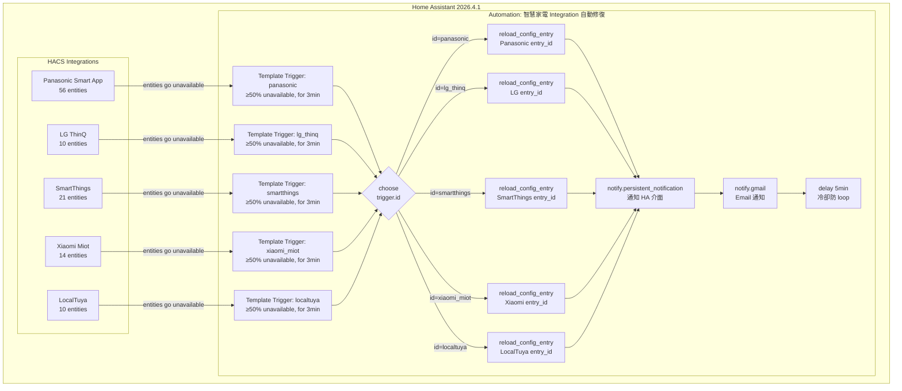

# Home Assistant Integration 自動修復架構

> 建立日期：2026-04-11
> 分類：homeassistant-integration-watchdog
> 環境：Home Assistant 2026.4.1 · 192.168.50.71:8123

---

## 概述

針對 HACS 安裝的第三方 integration（Panasonic / LG / SmartThings / Xiaomi / LocalTuya）容易 crash 的問題，
使用 HA 原生 Automation 實現「偵測 ≥50% 設備失聯 → 自動 reload 對應 integration」，
取代原本的每日 2AM reload all 方案，縮短恢復時間從最長 24h 到 3~8 分鐘。

---

## 系統架構圖



---

## 觸發條件設計

### 觸發邏輯（template trigger）


```jinja


{{ total > 0 and (ents | map('states') | select('equalto', 'unavailable') | list | count) / total >= 0.5 }}
```


- `integration_entities('domain')` — HA 內建函數，自動取得該 domain 所有 entity
- **≥50% 閾值** — 排除個別設備斷線的誤觸（如雲端 API 短暫不穩定）
- **for: minutes: 3** — 持續 3 分鐘才觸發，避免瞬斷誤動作

### 為何用 ≥50% 而不是 any unavailable

| 情境 | 描述 | 應該觸發？ |
|------|------|-----------|
| 1 台冷氣斷電 | 個別設備問題 | ❌ 不應 reload |
| Panasonic 雲端不穩 | 部分設備失聯（30%）| ❌ 不應 reload |
| Integration 程式 crash | 幾乎全部失聯（>50%）| ✅ 應 reload |
| HA 重啟後 integration 未載入 | 全部失聯（100%）| ✅ 應 reload |

---

## Integration 清單與 Entry ID

| Integration | Domain | Entry ID | Entity 數 |
|-------------|--------|----------|-----------|
| Panasonic Smart App | `panasonic_smart_app` | `01JV59P8J1RJ9H2DVCV3J53CQH` | 56 |
| LG ThinQ | `lg_thinq` | `01JV5591HB9C3KTWSZEWG0DZ30` | 10 |
| SmartThings（星都匯）| `smartthings` | `01JVFETGN4SK49H6JP713Q7GS4` | 21 |
| Xiaomi Miot | `xiaomi_miot` | `01JXJ6NQK07P96CRRF1DMED2VX` | 14 |
| LocalTuya（奇美清淨機）| `localtuya` | `01KPFZBPHQY8YYT4TQZD9TFEJV` | 10 |

---

## Automation 完整 YAML


```yaml
alias: "智慧家電 Integration 自動修復"
description: "偵測 Panasonic / LG / SmartThings / Xiaomi / LocalTuya 設備全線失聯（>=50%），自動 reload 並寄信通知"

trigger:
  - platform: template
    id: panasonic
    value_template: >
      
      
      {{ total > 0 and (ents | map('states') | select('equalto', 'unavailable') | list | count) / total >= 0.5 }}
    for:
      minutes: 3

  - platform: template
    id: lg_thinq
    value_template: >
      
      
      {{ total > 0 and (ents | map('states') | select('equalto', 'unavailable') | list | count) / total >= 0.5 }}
    for:
      minutes: 3

  - platform: template
    id: smartthings
    value_template: >
      
      
      {{ total > 0 and (ents | map('states') | select('equalto', 'unavailable') | list | count) / total >= 0.5 }}
    for:
      minutes: 3

  - platform: template
    id: xiaomi_miot
    value_template: >
      
      
      {{ total > 0 and (ents | map('states') | select('equalto', 'unavailable') | list | count) / total >= 0.5 }}
    for:
      minutes: 3

  - platform: template
    id: localtuya
    value_template: >
      
      
      {{ total > 0 and (ents | map('states') | select('equalto', 'unavailable') | list | count) / total >= 0.5 }}
    for:
      minutes: 3

conditions: []

action:
  - choose:
      - conditions:
          - condition: trigger
            id: panasonic
        sequence:
          - action: homeassistant.reload_config_entry
            data:
              entry_id: "01JV59P8J1RJ9H2DVCV3J53CQH"
          - action: notify.persistent_notification
            data:
              title: "⚠️ Panasonic Smart App 自動修復"
              message: "偵測到 Panasonic Smart App 設備失聯，已於 {{ now().strftime('%Y-%m-%d %H:%M') }} 自動重新載入 Integration。"
          - action: notify.gmail
            data:
              title: "⚠️ [HA] Panasonic Smart App Integration 自動修復"
              message: "時間：{{ now().strftime('%Y-%m-%d %H:%M:%S') }}\n事件：Panasonic Smart App 偵測到設備大量失聯（≥50%），已自動重新載入 Integration。\n\n— HomeAssistant 192.168.50.71:8123"
          - delay:
              minutes: 5

      - conditions:
          - condition: trigger
            id: lg_thinq
        sequence:
          - action: homeassistant.reload_config_entry
            data:
              entry_id: "01JV5591HB9C3KTWSZEWG0DZ30"
          - action: notify.persistent_notification
            data:
              title: "⚠️ LG ThinQ 自動修復"
              message: "偵測到 LG ThinQ 設備失聯，已於 {{ now().strftime('%Y-%m-%d %H:%M') }} 自動重新載入 Integration。"
          - action: notify.gmail
            data:
              title: "⚠️ [HA] LG ThinQ Integration 自動修復"
              message: "時間：{{ now().strftime('%Y-%m-%d %H:%M:%S') }}\n事件：LG ThinQ 偵測到設備大量失聯（≥50%），已自動重新載入 Integration。\n\n— HomeAssistant 192.168.50.71:8123"
          - delay:
              minutes: 5

      - conditions:
          - condition: trigger
            id: smartthings
        sequence:
          - action: homeassistant.reload_config_entry
            data:
              entry_id: "01JVFETGN4SK49H6JP713Q7GS4"
          - action: notify.persistent_notification
            data:
              title: "⚠️ SmartThings 自動修復"
              message: "偵測到 SmartThings 設備失聯，已於 {{ now().strftime('%Y-%m-%d %H:%M') }} 自動重新載入 Integration。"
          - action: notify.gmail
            data:
              title: "⚠️ [HA] SmartThings Integration 自動修復"
              message: "時間：{{ now().strftime('%Y-%m-%d %H:%M:%S') }}\n事件：SmartThings 偵測到設備大量失聯（≥50%），已自動重新載入 Integration。\n\n— HomeAssistant 192.168.50.71:8123"
          - delay:
              minutes: 5

      - conditions:
          - condition: trigger
            id: xiaomi_miot
        sequence:
          - action: homeassistant.reload_config_entry
            data:
              entry_id: "01JXJ6NQK07P96CRRF1DMED2VX"
          - action: notify.persistent_notification
            data:
              title: "⚠️ Xiaomi Miot 自動修復"
              message: "偵測到 Xiaomi Miot 設備失聯，已於 {{ now().strftime('%Y-%m-%d %H:%M') }} 自動重新載入 Integration。"
          - action: notify.gmail
            data:
              title: "⚠️ [HA] Xiaomi Miot Integration 自動修復"
              message: "時間：{{ now().strftime('%Y-%m-%d %H:%M:%S') }}\n事件：Xiaomi Miot 偵測到設備大量失聯（≥50%），已自動重新載入 Integration。\n\n— HomeAssistant 192.168.50.71:8123"
          - delay:
              minutes: 5

      - conditions:
          - condition: trigger
            id: localtuya
        sequence:
          - action: homeassistant.reload_config_entry
            data:
              entry_id: "01KPFZBPHQY8YYT4TQZD9TFEJV"
          - action: notify.persistent_notification
            data:
              title: "⚠️ LocalTuya 自動修復"
              message: "偵測到 LocalTuya 設備失聯，已於 {{ now().strftime('%Y-%m-%d %H:%M') }} 自動重新載入 Integration。"
          - action: notify.gmail
            data:
              title: "⚠️ [HA] LocalTuya Integration 自動修復"
              message: "時間：{{ now().strftime('%Y-%m-%d %H:%M:%S') }}\n事件：LocalTuya 偵測到設備大量失聯（≥50%），已自動重新載入 Integration。\n\n— HomeAssistant 192.168.50.71:8123"
          - delay:
              minutes: 5

    default:
      - action: notify.persistent_notification
        data:
          title: "✅ Automation 手動測試"
          message: "choose block 正常執行（手動觸發，未執行 reload）"
      - action: notify.gmail
        data:
          title: "✅ [HA] Automation 手動測試"
          message: "手動觸發測試成功，未執行 reload。\n\n— HomeAssistant 192.168.50.71:8123"

mode: parallel
max: 5
```


---

## 與舊方案比較

| 項目 | 舊方案（2AM reload all）| 新方案（自動偵測 reload）|
|------|------------------------|------------------------|
| 恢復時間 | 最長 24 小時 | **3~8 分鐘** |
| 影響範圍 | 全部 integration 重啟 | **只重啟問題 integration** |
| 觸發條件 | 固定時間 schedule | **實際 crash 才觸發** |
| 防誤觸機制 | 無 | ≥50% 閾值 + 3分鐘確認 |
| 防 loop 機制 | 無 | 5分鐘冷卻 + parallel max:4 |

---

## 重要注意事項

- **template trigger 只在 False → True 轉換時觸發**，若 HA 重啟時 integration 已失聯，需等 integration 恢復後再 crash 才會觸發
- **Panasonic 雲端問題 ≠ Integration Crash**：若是 Panasonic 雲端 API 不穩，reload 無效，需另外處理（例如單獨的 schedule reload）
- **HA 2026.4+** 通知不再出現在 `/api/states`，需透過 HA 介面通知鈴鐺查看
- **automation.trigger（手動觸發）不會設定 `trigger.id`**，choose block 會走 default branch（正常現象）
