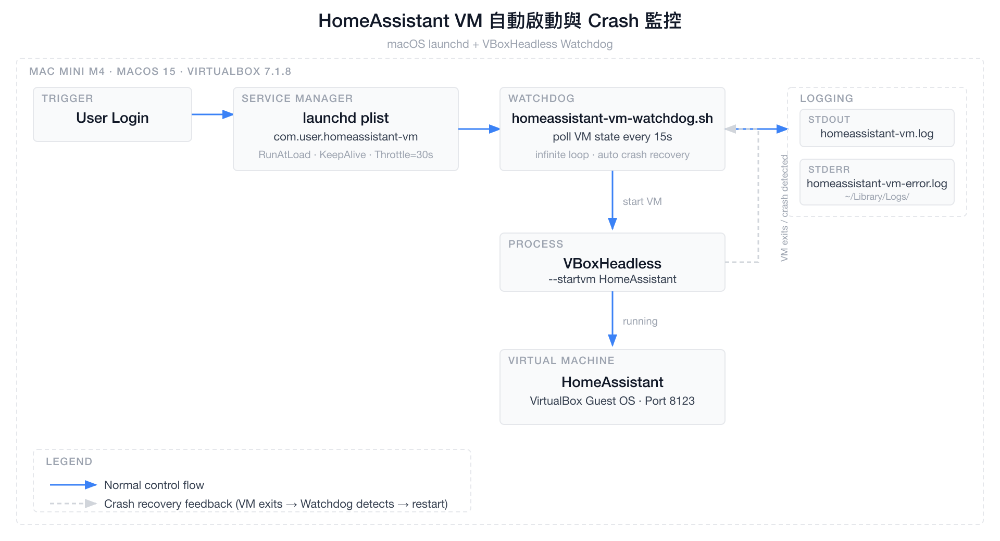

# VirtualBox HomeAssistant VM 自動啟動與 Crash 監控架構

> 建立日期：2026-04-11  
> 最後更新：2026-07-26  
> 分類：architecture  
> 環境：macOS 15 · VirtualBox 7.1.8 · Apple M4

## 概述

在 Mac Mini 上使用 macOS 原生的 `launchd` 服務管理 VirtualBox HomeAssistant VM，取代 Login Items `.app` 方案。透過 `VBoxHeadless`（無頭模式）持續持有 VM 行程，搭配 Watchdog Shell Script 實現：開機自動啟動、VM crash 自動重啟、完整 Log 紀錄。

---

## 架構圖



> 圖片原始檔：[architecture-notion.svg](architecture-notion.svg)

---

## 元件說明

### launchd plist（`com.user.homeassistant-vm.plist`）

| 設定 | 值 | 說明 |
|------|-----|------|
| `RunAtLoad` | `true` | 用戶登入後立即啟動 Watchdog |
| `KeepAlive` | `true` | Watchdog 腳本 crash 時自動重啟 |
| `ThrottleInterval` | `30s` | 防止 Watchdog 快速 crashloop |
| `StandardOutPath` | `/dev/null` | Script 自行管理 Log |
| `StandardErrorPath` | `~/Library/Logs/homeassistant-vm-error.log` | 未預期錯誤 |

### Watchdog Script（`homeassistant-vm-watchdog.sh`）

| VM State | Watchdog 行為 |
|----------|-------------|
| `running` / `starting` / `restoring` | sleep 60s，繼續輪詢 |
| `stopped` / `aborted` / `poweroff` / `saved` | 呼叫 `VBoxHeadless --startvm` |
| 查詢失敗（VBox 未就緒） | sleep 60s 後重試 |

### VBoxHeadless vs VBoxManage startvm

| | `VBoxHeadless` | `VBoxManage startvm` |
|--|:-:|:-:|
| 行程持續運行 | ✅ VM 結束才退出 | ❌ 啟動後立刻退出 |
| launchd 可監控 | ✅ | ❌ |
| Crash 可偵測 | ✅ | ❌ |
| 無頭（不顯示視窗） | ✅ | 需加 `--type headless` |

---

## 與舊方案比較

| 功能 | `.app` Login Items | launchd + Watchdog |
|------|:-:|:-:|
| 開機自動啟動 | ✅ | ✅ |
| VM crash 自動重啟 | ❌ | ✅ |
| 無頭模式（headless） | 視腳本而定 | ✅ |
| Log 紀錄 | ❌ | ✅ |
| 指令管理（start/stop） | ❌ | ✅ |
| Watchdog 本身 crash 重啟 | ❌ | ✅ |
| 需要圖形介面登入 | ✅ | ✅（LaunchAgent） |

> 💡 若想不需登入就啟動（純 headless server），可改用 `/Library/LaunchDaemons/`（需 root），但 VirtualBox 需額外設定。

---

## 檔案位置

```
~/
├── .local/bin/
│   └── homeassistant-vm-watchdog.sh     # Watchdog 主腳本
├── Library/
│   ├── LaunchAgents/
│   │   └── com.user.homeassistant-vm.plist  # launchd 設定
│   └── Logs/
│       ├── homeassistant-vm.log             # stdout log
│       └── homeassistant-vm-error.log       # stderr log
```

---

## Cloudflare Tunnel（外網存取）

> 設定日期：2026-07-26  
> 目的：讓 HA App 在外網（4G/5G）也能收到推播通知，並從外部連線 HA

### 網路架構

```
外網（手機 4G/5G）
    │
    ▼
Cloudflare Edge（台灣 tpe01 / 高雄 khh01 節點）
    │  QUIC / HTTP2
    ▼
cloudflared（Mac mini · 192.168.50.49 · LaunchAgent）
    │  HTTP · 內網
    ▼
HA Server VM（VirtualBox · 192.168.50.71:8123）
```

### Tunnel 資訊

| 項目 | 值 |
|------|----|
| Tunnel 名稱 | `ha-mansion` |
| Tunnel ID | `a430f2b4-fd44-4967-abee-b9a37938cd1a` |
| 公開網址 | `https://ha.mansionlai.com` |
| 網域 | `mansionlai.com`（Cloudflare Registrar） |
| DNS 紀錄 | `ha.mansionlai.com` → CNAME → Tunnel |
| 執行方式 | 整合於 HA VM Watchdog (`com.user.homeassistant-vm.plist`) |

### Mac mini 上新增的檔案

```
~/
├── .cloudflared/
│   ├── cert.pem                                    # Cloudflare 授權憑證
│   ├── a430f2b4-fd44-4967-abee-b9a37938cd1a.json  # Tunnel 金鑰（請勿外流）
│   ├── config.yml                                  # Tunnel 設定（指向 192.168.50.71:8123）
│   └── tunnel.log                                  # 運行日誌
└── Library/
    └── LaunchAgents/
        └── com.user.homeassistant-vm.plist         # 開機自動啟動設定（合併管理 VM 與 Tunnel）
```

### HA 設定（configuration.yaml）

```yaml
http:
  use_x_forwarded_for: true
  trusted_proxies:
    - 127.0.0.1
    - 172.16.0.0/12
    - 192.168.0.0/16
    - 10.0.0.0/8
    - 162.158.0.0/15   # Cloudflare IP
    - 104.16.0.0/13
    - 104.24.0.0/14
    - 172.64.0.0/13
    - 131.0.72.0/22
```

### 說明

- cloudflared 跑在 Mac mini（Host）上，透過內網連到 VM（192.168.50.71:8123）
- Mac mini 必須開著才能讓 Tunnel 保持連線（VM 本來就依賴 Mac mini）
- HA App 的 External URL 設定為 `https://ha.mansionlai.com` 後，外網推播即可正常運作
- Cloudflare Tunnel 本身**永久免費**；網域費用約 NT$290/年

---

## 參考資料

- [launchd 官方文件](https://developer.apple.com/library/archive/documentation/MacOSX/Conceptual/BPSystemStartup/Chapters/CreatingLaunchdJobs.html)
- [VBoxHeadless 文件](https://www.virtualbox.org/manual/ch07.html)
- [launchctl man page](https://ss64.com/osx/launchctl.html)
- [Cloudflare Tunnel 文件](https://developers.cloudflare.com/cloudflare-one/connections/connect-networks/)
- [HA HTTP 整合設定](https://www.home-assistant.io/integrations/http/)
