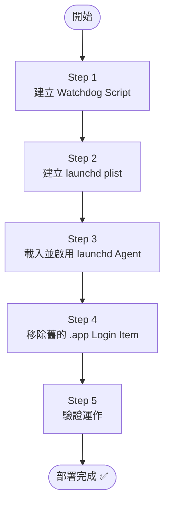
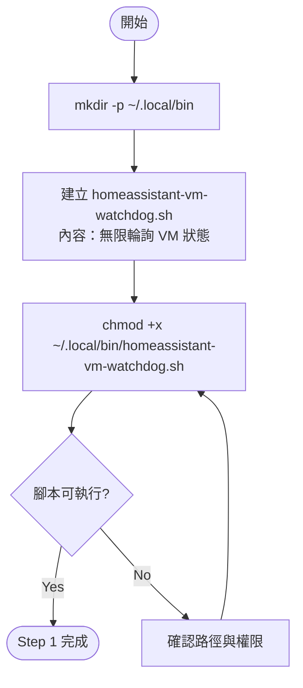
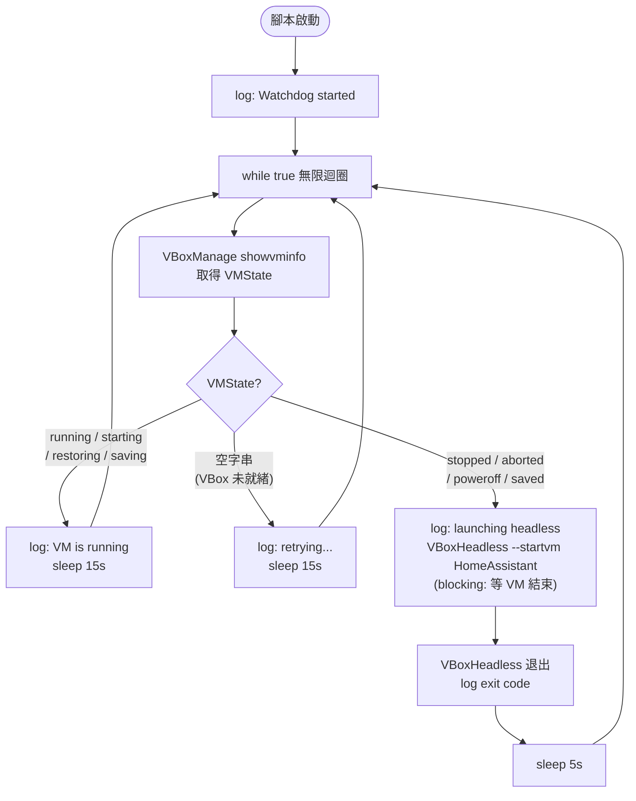
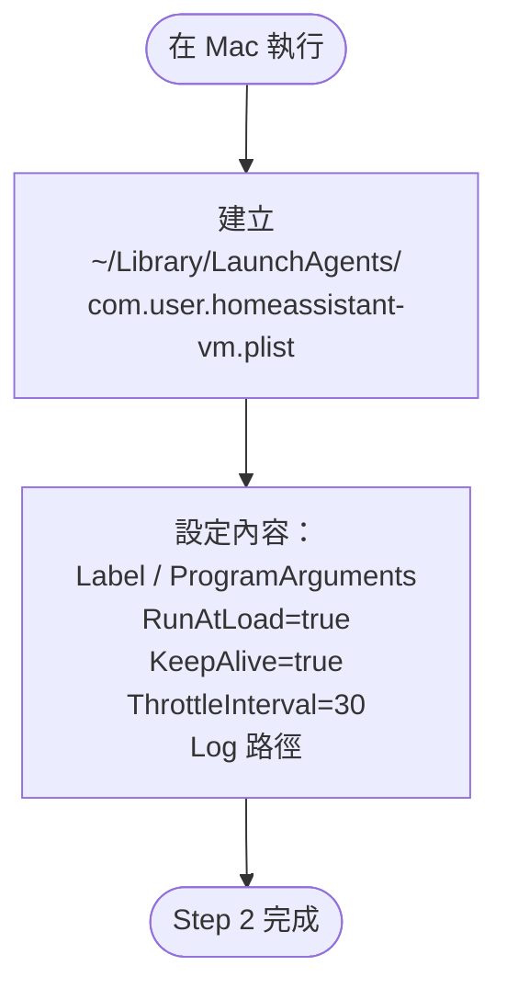
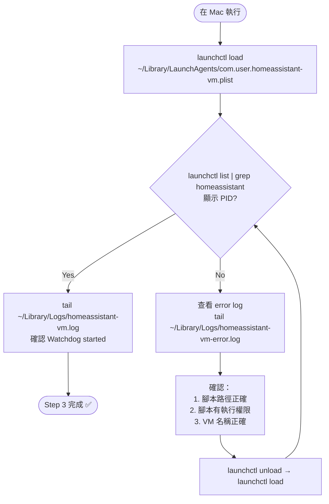
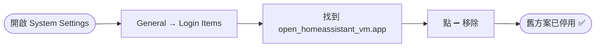
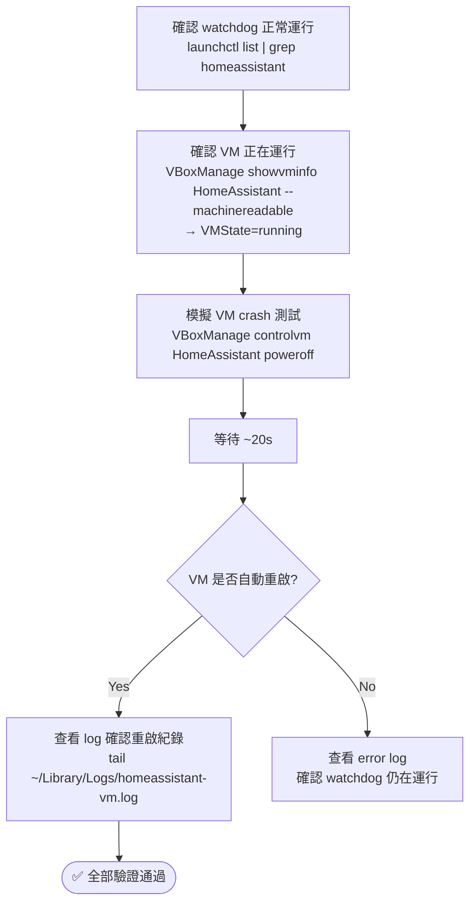
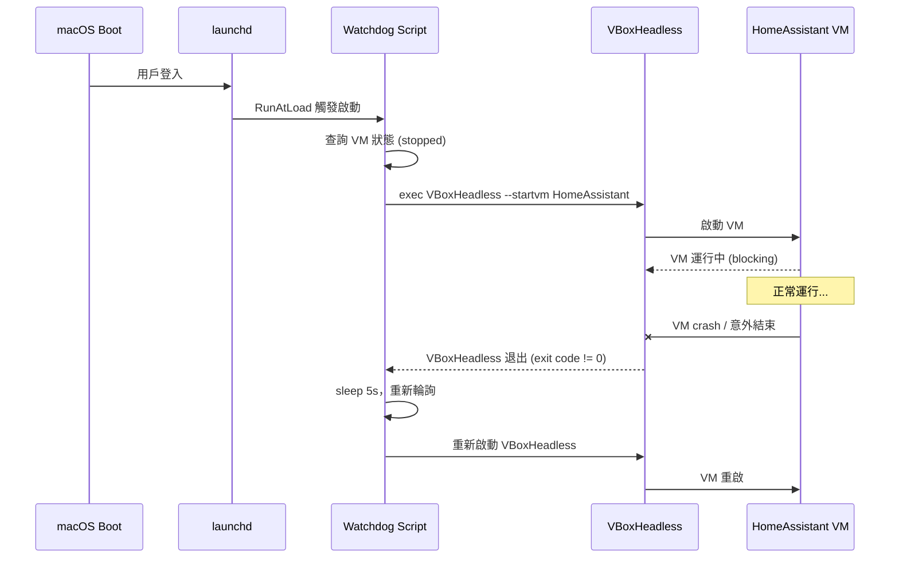

# HomeAssistant VM Watchdog 部署流程

> 建立日期：2026-04-11  
> 分類：flowchart  
> 前置條件：macOS 15、VirtualBox 7.1.8 已安裝、HomeAssistant VM 已建立

---

## 總覽

---

## Step 1：建立 Watchdog Script

**腳本邏輯：**

---

## Step 2：建立 launchd Plist

---

## Step 3：載入並啟用

---

## Step 4：移除舊的 .app Login Item

---

## Step 5：驗證流程

---

## 重開機驗證流程

---

## 參考資料

- [launchd plist keys 說明](https://www.launchd.info/)
- [VBoxHeadless 無頭模式](https://www.virtualbox.org/manual/ch07.html)
