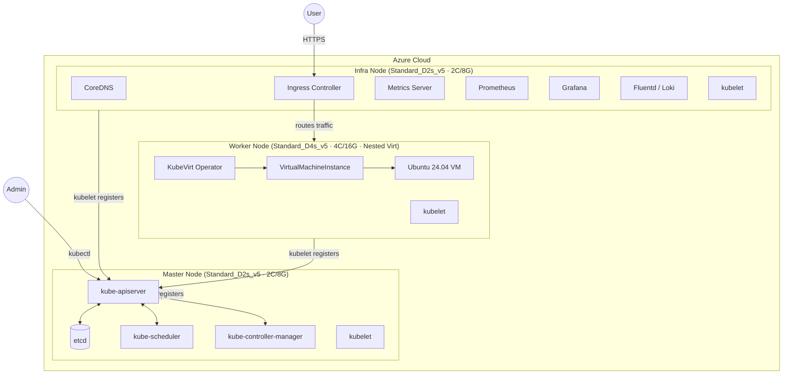

# K8s 三節點架構：Master / Infra / Worker + KubeVirt

> 分類：architecture

## 概述

使用三台 x86 VM 在 Azure 上架設 Kubernetes Cluster，節點角色分為 Master（控制面）、Infra（基礎設施服務）、Worker（使用者 Workload），並在 Worker 上部署 KubeVirt 以產生 Ubuntu 24.04 VM。

---

## 架構圖

---

## 元件分配表

### Master Node — 只跑 Control Plane

| 元件 | 功能 | CPU 消耗 | 備註 |
|------|------|---------|------|
| `kube-apiserver` | Cluster 唯一 API 入口 | 0.1–0.5 vCPU | TLS 加解密密集 |
| `etcd` | 儲存全部 Cluster 狀態 | 0.1–0.3 vCPU | I/O 密集，需穩定 CPU |
| `kube-scheduler` | 決定 Pod 排程到哪個 Node | <0.05 vCPU | 事件驅動 |
| `kube-controller-manager` | 維護期望狀態（RS/Node/SA） | 0.05–0.2 vCPU | 控制面核心邏輯 |
| `kubelet` | 管理 Master 上的 Pod | — | 每個 Node 都需要 |
| **合計** | | **~0.5–1.5 vCPU** | Burst 可到 2 vCPU |

> ⚠️ etcd 對延遲敏感，**不建議用 B-series Burstable**（CPU credit 耗盡時效能劣化）

### Infra Node — 跑 Cluster 基礎設施服務

| 元件 | 功能 | CPU 消耗 | 備註 |
|------|------|---------|------|
| `CoreDNS` | Cluster 內部 DNS | <0.05 vCPU | 所有 Pod 依賴 |
| `Ingress Controller` | 管理外部流量進入 | 0.1–0.5 vCPU | nginx / traefik |
| `Metrics Server` | 提供 HPA/VPA metrics | <0.05 vCPU | 輕量但關鍵 |
| `Prometheus` | Cluster 監控 | **0.5–1.5 vCPU** | 資源消耗大，需獨立 |
| `Grafana` | 監控視覺化儀表板 | 0.1–0.3 vCPU | 搭配 Prometheus |
| `Fluentd / Loki` | Log 收集與彙整 | 0.2–0.5 vCPU | I/O 密集型 |
| **合計** | | **~1–3 vCPU** | Prometheus 是大戶 |

### Worker Node — 跑使用者 Workload + KubeVirt

| 元件 | 功能 | CPU 需求 | 備註 |
|------|------|---------|------|
| `kubelet` + KubeVirt operator | K8s overhead | ~0.5 vCPU | 固定消耗 |
| `KubeVirt Operator` | 管理 VM 生命週期 | — | 需 /dev/kvm |
| `VirtualMachineInstance` | K8s 原生 VM 物件 | — | KubeVirt CRD |
| `Ubuntu 24.04 VM` | 目標 Guest VM | **2 vCPU** | 直接佔用 Host CPU |
| KVM overhead | Nested virt 損耗 | ~5–10% | — |
| **合計** | | **≥4 vCPU** | 建議 6–8 |

> ⚠️ Worker 必須選支援 **Nested Virtualization** 的 Azure VM（Dv3/Dv4/Dv5 系列）

---

## Azure VM 規格建議

### Lab / Dev 環境（省錢優先）

| 節點 | 推薦 VM | vCPU | RAM | 月費(約) |
|------|---------|------|-----|---------|
| Master | **Standard_D2s_v5** | 2 | 8GB | ~$70 USD |
| Infra | **Standard_D2s_v5** | 2 | 8GB | ~$70 USD |
| Worker | **Standard_D4s_v5** | 4 | 16GB | ~$140 USD |
| **合計** | | **8 vCPU** | **32GB** | **~$280/月** |

### Production / 穩定環境（效能優先）

| 節點 | 推薦 VM | vCPU | RAM | 月費(約) |
|------|---------|------|-----|---------|
| Master | **Standard_D4s_v5** | 4 | 16GB | ~$140 USD |
| Infra | **Standard_D4s_v5** | 4 | 16GB | ~$140 USD |
| Worker | **Standard_D8s_v5** | 8 | 32GB | ~$280 USD |
| **合計** | | **16 vCPU** | **64GB** | **~$560/月** |

---

## 參考資料

- [Kubernetes 官方文件](https://kubernetes.io/docs/)
- [KubeVirt 官方文件](https://kubevirt.io/user-guide/)
- [Azure Dv5 Series](https://learn.microsoft.com/en-us/azure/virtual-machines/dv5-dsv5-series)
- [etcd Hardware Recommendations](https://etcd.io/docs/v3.5/op-guide/hardware/)
