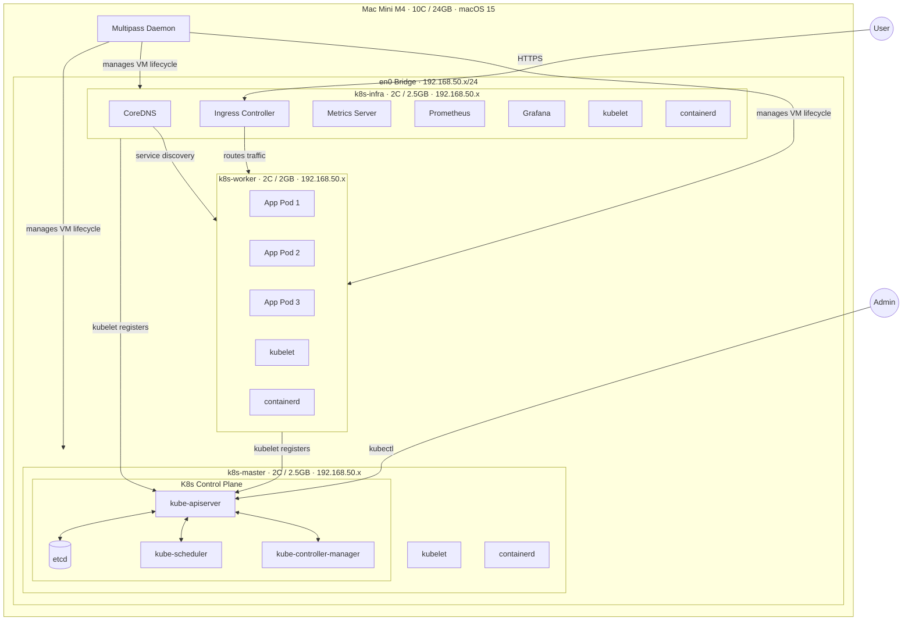

# Mac Mini M4 三節點 K8s 架構（Multipass + Bridge 網路）

> 建立日期：2026-04-11  
> 分類：architecture  
> 硬體：Apple M4 · 10C / 24GB RAM · macOS 15  
> 工具：Multipass 1.15 · Ubuntu 24.04 LTS (ARM64) · Kubernetes 1.32

## 概述

使用 Mac Mini M4 本機，透過 Multipass 建立三台 Ubuntu 24.04 VM，橋接至 en0（192.168.50.x/24），搭建純 K8s 三節點 Lab 環境。不包含 KubeVirt（Apple Silicon 無 nested virtualization 支援），專注於 K8s 核心元件與基礎設施服務的學習。

---

## 架構圖

---

## 節點規格

| 節點 | VM 名稱 | vCPU | RAM | Disk | 角色 |
|------|---------|------|-----|------|------|
| Master | `k8s-master` | 2 | 2.5GB | 30GB | K8s Control Plane |
| Infra | `k8s-infra` | 2 | 2.5GB | 30GB | 基礎設施服務 |
| Worker | `k8s-worker` | 2 | 2GB | 40GB | App Workload |
| **Mac Mini Host 保留** | — | — | ~17GB | — | macOS 系統 |
| **合計** | | **6C** | **7GB + 17GB host** | **100GB** | |

> ✅ 最低可用規格：kubeadm 強制要求 Master ≥ 2 CPU，Infra/Worker 各 2C 足以跑 Lab 工作負載。  
> ⚠️ Prometheus 記憶體需求較大（~500MB），Infra 2.5GB 為最低建議值，若 OOM 可先將 Prometheus retention 調低。

---

## 元件分配

### Master Node — K8s 控制面

| 元件 | 功能 | 備註 |
|------|------|------|
| `kube-apiserver` | Cluster 唯一 API 入口 | 所有操作必經此處 |
| `etcd` | 儲存全部 Cluster 狀態 | 對延遲敏感，需穩定 CPU |
| `kube-scheduler` | 決定 Pod 排程到哪個 Node | |
| `kube-controller-manager` | 維護期望狀態 | RS / Node / ServiceAccount |
| `kubelet` + `containerd` | Node agent + 容器執行環境 | ARM64 |

### Infra Node — Cluster 基礎設施

| 元件 | 功能 | 部署方式 |
|------|------|---------|
| `CoreDNS` | Cluster 內部 DNS | 隨 kubeadm 自動安裝 |
| `Ingress Controller` | 管理外部流量 | Helm (ingress-nginx) |
| `Metrics Server` | HPA/VPA metrics | kubectl apply |
| `Prometheus` | Cluster 監控 | kube-prometheus-stack |
| `Grafana` | 監控視覺化 | 含於 kube-prometheus-stack |

> Node label: `node-role=infra`，以 `nodeSelector` 限制服務只排到此節點

### Worker Node — App Workload

| 元件 | 說明 |
|------|------|
| `kubelet` + `containerd` | ARM64 容器執行環境 |
| App Pods | 使用者部署的應用程式 |

> ⚠️ 所有容器映像需支援 **arm64/aarch64** 架構

---

## 網路說明

| 類型 | 說明 |
|------|------|
| VM 網卡 | Multipass bridge → en0 → 192.168.50.x/24 |
| Pod Network (CNI) | Cilium (`172.46.0.0/16`) |
| Service Network | `10.96.0.0/12` |
| NodePort 存取 | 直接用 VM IP + NodePort |
| Ingress 存取 | 透過 Infra Node IP + 80/443 |

---

## 與 KubeVirt 版本差異

| 項目 | KubeVirt 版（Azure x86）| 本版（Mac Mini ARM）|
|------|------------------------|---------------------|
| 硬體 | Azure VM x86_64 | Mac Mini M4 ARM64 |
| VM 管理 | KubeVirt + QEMU/KVM | ❌ 不支援（無 nested virt）|
| 容器工作負載 | ✅ | ✅ |
| 成本 | ~$350/月 | 一次性硬體成本 |
| 適合場景 | VM workload 學習 | K8s 核心 + 微服務學習 |

---

## 參考資料

- [Multipass Documentation](https://multipass.run/docs)
- [Kubernetes 官方文件](https://kubernetes.io/docs/)
- [Cilium CNI](https://docs.cilium.io/en/stable/gettingstarted/k8s-install-default/)
- [kube-prometheus-stack](https://github.com/prometheus-community/helm-charts)
