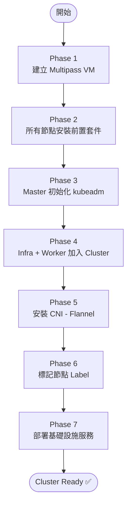
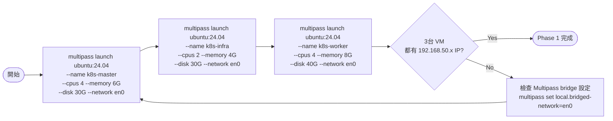
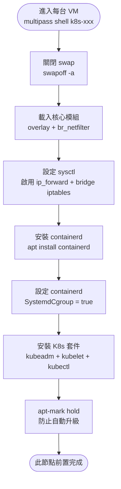
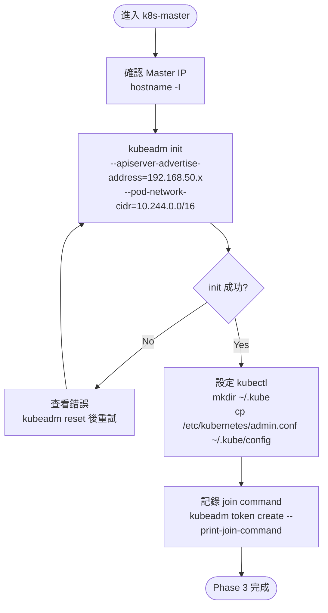
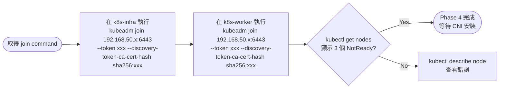
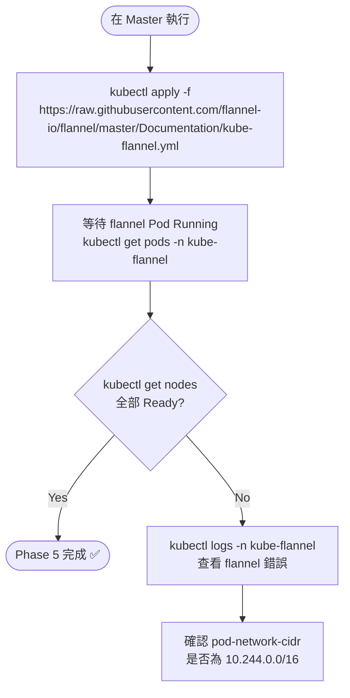
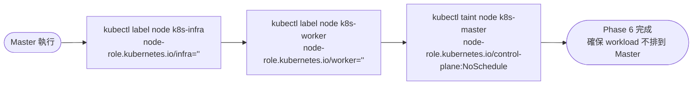
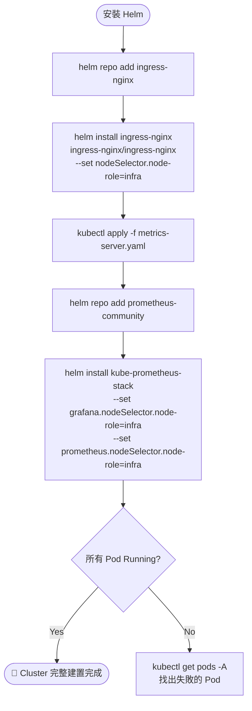

# Mac Mini K8s 三節點建置流程

> 建立日期：2026-04-11  
> 分類：flowchart  
> 前置條件：已安裝 Multipass 1.15+、Mac 連接至 192.168.50.x/24 網段

## 概述

從零開始，在 Mac Mini M4 上用 Multipass 建立三台 Ubuntu 24.04 VM，完成 K8s 三節點 Cluster 的完整建置流程，涵蓋 VM 建立、K8s 初始化、CNI 安裝、節點標記與基礎設施部署。

---

## 總覽流程圖



---

## Phase 1：建立 Multipass VM



---

## Phase 2：所有節點安裝前置套件

> 三台 VM 都需執行，可平行操作



---

## Phase 3：Master 初始化



---

## Phase 4：Infra + Worker 加入 Cluster



---

## Phase 5：安裝 CNI（Flannel）



---

## Phase 6：節點標記



---

## Phase 7：部署基礎設施服務



---

## 驗證 Checklist

```bash
# 確認所有節點 Ready
kubectl get nodes -o wide

# 確認核心 Pod 正常
kubectl get pods -n kube-system

# 確認 Infra 服務
kubectl get pods -n ingress-nginx
kubectl get pods -n monitoring

# 測試 DNS
kubectl run test --image=busybox --restart=Never -- nslookup kubernetes.default

# 測試 Ingress
curl -H "Host: test.local" http://192.168.50.x
```

---

## 參考資料

- [Multipass Bridge Networking](https://multipass.run/docs/create-an-instance#heading--bridged)
- [kubeadm 安裝指南](https://kubernetes.io/docs/setup/production-environment/tools/kubeadm/install-kubeadm/)
- [Flannel CNI](https://github.com/flannel-io/flannel)
- [ingress-nginx Helm](https://kubernetes.github.io/ingress-nginx/deploy/#quick-start)
