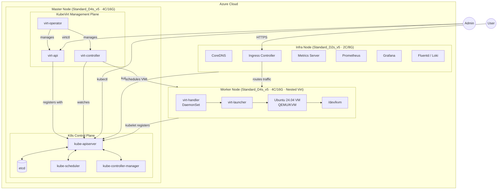

# K8s 三節點架構：Master / Infra / Worker + KubeVirt（Option B）

> 分類：architecture  
> 架構決策：KubeVirt 管理面（virt-operator/virt-api/virt-controller）與 K8s Control Plane 同放 Master

## 概述

使用三台 x86 VM 在 Azure 上架設 Kubernetes Cluster。採用 **Option B** 架構：Master 同時承載 K8s 控制面與 KubeVirt 管理面（概念一致，適合 Lab 環境），Infra 專責基礎設施服務，Worker 執行 VM workload。

---

## 架構圖

---

## 元件分配表

### Master Node — K8s 控制面 + KubeVirt 管理面

| 類別 | 元件 | 功能 | CPU 消耗 |
|------|------|------|---------|
| K8s CP | `kube-apiserver` | Cluster 唯一 API 入口 | 0.1–0.5 vCPU |
| K8s CP | `etcd` | 儲存全部 Cluster 狀態 | 0.1–0.3 vCPU |
| K8s CP | `kube-scheduler` | 決定 Pod 排程到哪個 Node | <0.05 vCPU |
| K8s CP | `kube-controller-manager` | 維護期望狀態（RS/Node/SA） | 0.05–0.2 vCPU |
| KubeVirt | `virt-operator` | 管理 KubeVirt 自身生命週期 | <0.05 vCPU（平時極輕量） |
| KubeVirt | `virt-api` | 處理 VM/VMI API 請求 | 0.1–0.3 vCPU |
| KubeVirt | `virt-controller` | 管理 VM 狀態機 | 0.1–0.3 vCPU |
| | `kubelet` | 管理 Master 上的 Pod | — |
| | **合計** | | **~0.7–2 vCPU** |

> ⚠️ etcd 對延遲敏感，Master 需使用 **D-series（非 Burstable B-series）**，確保穩定 CPU  
> 💡 virt-operator 平時幾乎不消耗資源，只在安裝/升級 KubeVirt 時才活躍

### Infra Node — Cluster 基礎設施服務

| 元件 | 功能 | CPU 消耗 | 備註 |
|------|------|---------|------|
| `CoreDNS` | Cluster 內部 DNS | <0.05 vCPU | 所有 Pod 依賴 |
| `Ingress Controller` | 管理外部流量進入 | 0.1–0.5 vCPU | nginx / traefik |
| `Metrics Server` | 提供 HPA/VPA metrics | <0.05 vCPU | 輕量但關鍵 |
| `Prometheus` | Cluster 監控 | **0.5–1.5 vCPU** | 資源消耗大，需獨立 |
| `Grafana` | 監控視覺化儀表板 | 0.1–0.3 vCPU | 搭配 Prometheus |
| `Fluentd / Loki` | Log 收集與彙整 | 0.2–0.5 vCPU | I/O 密集型 |
| **合計** | | **~1–3 vCPU** | Prometheus 是大戶 |

### Worker Node — virt-handler + VM Workload

| 元件 | 功能 | CPU 需求 | 備註 |
|------|------|---------|------|
| `virt-handler` | Node-level KVM agent（DaemonSet） | ~0.2 vCPU | 直接存取 /dev/kvm |
| `virt-launcher` | 包裝 QEMU 行程（per-VM Pod） | — | 每個 VM 一個 |
| `Ubuntu 24.04 VM` | 目標 Guest VM | **2 vCPU** | 直接佔用 Host CPU |
| K8s overhead | kubelet | ~0.1 vCPU | 固定消耗 |
| KVM overhead | Nested virt 損耗 | ~5–10% | — |
| **合計** | | **≥4 vCPU** | 建議 6–8 |

> ⚠️ Worker 必須選支援 **Nested Virtualization** 的 Azure VM（Dv3/Dv4/Dv5 系列）

---

## Azure VM 規格建議（Option B）

### Lab / Dev 環境

| 節點 | 推薦 VM | vCPU | RAM | 月費(約) | 說明 |
|------|---------|------|-----|---------|------|
| Master | **Standard_D4s_v5** | 4 | 16GB | ~$140 USD | K8s CP + KubeVirt 管理面，需較多資源 |
| Infra | **Standard_D2s_v5** | 2 | 8GB | ~$70 USD | 基礎設施服務 |
| Worker | **Standard_D4s_v5** | 4 | 16GB | ~$140 USD | Nested Virt + Ubuntu VM |
| **合計** | | **10 vCPU** | **40GB** | **~$350/月** | |

### Production / 穩定環境

| 節點 | 推薦 VM | vCPU | RAM | 月費(約) | 說明 |
|------|---------|------|-----|---------|------|
| Master | **Standard_D4s_v5** | 4 | 16GB | ~$140 USD | 足夠應付 CP + KubeVirt 管理面高峰 |
| Infra | **Standard_D4s_v5** | 4 | 16GB | ~$140 USD | Prometheus + Loki 同時重載 |
| Worker | **Standard_D8s_v5** | 8 | 32GB | ~$280 USD | 可跑多個 KubeVirt VM |
| **合計** | | **16 vCPU** | **64GB** | **~$560/月** | |

---

## 架構決策說明（Option B vs A）

| | Option A（原始）| Option B（採用）|
|-|----------------|-----------------|
| KubeVirt 管理面 | Infra Node | **Master Node** |
| 概念一致性 | 管理面分散兩處 | ✅ 管理面集中 |
| etcd 鄰居風險 | 低 | 中（需 D4s_v5） |
| 適合情境 | 高 VM 密度生產 | ✅ Lab / 中低密度 |
| Master 掛掉影響 | 只失去 K8s CP | K8s CP + KubeVirt 管理面 |

---

## 參考資料

- [Kubernetes 官方文件](https://kubernetes.io/docs/)
- [KubeVirt 官方文件](https://kubevirt.io/user-guide/)
- [KubeVirt Architecture](https://kubevirt.io/user-guide/architecture/)
- [Azure Dv5 Series](https://learn.microsoft.com/en-us/azure/virtual-machines/dv5-dsv5-series)
- [etcd Hardware Recommendations](https://etcd.io/docs/v3.5/op-guide/hardware/)
