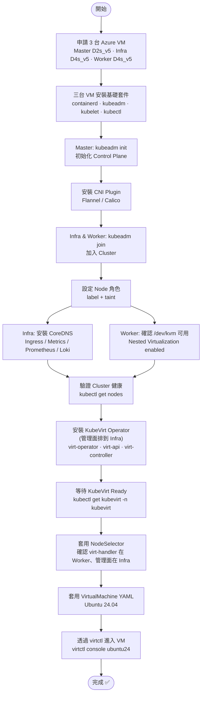

# K8s 三節點 + KubeVirt 架設流程

> 分類：flowchart  
> 架構決策：Option A — Master 僅承載 K8s Control Plane，Infra 部署基礎設施服務與 KubeVirt 管理面

## 架設流程圖

---

## 流程說明

| 步驟 | 動作 | 執行節點 | Option A 備註 |
|------|------|---------|--------------|
| 1 | 申請 Azure VM(Master/Infra/Worker) | — | Infra 需 D4s_v5(多承載基礎設施服務與 KubeVirt 管理面) |
| 2 | 安裝 containerd + kubeadm + kubelet + kubectl | 全部 | — |
| 3 | `kubeadm init` 初始化 Control Plane | Master | — |
| 4 | 安裝 CNI Plugin（Flannel） | Master | — |
| 5 | `kubeadm join` 加入 Cluster | Infra, Worker | — |
| 6 | 設定 Node label + taint | Master (kubectl) | Infra 加 KubeVirt mgmt toleration |
| 7 | 部署 CoreDNS / Ingress / Prometheus / Loki | Infra | — |
| 8 | 確認 `/dev/kvm` 可用（Nested Virt） | Worker | — |
| 9 | 驗證 `kubectl get nodes` 全部 Ready | Master (kubectl) | — |
| 10 | 安裝 KubeVirt Operator + CR | Master (kubectl) | virt-operator/virt-api/virt-controller → Infra |
| 11 | 確認 virt-handler DaemonSet 僅在 Worker | Master (kubectl) | virt-handler 需 /dev/kvm |
| 12 | 等待 KubeVirt Available | Master (kubectl) | — |
| 13 | 套用 Ubuntu 24.04 VirtualMachine YAML | Master (kubectl) | VMI Pod 排到 Worker |
| 14 | `virtctl console ubuntu24` 進入 VM | Master (virtctl) | — |

---

## 參考資料

- [kubeadm 安裝指南](https://kubernetes.io/docs/setup/production-environment/tools/kubeadm/)
- [KubeVirt 安裝指南](https://kubevirt.io/user-guide/operations/installation/)
- [Flannel 安裝](https://github.com/flannel-io/flannel)
