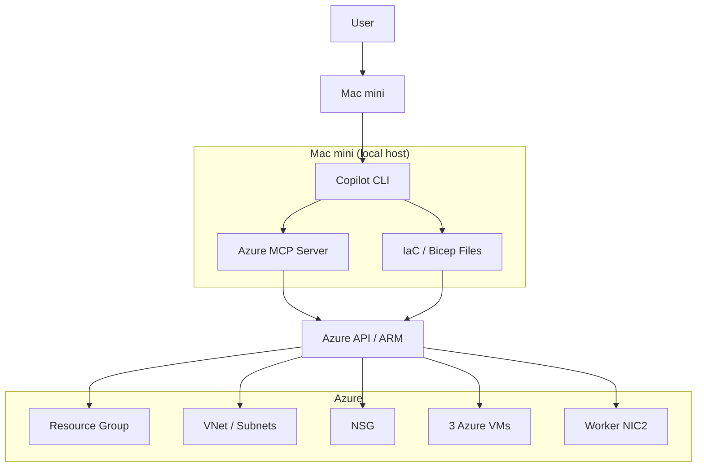

# Phase 0 — Azure 資源建立

## 共通輸入

| 項目 | 值 |
|------|----|
| Resource Group | `mansion_kubevirt_resource` |
| Region | 例如 `japaneast` |
| VNet | `mansion_kubevirt_vnet` |
| Address space（節點 & VM overlay） | `10.10.0.0/16` |
| `mansion_kubevirt_node_subnet`（K8s 節點子網） | `10.10.10.0/24` |
| `mansion_kubevirt_vm_subnet`（VM overlay，Worker eth1） | `10.10.100.0/24` |
| `mansion_kubevirt_ceph_subnet`（保留，ARM PUT 安全） | `172.10.10.0/24` |
| SSH user | `ubuntu` |
| SSH public key | 由使用者提供 |
| NSG allowed source | 使用者的固定 Public IP 或 CIDR |


## 環境概覽

| 節點 | Azure VM | Private IP | 角色 |
|------|----------|------------|------|
| mansion_kubevirt_master | Standard_D2s_v4 (2C/8G) | 10.10.10.11 | K8s CP |
| mansion_kubevirt_infra | Standard_D4s_v4 (4C/16G) | 10.10.10.12 | Prometheus + OpenSearch + Fluent Bit + KubeVirt 管理面 |
| mansion_kubevirt_worker | Standard_D4s_v4 (4C/16G) | 10.10.10.13 | KubeVirt VM workload |

**Pod 網段：** 10.244.0.0/16（Cilium）  
**KubeVirt VM 網段：** 10.10.100.0/24（mansion_kubevirt_vm_subnet，Worker eth1）

---

## 建置模式

| 模式 | 適用情境 | 說明 |
|------|----------|------|
| Option A | 第一次熟悉 Azure Portal | 手動建立 RG、VNet、NSG、VM、NIC 與 IP |
| Option B | 未來重建 / 重複部署 | 在 Mac mini 上由本地 Copilot CLI 透過 Azure MCP + IaC 代執行 |

## Option A：Azure VM 建立（Portal GUI）

### Step 0-1：建立 Resource Group

1. Portal → **Resource groups** → **Create**
2. Subscription: 選你的訂閱
3. Resource group name: `mansion_kubevirt_resource`
4. Region: 選你最近的地區（例如 East Asia）
5. → **Review + create** → **Create**

---

### Step 0-2：建立 Virtual Network（共用，由 KubeVirt lab 建立）

1. Portal → **Virtual networks** → **Create**
2. Basics:
   - Resource group: `mansion_kubevirt_resource`
   - Name: `mansion_kubevirt_vnet`
   - Region: 同上
3. **IP addresses** tab：
   - Address space: `10.10.0.0/16`（K8s 節點 & VM overlay）
   - 新增第二個 address space: `172.10.0.0/16`（mansion_kubevirt_ceph_subnet 預留）
   - 刪除預設 subnet，新增三個：

   | Subnet name | Address range | 用途 |
   |-------------|---------------|------|
   | `mansion_kubevirt_node_subnet` | `10.10.10.0/24` | K8s 節點（master .11, infra .12, worker .13） |
   | `mansion_kubevirt_vm_subnet` | `10.10.100.0/24` | KubeVirt VM overlay（Worker eth1 專用） |
   | `mansion_kubevirt_ceph_subnet` | `172.10.10.0/24` | 預留，避免 KubeVirt 重部署時被 ARM PUT 刪除 |

4. → **Review + create** → **Create**

---

### Step 0-3：建立 Network Security Group

1. Portal → **Network security groups** → **Create**
2. Name: `mansion_kubevirt_nsg`，Resource group: `mansion_kubevirt_resource`
3. 建立後進入 NSG → **Inbound security rules** → 新增以下規則：

| Priority | Name | Port | Protocol | Source | Action |
|----------|------|------|----------|--------|--------|
| 100 | Allow-SSH | 22 | TCP | **Your IP** | Allow |
| 200 | Allow-K8sAPI | 6443 | TCP | **Your IP** | Allow |
| 300 | Allow-NodePort | 30000-32767 | TCP | **Your IP** | Allow |
| 1000 | Allow-Internal | Any | Any | `10.10.0.0/16` | Allow |

> ⚠️ Source 的 **Your IP** 填你家/辦公室的 Public IP（可到 https://myip.is 查詢）  
> 💡 `Allow-Internal` 的 Source CIDR `10.10.0.0/16` 覆蓋 mansion_kubevirt 所有節點（K8s 節點 10.10.10.x、VM overlay 10.10.100.x）之間的東西向流量。

---

### Step 0-4：建立 3 台 VM

每台 VM 重複以下步驟（共 3 次）：

#### Basics Tab

| 欄位 | mansion_kubevirt_master | mansion_kubevirt_infra | mansion_kubevirt_worker |
|------|-----------|-----------|-----------|
| VM name | `mansion_kubevirt_master` | `mansion_kubevirt_infra` | `mansion_kubevirt_worker` |
| Image | Ubuntu Server 22.04 LTS (Gen2) | 同左 | 同左 |
| Size | Standard_D2s_v4 | Standard_D4s_v4 | Standard_D4s_v4 |
| Auth type | SSH public key | 同左 | 同左 |
| Username | `ubuntu` | 同左 | 同左 |
| SSH key | 貼上你的 public key | 同左 | 同左 |

#### Disks Tab
- OS disk type: **Standard SSD (LRS)**（省費用）

#### Networking Tab
| 欄位 | 設定 |
|------|------|
| Virtual network | `mansion_kubevirt_vnet` |
| Subnet | `mansion_kubevirt_node_subnet` |
| Public IP | 建立新的（Static，名稱如 `mansion_kubevirt_master_pip`）|
| NIC network security group | **Advanced** → 選 `mansion_kubevirt_nsg` |

**⚠️ 重要：設定 Static Private IP**

建立後：VM → **Networking** → NIC → **IP configurations** → `ipconfig1` → Assignment 改為 **Static**，IP 填入：

| 節點 | Private IP |
|------|-----------|
| mansion_kubevirt_master | `10.10.10.11` |
| mansion_kubevirt_infra | `10.10.10.12` |
| mansion_kubevirt_worker | `10.10.10.13` |

---

### Step 0-5：Worker 加第二張 NIC

1. **先停止 mansion_kubevirt_worker**（Worker 必須停機才能加 NIC）
2. Portal → mansion_kubevirt_worker → **Networking** → **Attach network interface** → **Create and attach network interface**
3. 設定：
   - Name: `mansion_kubevirt_worker_nic2`
   - Subnet: `mansion_kubevirt_vm_subnet`（10.10.100.0/24）
   - Private IP assignment: **Static** → `10.10.100.13`（Worker eth1 IP）
4. 建立後 → 啟動 Worker

---

### Step 0-6：Worker eth1 啟用 IP Forwarding

1. Portal → k8s-worker → **Networking** → 點選第二張 NIC（`mansion_kubevirt_worker_nic2`）
2. → **IP configurations** → 頂部有 **IP forwarding** 選項 → 設為 **Enabled**
3. 儲存

---

### Step 0-7：驗證 VM 建立完成

SSH 進入三台 VM：

```bash
# 從 Portal 取得各 VM 的 Public IP
ssh ubuntu@<MASTER_PUBLIC_IP>
ssh ubuntu@<INFRA_PUBLIC_IP>
ssh ubuntu@<WORKER_PUBLIC_IP>
```

在每台 VM 確認 Private IP 與介面：

```bash
ip addr show
# master 應看到 eth0: 10.10.10.11
# infra  應看到 eth0: 10.10.10.12
# worker 應看到 eth0: 10.10.10.13 + eth1: 10.10.100.13
```

三台互 ping（確認 NSG `Allow-Internal` 規則允許東西向流量）：

```bash
# 在 master 上（eth0: 10.10.10.11，位於 mansion_kubevirt_node_subnet）
ping -c 3 10.10.10.12  # infra
ping -c 3 10.10.10.13  # worker
```

---

## Option B：Mac mini + Azure MCP + IaC

### Pretasks on Mac mini

1. 安裝 Azure CLI
2. 完成 `az login`
3. 確認正確 subscription
4. 安裝並啟用 Azure MCP server
5. 確認本地 Copilot CLI 可連到 Azure MCP
6. 準備 SSH public key
7. 準備 IaC 模板與參數檔
8. 確認 NSG 允許來源 IP / CIDR
9. 確認 Azure quota 與 VM SKU 可用

### MCP 架構是什麼

| 元件 | 角色 |
|------|------|
| Copilot CLI | 協調者，接收使用者指令並決定呼叫哪個工具 |
| Azure MCP server | Azure 工具入口，讓 Copilot 能操作 Azure 能力 |
| Azure API / ARM | 真正建立資源的執行端 |
| IaC（建議 Bicep） | 定義 RG、VNet、Subnet、NSG、NIC、VM 的藍圖 |
| Mac mini | 本地控制主機，承載登入狀態、MCP server 與 IaC 模板 |



### Option B 執行流程

1. 在 Mac mini 開啟本地 Copilot CLI
2. 驗證 Azure MCP 可用
3. 載入 IaC 模板與參數檔（見 [IaC README](../iac/)）
4. 建立以下 Azure 資源：
   - Resource Group
   - VNet + 2 個 Subnet
   - NSG + inbound rules
   - 3 台 VM
   - Static Private/Public IP
   - Worker 第 2 張 NIC
   - Worker 第 2 張 NIC 的 IP forwarding
5. 回報建置結果與驗證清單

### Option B 預期輸出

- `mansion_kubevirt_resource`
- `mansion_kubevirt_vnet`
- `mansion_kubevirt_node_subnet`（10.10.10.0/24，K8s 節點子網）
- `mansion_kubevirt_vm_subnet`（10.10.100.0/24，VM overlay）
- `mansion_kubevirt_ceph_subnet`（172.10.10.0/24，保留）
- `mansion_kubevirt_nsg`
- `mansion_kubevirt_master`（10.10.10.11）
- `mansion_kubevirt_infra`（10.10.10.12）
- `mansion_kubevirt_worker`（10.10.10.13）
- Worker 第 2 張 NIC `mansion_kubevirt_worker_nic2`（10.10.100.13）
