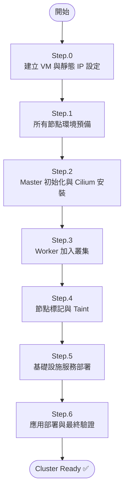
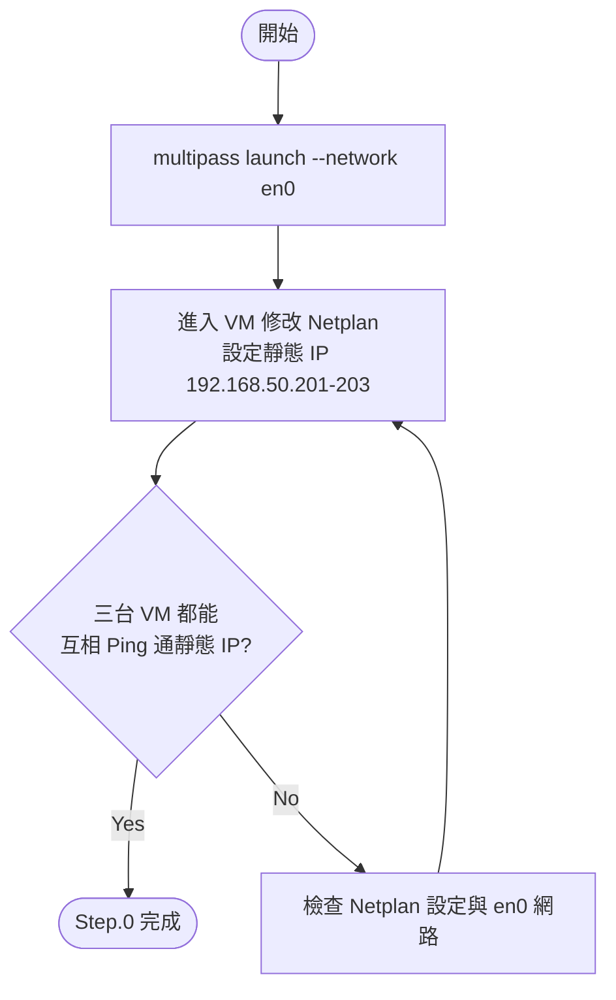
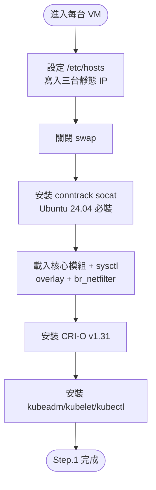
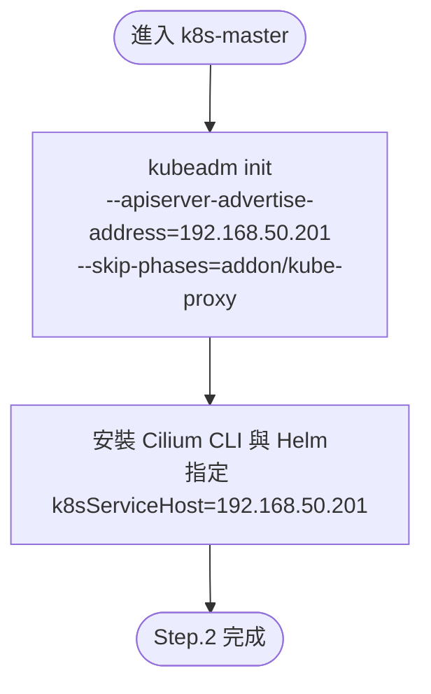
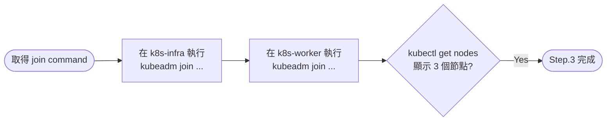
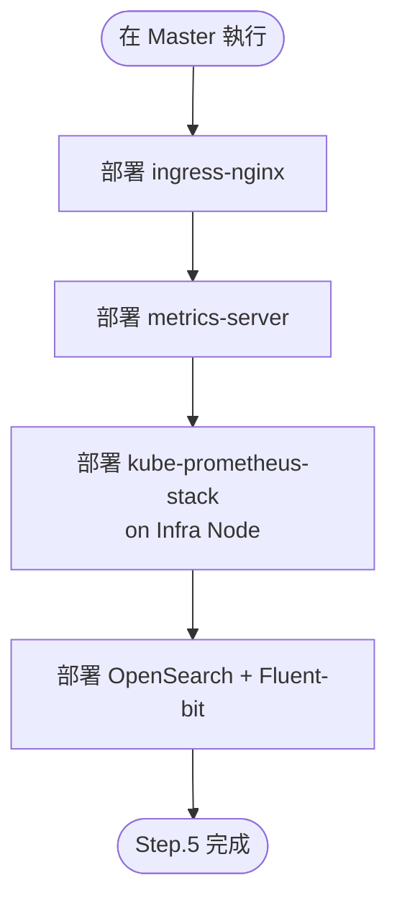
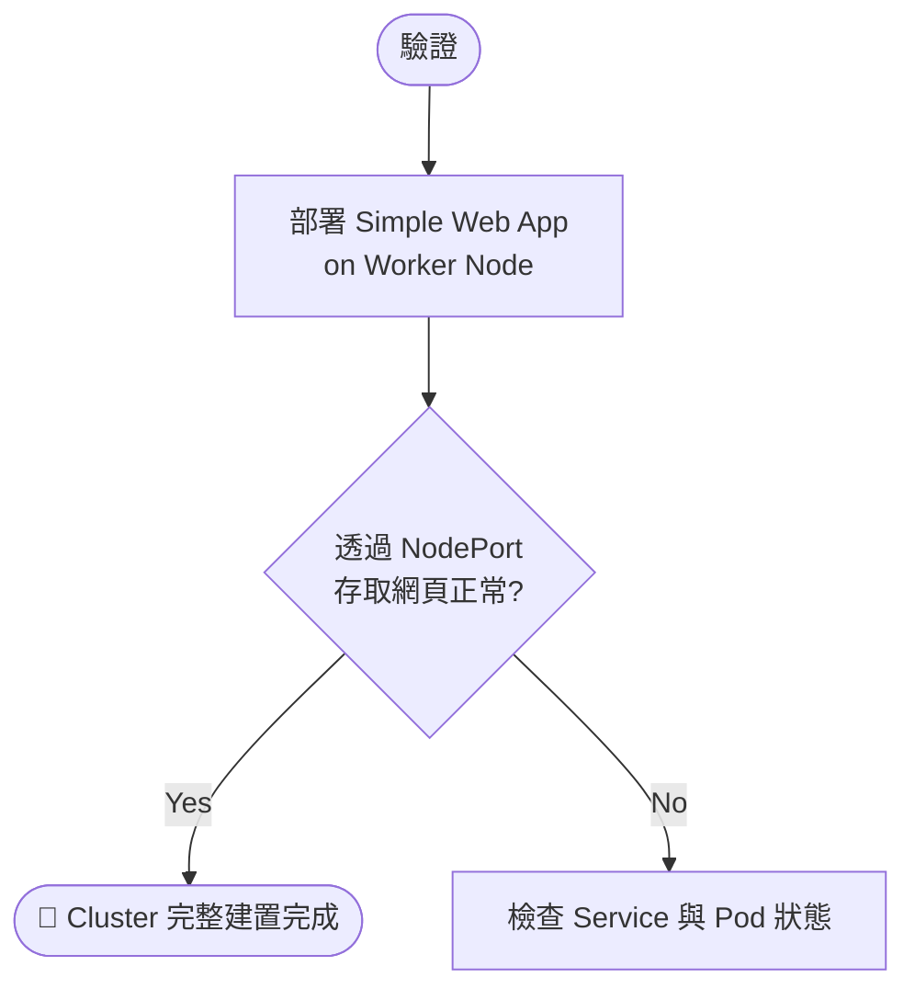

# Mac Mini K8s 三節點建置流程

> 建立日期：2026-04-11  
> 更新日期：2026-05-17 (修正靜態 IP、CNI 參數與全文件步驟對齊)  
> 分類：flowchart  
> 前置條件：已安裝 Multipass 1.15+、Mac 連接至 192.168.50.x/24 網段

## 總覽流程圖

---

## Step.0：建立 Multipass VM 與網路設定

---

## Step.1：所有節點環境預備

---

## Step.2：Master 初始化與 Cilium 安裝

---

## Step.3：Worker 加入叢集

---

## Step.5：基礎設施服務部署

---

## Step.6：應用部署與驗證

---

## 驗證 Checklist

- [ ] 所有節點狀態為 **Ready** (`kubectl get nodes`)
- [ ] Cilium 狀態為 **OK** (`cilium status`)
- [ ] 所有系統 Pod 狀態為 **Running**
- [ ] 可從 Mac Mini 存取 Web App NodePort
- [ ] Grafana 儀表板可正常開啟
