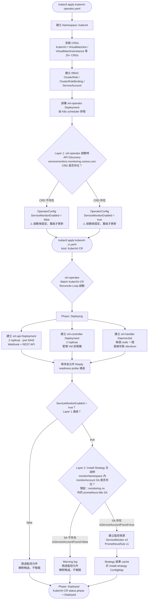

# KubeVirt v1.5.0 — virt-operator 安裝流程與元件建立機制

> 建立日期：2026-04-15  
> 分類：concepts/kubevirt  
> 版本：KubeVirt v1.5.0

---

## 概述

KubeVirt 採用 Operator Pattern 安裝。安裝分兩步：先 apply operator（含 CRD），再 apply KubeVirt CR。virt-operator 監聽 KubeVirt CR 後，自動建立 virt-api、virt-controller、virt-handler，並視叢集是否有 Prometheus Operator 來決定是否建立 ServiceMonitor 與 PrometheusRule。

---

## 安裝順序

```bash
# Step 1：安裝 operator（含 CRD、RBAC、virt-operator Deployment）
kubectl apply -f https://github.com/kubevirt/kubevirt/releases/download/v1.5.0/kubevirt-operator.yaml

# Step 2：等 virt-operator Running 後，apply KubeVirt CR
kubectl wait -n kubevirt deployment/virt-operator --for=condition=Available --timeout=2m
kubectl apply -f https://github.com/kubevirt/kubevirt/releases/download/v1.5.0/kubevirt-cr.yaml

# Step 3：等待完全部署完成
kubectl wait kv kubevirt -n kubevirt --for=condition=Available --timeout=10m
```

> ⚠️ 不能反過來。`kind: KubeVirt` CR 依賴 kubevirt-operator.yaml 裡安裝的 CRD，若先 apply CR 會報錯：`no kind "KubeVirt" is registered`

---

## virt-operator 元件建立流程圖



---

## 元件建立順序說明

### Stage 1：kubevirt-operator.yaml 包含

| 資源 | 說明 |
|------|------|
| Namespace `kubevirt` | 所有 KubeVirt 元件的命名空間 |
| 20+ CRDs | VirtualMachine、VirtualMachineInstance、KubeVirt、DataVolume 等 |
| ClusterRole / ClusterRoleBinding | virt-operator 的 RBAC 權限 |
| ServiceAccount | virt-operator 身份 |
| Deployment `virt-operator` | Operator 本體，啟動後開始監聽 KubeVirt CR |

### Stage 2：apply KubeVirt CR 後，virt-operator reconcile 建立

| 元件 | 類型 | replicas | 功能 |
|------|------|----------|------|
| `virt-api` | Deployment | 2 | 處理 VM/VMI REST API 請求、Webhook |
| `virt-controller` | Deployment | 2 | 管理 VM 生命週期狀態機 |
| `virt-handler` | DaemonSet | 每 node 1 | Node-level KVM agent，直接存取 /dev/kvm |
| `virt-exportproxy` | Deployment | 1 | VM disk export 功能（v1.x 新增）|
| `ServiceMonitor` × 4 | 監控資源 | — | 條件建立（見下節）|
| `PrometheusRule` | 監控資源 | — | 條件建立（見下節）|

---

## ServiceMonitor & PrometheusRule 條件建立機制

virt-operator 採用**兩層判斷**決定是否建立監控資源，缺一不可：

### Layer 1：API Discovery（virt-operator 啟動時，一次性）

- **時機**：virt-operator Pod 啟動時執行，結果固定在 `OperatorConfig`，**重啟才會重新判斷**
- **位置**：`pkg/virt-operator/util/client.go`
- **邏輯**：使用 `DiscoveryClient` 掃描 cluster 上所有 API groups，確認 `monitoring.coreos.com/v1` 下是否有 `servicemonitors` resource

```go
func IsServiceMonitorEnabled(clientset kubecli.KubevirtClient) bool {
    _, resources, _ := clientset.DiscoveryClient().ServerGroupsAndResources()
    for _, r := range resources {
        if r.GroupVersion == "monitoring.coreos.com/v1" {
            for _, res := range r.APIResources {
                if res.Name == "servicemonitors" {
                    return true  // ← 設定 OperatorConfig.ServiceMonitorEnabled = true
                }
            }
        }
    }
    return false
}
```

### Layer 2：SA 存在判斷（apply kubevirt-cr.yaml 後，生成 Install Strategy 時）

- **時機**：`GenerateCurrentInstallStrategy()` 被呼叫時（apply KubeVirt CR 觸發 reconcile）
- **位置**：`pkg/virt-operator/resource/generate/install/strategy.go`
- **邏輯**：依 `monitorNamespace` + `monitorAccount`（來自 KubeVirt CR spec 或預設值）查找 ServiceAccount 是否存在

```go
func getMonitorNamespace(client kubecli.KubevirtClient, config *util.KubeVirtDeploymentConfig) (string, bool) {
    namespace := config.GetMonitorNamespace()   // 預設依序嘗試 openshift-monitoring → monitoring
    account   := config.GetMonitorAccount()     // 預設 prometheus-k8s

    _, err := client.CoreV1().ServiceAccounts(namespace).
        Get(context.Background(), account, metav1.GetOptions{})
    if err != nil {
        log.Warningf("ServiceAccount %s/%s not found, skipping monitoring resources", namespace, account)
        return "", false  // ← isServiceAccountFound = false → Strategy 不含監控資源
    }
    return namespace, true
}
```

- **結果快取**：Strategy 結果寫入 `install-strategy` ConfigMap，不會因為 SA 後來建立而自動重跑

### 兩層判斷組合結果

| Layer 1 (CRD 存在) | Layer 2 (SA 存在) | 結果 |
|-------------------|-----------------|------|
| ❌ | 任意 | 跳過，不報錯 |
| ✅ | ❌ | Warning log，跳過 |
| ✅ | ✅ | **自動建立 ServiceMonitor + PrometheusRule** |

### 常見踩坑情境

| 情境 | Layer 1 | Layer 2 | 結果 |
|------|---------|---------|------|
| 先裝 KubeVirt，後裝 Prometheus Operator | ❌（啟動時 CRD 不在）| ❌ | 跳過 |
| `servicemonitors` CRD 存在，但 SA 在不同 namespace | ✅ | ❌ | 跳過 |
| `monitorAccount` 設定了不存在的 SA 名稱 | ✅ | ❌ | 跳過 |
| 先裝 `kube-prometheus-stack`，再裝 KubeVirt | ✅ | ✅ | 自動建立 ✅ |

> **對本次建置的意義**：Phase 4a 先安裝 kube-prometheus-stack → Phase 5 安裝 KubeVirt 時，兩層判斷都通過，ServiceMonitor + PrometheusRule 會**自動建立**。

---

## Template 來源：內嵌在 Go Source Code

KubeVirt operator **不讀外部檔案**，所有資源 spec 都硬編碼在 source code 裡：

```
kubevirt/
└── pkg/virt-operator/resource/generate/components/
    ├── prometheus.go       ← ServiceMonitor + PrometheusRule template
    ├── deployments.go      ← virt-api + virt-controller Deployment template
    ├── daemonsets.go       ← virt-handler DaemonSet template
    ├── rbac.go             ← ClusterRole / ClusterRoleBinding template
    └── crds.go             ← 所有 KubeVirt CRD template
```

### PrometheusRule 包含的告警規則（部分）

| Alert Name | 說明 |
|------------|------|
| `KubevirtVMIExcessiveMigrationsDetected` | VM 遷移次數過多 |
| `KubevirtNoAvailableNodesToRunVMs` | 無可用節點運行 VM |
| `KubevirtVMStuck` | VM 卡在非預期狀態 |
| `KubevirtVmiRunningOutsideGuestInfrastructure` | VMI 在非預期節點運行 |
| `KubevirtOrphanedVirtualMachineInstances` | 孤兒 VMI（無對應 VM 資源）|
| `KubevirtVMHighMemoryUsage` | VM 記憶體使用率過高 |

### prometheus.go 簡化範例

```go
func NewPrometheusRule(namespace string) *promv1.PrometheusRule {
    return &promv1.PrometheusRule{
        ObjectMeta: metav1.ObjectMeta{
            Name:      "kubevirt-prometheus-rule",
            Namespace: namespace,
            Labels:    map[string]string{"prometheus.kubevirt.io": ""},
        },
        Spec: promv1.PrometheusRuleSpec{
            Groups: []promv1.RuleGroup{
                {
                    Name: "kubevirt.rules",
                    Rules: []promv1.Rule{
                        {
                            Alert: "KubevirtNoAvailableNodesToRunVMs",
                            Expr:  intstr.FromString(
                                `sum(kube_node_status_allocatable{resource="devices_kubevirt_io_kvm"}) == 0`,
                            ),
                            For:    &metav1.Duration{Duration: 5 * time.Minute},
                            Labels: map[string]string{"severity": "warning"},
                        },
                    },
                },
            },
        },
    }
}
```

---

## 重點整理

- **安裝順序**：`operator.yaml` → 等 virt-operator Running → `cr.yaml`
- **元件建立**：virt-operator watch KubeVirt CR → Reconcile → 依序建立 virt-api / virt-controller / virt-handler
- **監控資源**：**兩層判斷**，Layer 1（virt-operator 啟動時 API Discovery CRD）且 Layer 2（monitorNamespace 內 monitorAccount SA 存在）都通過才建立
- **Template 來源**：Go source code 硬編碼在 `pkg/virt-operator/resource/generate/components/`，不讀外部 YAML

---

## 手動補建 ServiceMonitor & PrometheusRule

> 適用情境：  
> 1. 安裝 KubeVirt 時 Prometheus Operator 尚未就緒，導致自動建立被跳過  
> 2. 想要**客製化** labels、selector、alerting rules 而不使用 virt-operator 內建版本

### 前置確認：確認監控資源是否已存在

```bash
kubectl get servicemonitor -n monitoring | grep kubevirt
kubectl get prometheusrule -n monitoring | grep kubevirt
# 若無任何輸出 → 需要手動補建
```

---

### 方法一：刪除 Strategy ConfigMap + 重啟 virt-operator（讓 Operator 自動補建）

**適用**：Prometheus Operator 已安裝、`monitoring` namespace 有 `prometheus-k8s` ServiceAccount、只需要預設版本的監控資源。

```bash
# 1. 刪除舊的 install strategy（讓 virt-operator 重新評估叢集環境）
kubectl delete cm -n kubevirt -l kubevirt.io/install-strategy

# 2. 重啟 virt-operator（重設 OperatorConfig.ServiceMonitorEnabled flag）
kubectl rollout restart deployment/virt-operator -n kubevirt
kubectl rollout status deployment/virt-operator -n kubevirt

# 3. 確認監控資源已建立
kubectl get servicemonitor,prometheusrule -n monitoring
```

**原理**：  
- virt-operator 啟動時做 Layer 1（API Discovery）  
- Strategy ConfigMap 被刪除 → virt-operator 重跑 Layer 2（SA 存在判斷）  
- 兩層都通過 → 自動建立 ServiceMonitor + PrometheusRule

---

### 方法二：手動 apply YAML（可客製化 labels、selector、告警規則）

**適用**：想自訂 labels、scrape 設定，或修改 alerting rules threshold / severity，甚至加入業務告警。

#### ServiceMonitor

```yaml
# kubevirt-service-monitor.yaml
apiVersion: monitoring.coreos.com/v1
kind: ServiceMonitor
metadata:
  name: kubevirt-service-monitor
  namespace: monitoring                  # ← 視實際 serviceMonitorNamespace 調整
  labels:
    prometheus.kubevirt.io: "true"
    k8s-app: kubevirt
    # ▼ 客製化：加入自己的 label 讓特定 Prometheus instance selector 匹配
    # release: kube-prometheus-stack     # kube-prometheus-stack 預設用此 label 篩選 ServiceMonitor
spec:
  selector:
    matchLabels:
      prometheus.kubevirt.io: "true"     # 選出 kubevirt namespace 內所有 metrics Service
  namespaceSelector:
    matchNames:
      - kubevirt
  endpoints:
    - port: metrics
      scheme: https
      tlsConfig:
        insecureSkipVerify: true
      honorLabels: true
      # ▼ 客製化：調整 scrape interval
      # interval: 30s
      # scrapeTimeout: 10s
```

#### PrometheusRule

```yaml
# kubevirt-prometheus-rule.yaml
apiVersion: monitoring.coreos.com/v1
kind: PrometheusRule
metadata:
  name: kubevirt-prometheus-rule
  namespace: monitoring
  labels:
    prometheus.kubevirt.io: "true"
    k8s-app: kubevirt
    # ▼ 客製化：需匹配 Prometheus CR 的 ruleSelector
    # release: kube-prometheus-stack
spec:
  groups:
    - name: kubevirt.rules
      rules:
        # ── 官方規則（保留、可調整 threshold）──
        - alert: KubevirtNoAvailableNodesToRunVMs
          expr: |
            sum(kube_node_status_allocatable{resource="devices_kubevirt_io_kvm"}) == 0
          for: 5m
          labels:
            severity: warning
          annotations:
            summary: "沒有可用節點運行 VM"
            description: "叢集中無任何節點有可用的 KVM 資源"

        - alert: KubevirtVMStuck
          expr: |
            kubevirt_vm_error_status_last_transition_timestamp_seconds > 0
          for: 10m
          labels:
            severity: critical
          annotations:
            summary: "VM 卡在 Error 狀態超過 10 分鐘"
            description: "VM {{ $labels.name }} 在 namespace {{ $labels.namespace }} 處於錯誤狀態"

        # ── 客製化規則（範例）──
        - alert: KubevirtVMNotRunning
          expr: |
            kubevirt_vm_running_status_last_transition_timestamp_seconds == 0
          for: 15m
          labels:
            severity: warning
            team: platform
          annotations:
            summary: "VM {{ $labels.name }} 長時間未在 Running 狀態"
```

```bash
kubectl apply -f kubevirt-service-monitor.yaml
kubectl apply -f kubevirt-prometheus-rule.yaml
kubectl get servicemonitor,prometheusrule -n monitoring
```

> **kube-prometheus-stack 注意**：Prometheus 預設只抓 `release: <helm-release-name>` 的 ServiceMonitor/PrometheusRule。需在 `metadata.labels` 加入對應 label，或修改 Prometheus CR 的 `serviceMonitorSelector` / `ruleSelector`。

---

### 取得官方完整 YAML 的正確方式

> ⚠️ KubeVirt 的 ServiceMonitor / PrometheusRule **沒有獨立的 release YAML 檔**，全部硬編碼在 Go binary 中由 virt-operator 動態生成。要取得完整可 apply 的 YAML，有以下兩種方式：

#### 方式 A：從已安裝的叢集直接 export（最可靠）

virt-operator 兩層條件通過後，資源已建立在 monitoring namespace：

```bash
# 取得 PrometheusRule（含所有告警規則）
kubectl get prometheusrule -n monitoring -l prometheus.kubevirt.io -o yaml \
  | grep -v 'creationTimestamp\|resourceVersion\|uid\|generation\|managedFields' \
  > kubevirt-prometheus-rule.yaml

# 取得 ServiceMonitor
kubectl get servicemonitor -n monitoring -l prometheus.kubevirt.io -o yaml \
  | grep -v 'creationTimestamp\|resourceVersion\|uid\|generation\|managedFields' \
  > kubevirt-service-monitor.yaml
```

#### 方式 B：從 virt-operator image dump（無需叢集建立監控資源）

```bash
# 先確認 virt-operator image tag
kubectl get deployment -n kubevirt virt-operator -o jsonpath='{.spec.template.spec.containers[0].image}'

# 用同版本 image 執行 dump（需要 Docker / containerd 環境）
docker run --rm kubevirt/virt-operator:v1.5.0 \
  /usr/bin/virt-operator --dump-install-strategy 2>/dev/null \
  | python3 -c "
import sys, yaml
docs = list(yaml.safe_load_all(sys.stdin))
for d in docs:
    if d and d.get('kind') in ('ServiceMonitor', 'PrometheusRule'):
        print('---')
        print(yaml.dump(d, default_flow_style=False))
"
```

---

### 升級 KubeVirt 版本後的更新步驟

使用方法二（手動 apply YAML）時，virt-operator **不會**自動更新你手動建立的資源。升級 KubeVirt 後需要手動處理：

#### ServiceMonitor 的變動點（通常不大）

升級時需確認：
- 是否新增了元件（如 `virt-exportproxy`）需要對應的 metrics endpoint
- 端點的 port 名稱是否有更名

```bash
# 比對新版官方 ServiceMonitor 與目前手動版本的差異
# 1. 先 export 新版（方式 A 需要先讓 virt-operator 在測試叢集上跑一次）
# 2. diff 比較
diff kubevirt-service-monitor-old.yaml kubevirt-service-monitor-new.yaml
```

#### PrometheusRule 的變動點（每個版本都可能有變化）

告警規則變動最頻繁：新增告警、修改 expr、調整 threshold。

```bash
# Step 1：export 新版 KubeVirt 的 PrometheusRule（用方式 A 或 B 取得）
# 存為 kubevirt-prometheus-rule-vX.Y.Z.yaml

# Step 2：比對新舊規則差異
diff <(grep 'alert:' kubevirt-prometheus-rule-old.yaml | sort) \
     <(grep 'alert:' kubevirt-prometheus-rule-new.yaml | sort)

# Step 3：將新版官方規則 merge 進你的客製化版本
# - 保留自己新增的 alert rules（客製化部分）
# - 更新官方規則的 expr / for / labels（避免告警誤報或漏報）

# Step 4：apply 更新後的 YAML
kubectl apply -f kubevirt-prometheus-rule.yaml
```

#### 升級 checklist

| 項目 | ServiceMonitor | PrometheusRule |
|------|---------------|----------------|
| 新版 release notes 是否提到監控變動 | 查閱 | 查閱 |
| 新增元件的 endpoint | 確認 | — |
| 告警規則 expr / threshold 更新 | — | **必須同步** |
| 新增的告警規則 | — | 建議加入 |
| 客製化部分是否衝突 | 確認 | 確認 |

---

### 兩種方法比較

| 方法 | 適用情境 | 結果 |
|------|---------|------|
| **方法一**：刪 Strategy CM + 重啟 virt-operator | 只需預設版本、兩層條件已就緒 | 由 virt-operator 管理，升級時自動同步 |
| **方法二**：手動 apply YAML | 需客製化 labels / selector / alert rules | 完全自訂；升級 KubeVirt 後需手動 diff 新版並更新（見「升級步驟」）|

---

## 參考資料

- [KubeVirt v1.5.0 Release](https://github.com/kubevirt/kubevirt/releases/tag/v1.5.0)
- [virt-operator source: components/](https://github.com/kubevirt/kubevirt/tree/v1.5.0/pkg/virt-operator/resource/generate/components)
- [prometheus.go](https://github.com/kubevirt/kubevirt/blob/v1.5.0/pkg/virt-operator/resource/generate/components/prometheus.go)
- [KubeVirt Monitoring Docs](https://kubevirt.io/user-guide/monitoring/)
