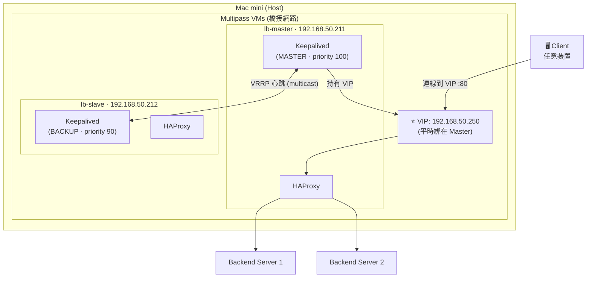
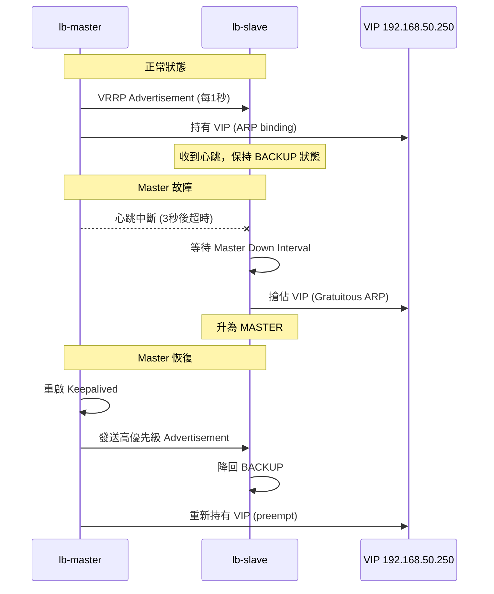
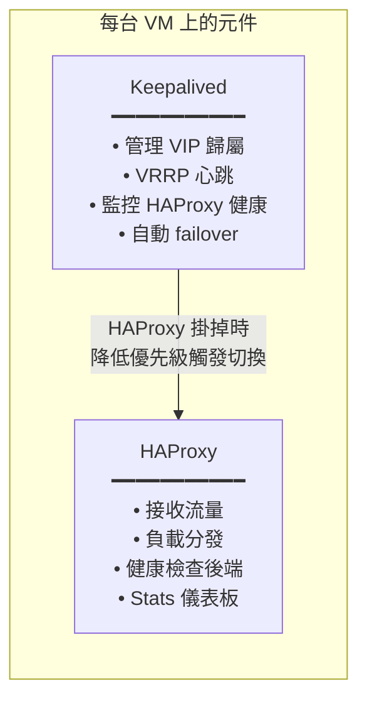
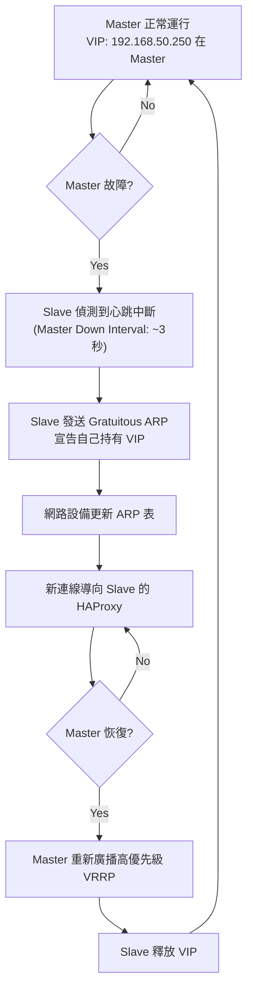

# Load Balancer 架構概覽

## 整體架構

## VRRP 協定原理

**VRRP（Virtual Router Redundancy Protocol）** 是一種讓多台機器共用一個虛擬 IP 的協定。

## Active-Standby vs Active-Active

| 模式 | 說明 | 本實驗 |
|------|------|--------|
| **Active-Standby** | 同時只有一台工作，另一台待命 | ✅ 使用此模式 |
| Active-Active | 兩台同時服務，需要 ECMP 或 DNS 輪詢 | 較複雜，進階主題 |

## 元件角色分工

### Keepalived 負責
- 透過 **VRRP** 在兩台機器間協商 VIP 歸屬
- 監控本機 HAProxy 是否存活（`vrrp_script`）
- HAProxy 死掉時自動降低 priority，觸發 VIP 漂移到 Slave

### HAProxy 負責
- 接收到達 VIP 的流量
- 根據設定的演算法（Round Robin / Least Conn 等）分發到後端
- 對後端做健康檢查，自動移除掛掉的後端

## 故障切換流程

## IP 規劃總結

| 用途 | IP | 備註 |
|------|----|------|
| lb-master 固定 IP | `192.168.50.211` | VM 靜態 IP，永遠存在 |
| lb-slave 固定 IP | `192.168.50.212` | VM 靜態 IP，永遠存在 |
| VIP（虛擬 IP） | `192.168.50.250` | 會在兩台間漂移 |
| Mac mini（Host） | `192.168.50.x` | 你的 Mac mini 實際 IP |
