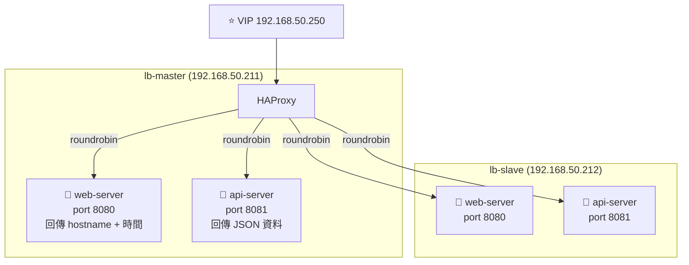

# Docker Backend Service

在 lb-master 和 lb-slave 兩台 VM 上各自跑 Docker 容器，作為 HAProxy 的後端服務。

## 架構說明



> 兩台 VM 上的 Docker 容器配置完全相同，方便觀察 HAProxy 輪流分配到不同 node。

---

## Step 1：安裝 Docker

在**兩台 VM** 都執行：

```bash
# 安裝 Docker
curl -fsSL https://get.docker.com | sudo sh

# 加入 docker 群組（免 sudo）
sudo usermod -aG docker $USER
newgrp docker

# 確認
docker version
```

---

## Step 2：建立 Docker Compose 檔案

在**兩台 VM** 都建立：

```bash
mkdir -p ~/backend && cd ~/backend
nano docker-compose.yml
```

貼入以下內容：

```yaml
version: '3.8'

services:
  web-server:
    image: nginx:alpine
    container_name: web-server
    ports:
      - "8080:80"
    volumes:
      - ./web/index.html:/usr/share/nginx/html/index.html:ro
    restart: unless-stopped

  api-server:
    image: python:3.11-alpine
    container_name: api-server
    ports:
      - "8081:8081"
    volumes:
      - ./api/app.py:/app/app.py:ro
    working_dir: /app
    command: python app.py
    restart: unless-stopped
```

---

## Step 3：建立 Web Server 頁面

```bash
mkdir -p ~/backend/web
```

**lb-master** 上建立（內容標示 master 方便觀察）：

```bash
# 在 lb-master 上執行
HOSTNAME=$(hostname)
cat > ~/backend/web/index.html << EOF
<!DOCTYPE html>
<html>
<head><title>Backend Web Server</title></head>
<body>
  <h1>🟢 Web Server</h1>
  <p><strong>Node:</strong> ${HOSTNAME}</p>
  <p><strong>IP:</strong> 192.168.50.211</p>
  <p><strong>Time:</strong> <span id="time"></span></p>
  <script>
    document.getElementById('time').textContent = new Date().toLocaleString();
  </script>
</body>
</html>
EOF
```

**lb-slave** 上建立（IP 改為 .212）：

```bash
# 在 lb-slave 上執行
HOSTNAME=$(hostname)
cat > ~/backend/web/index.html << EOF
<!DOCTYPE html>
<html>
<head><title>Backend Web Server</title></head>
<body>
  <h1>🔵 Web Server</h1>
  <p><strong>Node:</strong> ${HOSTNAME}</p>
  <p><strong>IP:</strong> 192.168.50.212</p>
  <p><strong>Time:</strong> <span id="time"></span></p>
  <script>
    document.getElementById('time').textContent = new Date().toLocaleString();
  </script>
</body>
</html>
EOF
```

---

## Step 4：建立 API Server

在**兩台 VM** 建立（`$HOSTNAME` 會自動帶入各自的 hostname）：

```bash
mkdir -p ~/backend/api
cat > ~/backend/api/app.py << 'EOF'
import http.server
import json
import socket
import datetime

class APIHandler(http.server.BaseHTTPRequestHandler):
    def do_GET(self):
        if self.path == '/health':
            self._respond(200, {"status": "ok"})
        elif self.path == '/api/info':
            self._respond(200, {
                "hostname": socket.gethostname(),
                "ip": socket.gethostbyname(socket.gethostname()),
                "timestamp": datetime.datetime.now().isoformat(),
                "service": "api-server"
            })
        else:
            self._respond(404, {"error": "not found"})

    def _respond(self, code, data):
        body = json.dumps(data, indent=2).encode()
        self.send_response(code)
        self.send_header('Content-Type', 'application/json')
        self.send_header('Content-Length', len(body))
        self.end_headers()
        self.wfile.write(body)

    def log_message(self, format, *args):
        print(f"[{datetime.datetime.now().isoformat()}] {format % args}")

server = http.server.HTTPServer(('0.0.0.0', 8081), APIHandler)
print("API Server running on :8081")
server.serve_forever()
EOF
```

---

## Step 5：啟動 Docker Compose

在**兩台 VM** 執行：

```bash
cd ~/backend
docker compose up -d

# 確認容器運行
docker ps
```

預期輸出：
```
CONTAINER ID   IMAGE            PORTS                    NAMES
xxxxxxxxxxxx   nginx:alpine     0.0.0.0:8080->80/tcp     web-server
xxxxxxxxxxxx   python:3.11-...  0.0.0.0:8081->8081/tcp   api-server
```

---

## Step 6：本機驗證

在各自 VM 上驗證：

```bash
# 測試 Web Server
curl http://localhost:8080
# 預期：HTML 頁面，含 hostname 和 IP

# 測試 API Server
curl http://localhost:8081/api/info
# 預期：
# {
#   "hostname": "lb-master",
#   "ip": "192.168.50.211",
#   "timestamp": "2024-...",
#   "service": "api-server"
# }

# 測試健康檢查端點
curl http://localhost:8081/health
# 預期：{"status": "ok"}
```

---

## Step 7：從 Mac 跨節點驗證

```bash
# 從 Mac 測試 lb-master 的後端
curl http://192.168.50.211:8080
curl http://192.168.50.211:8081/api/info

# 從 Mac 測試 lb-slave 的後端
curl http://192.168.50.212:8080
curl http://192.168.50.212:8081/api/info
```

兩台回應的 `hostname` 和 `ip` 欄位應不同，確認是不同的 node 在服務。

---

## 後端服務 URL 彙整

| 服務 | lb-master | lb-slave | HAProxy VIP |
|------|-----------|----------|-------------|
| Web | `192.168.50.211:8080` | `192.168.50.212:8080` | `192.168.50.250:80` |
| API | `192.168.50.211:8081` | `192.168.50.212:8081` | `192.168.50.250:8081` |
| Health | `:8081/health` | `:8081/health` | — |

下一步：更新 [HAProxy 配置](./haproxy-config) 指向這些後端，或使用 [Ansible Playbook](./ansible-playbook) 一鍵完成所有設定。
