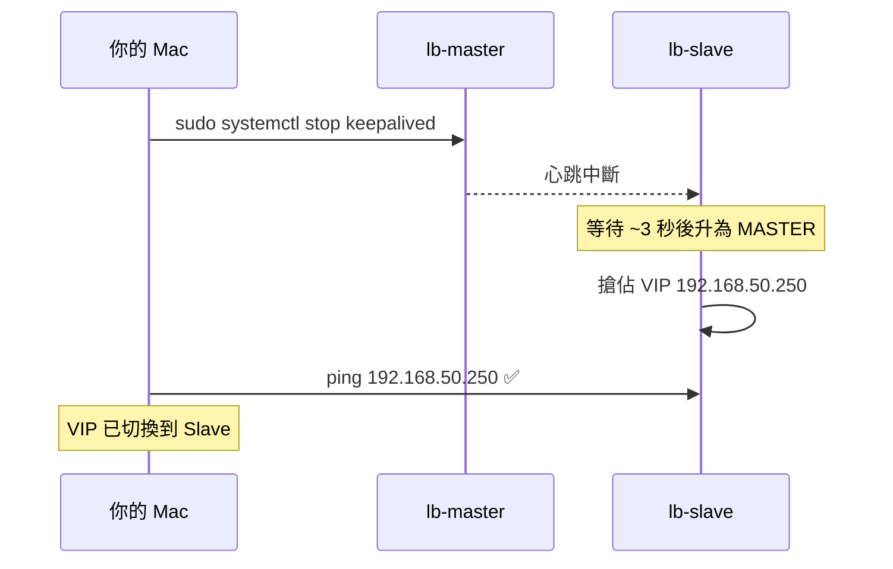
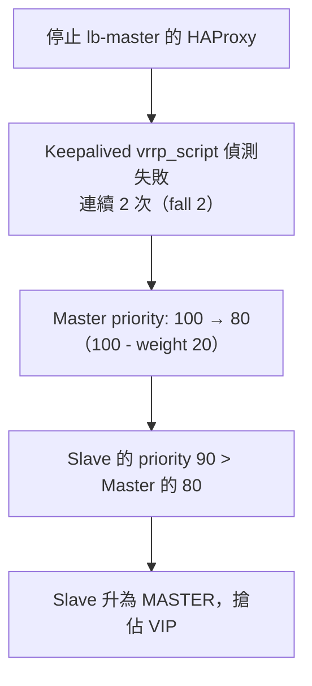

# 故障切換測試

## 測試前確認清單

在開始測試前，確認以下狀態都正常：

```bash
# 在 lb-master 執行
ip addr show ens4 | grep inet
# 預期：192.168.50.211 和 192.168.50.250 都存在

sudo systemctl status keepalived | grep Active
# 預期：active (running)

sudo systemctl status haproxy | grep Active
# 預期：active (running)
```

```bash
# 在 lb-slave 執行
ip addr show ens4 | grep inet
# 預期：只有 192.168.50.212，沒有 192.168.50.250

sudo systemctl status keepalived | grep Active
# 預期：active (running)
```

---

## 測試一：確認正常狀態的 VIP

從 Mac 執行：

```bash
# 確認 VIP 可達
ping -c 3 192.168.50.250

# 確認 VIP 在 Master（查看 ARP 表）
arp -n 192.168.50.250
# 預期：192.168.50.250 對應到 lb-master 的 MAC address
```

---

## 測試二：停止 Master 的 Keepalived（模擬 Master 故障）



**操作步驟：**

**Terminal 1（持續監控 VIP）：**
```bash
# 在 Mac 上持續 ping VIP，觀察中斷時間
ping 192.168.50.250
```

**Terminal 2（執行故障模擬）：**
```bash
# 停止 lb-master 的 keepalived
multipass exec lb-master -- sudo systemctl stop keepalived
```

**預期現象：**
- ping 會中斷約 **3~5 秒**（Master Down Interval）
- 之後恢復，VIP 已由 Slave 接管

**驗證 VIP 已切換：**
```bash
# 確認 Slave 現在持有 VIP
multipass exec lb-slave -- ip addr show ens4 | grep inet
# 預期：看到 192.168.50.250

# Master 上已沒有 VIP
multipass exec lb-master -- ip addr show ens4 | grep inet
# 預期：只有 192.168.50.211
```

---

## 測試三：Master 恢復後 VIP 回切

```bash
# 重新啟動 lb-master 的 keepalived
multipass exec lb-master -- sudo systemctl start keepalived
```

**預期現象：**
- Master 發送高優先級 VRRP Advertisement（priority: 100）
- Slave 收到後讓出 VIP（因為 `nopreempt` 在 Slave 設定，Master 主動廣播時 Slave 仍會讓出）
- VIP 回到 Master

```bash
# 確認 VIP 回到 Master
multipass exec lb-master -- ip addr show ens4 | grep inet
# 預期：看到 192.168.50.250
```

---

## 測試四：停止 HAProxy（Keepalived 的 vrrp_script 觸發切換）

這個測試驗證 `vrrp_script` 的功能：HAProxy 掛掉時，Keepalived 自動降低 priority 觸發切換。



**操作：**

```bash
# Terminal 1：監控 VIP
ping 192.168.50.250

# Terminal 2：停止 HAProxy（不停 Keepalived）
multipass exec lb-master -- sudo systemctl stop haproxy
```

**等待約 4~6 秒**（vrrp_script `interval 2` × `fall 2`）

```bash
# 確認 VIP 已切換到 Slave
multipass exec lb-slave -- ip addr show ens4 | grep inet
```

**恢復：**

```bash
multipass exec lb-master -- sudo systemctl start haproxy
# 等待 ~4 秒（rise 2），Master priority 恢復為 100，VIP 回切
```

---

## 測試五：直接關掉 VM（最極端情境）

```bash
# Terminal 1：持續 ping VIP
ping 192.168.50.250

# Terminal 2：暫停 lb-master VM
multipass stop lb-master
```

**預期：**
- ping 中斷約 **3~5 秒**
- Slave 接管 VIP

```bash
# 恢復 lb-master
multipass start lb-master

# 等 keepalived 自動啟動後，VIP 回切到 Master
sleep 10
multipass exec lb-master -- ip addr show ens4 | grep inet
```

---

## 測試結果記錄表

| 測試項目 | 切換時間 | 結果 | 備註 |
|----------|----------|------|------|
| 停止 Keepalived | ~3-5 秒 | VIP 漂移到 Slave | — |
| 恢復 Keepalived | ~2-3 秒 | VIP 回到 Master | — |
| 停止 HAProxy | ~4-6 秒 | VIP 漂移到 Slave | vrrp_script 觸發 |
| 恢復 HAProxy | ~4-6 秒 | VIP 回到 Master | priority 恢復 |
| 關掉 VM | ~3-5 秒 | VIP 漂移到 Slave | — |

> **切換時間影響因素**：`advert_int`（心跳間隔）+ Master Down Interval = 3 × advert_int

---

## 即時查看 Keepalived 日誌

```bash
# 在 lb-master 上即時追蹤日誌
multipass exec lb-master -- sudo journalctl -u keepalived -f
```

關鍵日誌訊息：

| 訊息 | 意義 |
|------|------|
| `Entering MASTER STATE` | 這台升為 Master，持有 VIP |
| `Entering BACKUP STATE` | 這台降為 Backup，釋放 VIP |
| `Script chk_haproxy succeeded` | HAProxy 健康 |
| `Script chk_haproxy failed` | HAProxy 異常，priority 下降 |
| `VRRP_Instance(VI_1) setting protocol VIPs` | 正在綁定 VIP |
| `VRRP_Instance(VI_1) removing protocol VIPs` | 正在釋放 VIP |
