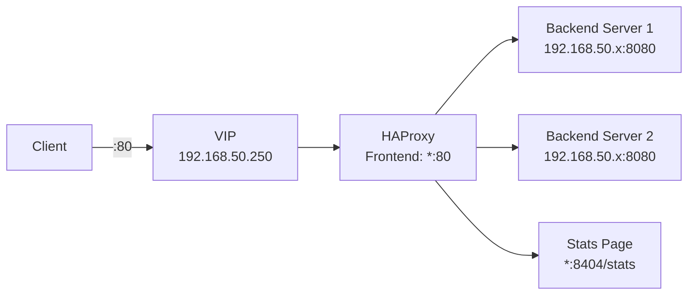
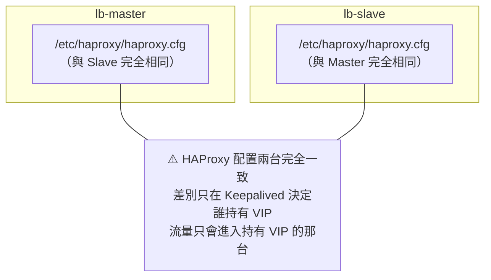

# HAProxy 配置

## 配置架構



> **說明**：HAProxy 配置在**兩台 VM 完全相同**。平時只有 Master 的 HAProxy 收到流量（因為 VIP 在 Master），Slave 的 HAProxy 保持待命狀態。

---

## 完整 HAProxy 配置

在**兩台 VM** 都執行相同步驟：

```bash
sudo nano /etc/haproxy/haproxy.cfg
```

貼入以下配置：

```cfg
#---------------------------------------------------------------------
# Global settings
#---------------------------------------------------------------------
global
    log /dev/log local0
    log /dev/log local1 notice
    chroot /var/lib/haproxy
    stats socket /run/haproxy/admin.sock mode 660 level admin expose-fd listeners
    stats timeout 30s
    user haproxy
    group haproxy
    daemon

    # 最大連線數
    maxconn 50000

#---------------------------------------------------------------------
# Defaults
#---------------------------------------------------------------------
defaults
    mode http
    log global
    option httplog
    option dontlognull
    option http-server-close
    option forwardfor except 127.0.0.0/8
    option redispatch
    retries 3
    timeout http-request    10s
    timeout queue           1m
    timeout connect         10s
    timeout client          1m
    timeout server          1m
    timeout http-keep-alive 10s
    timeout check           10s
    maxconn 3000

#---------------------------------------------------------------------
# Stats 監控頁面
#---------------------------------------------------------------------
frontend stats
    bind *:8404
    stats enable
    stats uri /stats
    stats refresh 10s
    stats show-legends
    stats show-node
    stats auth admin:admin123          # 帳號:密碼（建議修改）

#---------------------------------------------------------------------
# Frontend：對外接收流量
#---------------------------------------------------------------------
frontend http_front
    bind *:80
    default_backend http_back

#---------------------------------------------------------------------
# Backend：後端伺服器列表
#---------------------------------------------------------------------
backend http_back
    balance roundrobin                 # 負載均衡演算法：Round Robin

    # 健康檢查：每 5 秒一次，連續失敗 3 次移除，成功 2 次恢復
    option httpchk GET /health
    http-check expect status 200

    # 後端 Web Server（Docker 容器，跑在兩台 VM 上）
    server lb-master 192.168.50.211:8080 check inter 5s fall 3 rise 2
    server lb-slave  192.168.50.212:8080 check inter 5s fall 3 rise 2
```

---

## 設定說明

### 負載均衡演算法

| 演算法 | 設定值 | 說明 | 適用場景 |
|--------|--------|------|----------|
| Round Robin | `roundrobin` | 輪流分配（預設）| 無狀態服務 |
| Least Connections | `leastconn` | 送到連線數最少的 | 長連線服務 |
| Source IP Hash | `source` | 同 IP 固定到同後端 | 需要 Session 黏性 |
| Random | `random` | 隨機選擇 | 測試用 |

### Server 行選項說明

```
server web1 192.168.50.101:8080 check inter 5s fall 3 rise 2
│      │    │                   │     │       │    │   └─ 恢復需連續成功 2 次
│      │    │                   │     │       │    └───── 移除需連續失敗 3 次
│      │    │                   │     │       └────────── 檢查間隔 5 秒
│      │    │                   │     └────────────────── 啟用健康檢查
│      │    │                   └──────────────────────── 後端 IP:Port
│      │    └──────────────────────────────────────────── 後端名稱
└──────┴───────────────────────────────────────────────── 關鍵字
```

---

## 快速測試用後端（無真實後端時）

如果你還沒有後端伺服器，可以在 lb-master 和 lb-slave 本機跑一個簡單的測試服務：

```bash
# 在任意一台或 Mac 上，用 Python 啟動一個簡單 HTTP server
python3 -m http.server 8080
```

然後把 haproxy.cfg 中的後端改為本機 IP 測試：

```cfg
backend http_back
    balance roundrobin
    server local1 127.0.0.1:8080 check
```

---

## 啟動 HAProxy

在**兩台 VM** 都執行：

```bash
# 先驗證配置語法
sudo haproxy -c -f /etc/haproxy/haproxy.cfg
# 輸出 "Configuration file is valid" 代表正確

# 啟動
sudo systemctl enable haproxy
sudo systemctl start haproxy

# 查看狀態
sudo systemctl status haproxy
```

---

## 存取 Stats 頁面

HAProxy 提供內建的監控頁面，可以看到後端健康狀態：

```bash
# 從 Mac 瀏覽器開啟（VIP 持有者的 Stats 頁面）
open http://192.168.50.250:8404/stats
```

帳號：`admin` / 密碼：`admin123`

Stats 頁面可以看到：
- 前端/後端連線統計
- 每台後端的狀態（綠色 = 正常，紅色 = 掛掉）
- 請求數、錯誤率、回應時間

---

## 兩台 VM 配置完全相同



下一步：[故障切換測試](./failover-testing)
