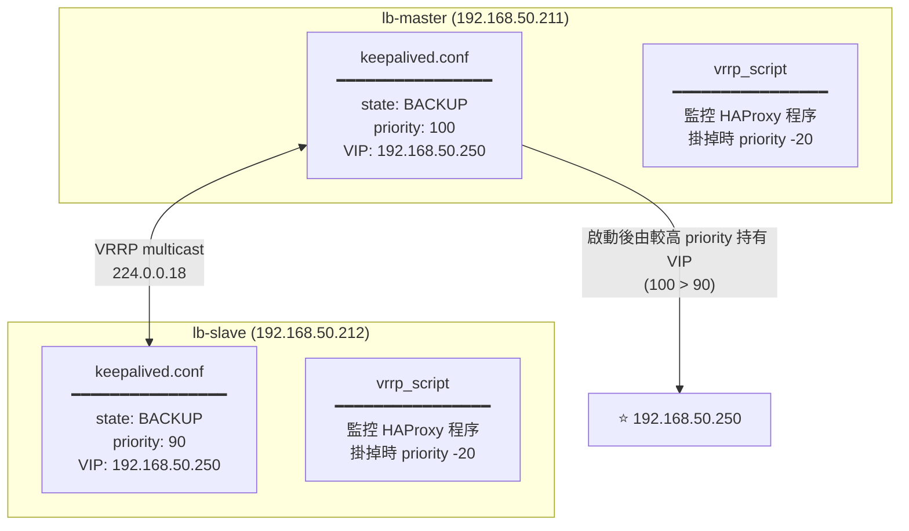
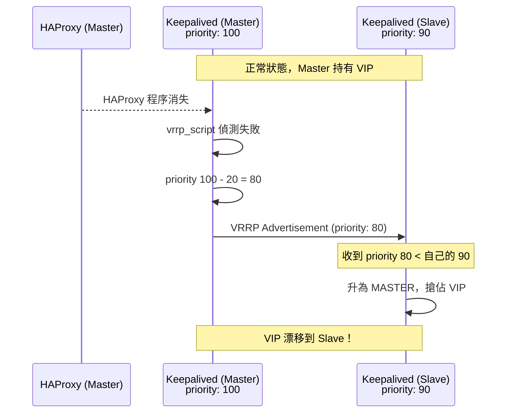

# Keepalived 配置

## 配置架構



> 將上面配置裡的 `<bridge-iface>` 替換成你的橋接網卡名稱（例如 `ens4` 或 `enp0s2`）。

---

## lb-master 配置

在 lb-master 上執行：

```bash
multipass shell lb-master
sudo nano /etc/keepalived/keepalived.conf
```

貼入以下完整配置：

```conf
! Configuration File for keepalived

# 全域設定
global_defs {
    router_id lb-master          # 本機識別名稱（任意字串）
    script_user root             # 執行腳本的使用者
    enable_script_security       # 安全模式
}

# 監控 HAProxy 程序的腳本
vrrp_script chk_haproxy {
    script "killall -0 haproxy"  # 確認 haproxy 程序存在
    interval 2                   # 每 2 秒檢查一次
    weight -20                   # HAProxy 掛掉時，priority 減 20
    fall 2                       # 連續失敗 2 次才判定為掛掉
    rise 2                       # 連續成功 2 次才判定為恢復
}

# VRRP 實例設定
vrrp_instance VI_1 {
    state BACKUP                 # 初始角色：Backup（No preempt 模式）
    interface <bridge-iface>     # 橋接網卡名稱（例如 ens4 / enp0s2）
    virtual_router_id 51         # VRRP 群組 ID（Master 和 Slave 要一致）
    priority 100                 # 優先級（越高越優先持有 VIP）
    advert_int 1                 # VRRP 廣播間隔（秒）
    nopreempt                    # 不主動搶回 VIP（No preempt）

    # 注意：若家用路由器不支援多播 (Multicast)，請取消註解並設定單播 (Unicast)
    # unicast_src_ip 192.168.50.211  # 本機 IP
    # unicast_peer {
    #     192.168.50.212              # 對端 IP
    # }

    authentication {
        auth_type PASS
        auth_pass LB2024secret   # 認證密碼（Master 和 Slave 要一致）
    }

    virtual_ipaddress {
        192.168.50.250/24        # VIP 設定
    }

    # 掛載 HAProxy 監控腳本
    track_script {
        chk_haproxy
    }
}
```

> 將上面配置裡的 `<bridge-iface>` 替換成和 lb-master 相同的橋接網卡名稱。

---

## lb-slave 配置

在 lb-slave 上執行：

```bash
multipass shell lb-slave
sudo nano /etc/keepalived/keepalived.conf
```

貼入以下配置（**與 Master 的差異標記了注解**）：

```conf
! Configuration File for keepalived

global_defs {
    router_id lb-slave           # ← 改這裡
    script_user root
    enable_script_security
}

vrrp_script chk_haproxy {
    script "killall -0 haproxy"
    interval 2
    weight -20
    fall 2
    rise 2
}

vrrp_instance VI_1 {
    state BACKUP                 # ← 改這裡：BACKUP
    interface <bridge-iface>
    virtual_router_id 51         # ← 必須和 Master 一樣
    priority 90                  # ← 改這裡：90（低於 Master 的 100）
    advert_int 1
    nopreempt                    # ← 改這裡：不主動搶回（等 Master 主動釋放）

    authentication {
        auth_type PASS
        auth_pass LB2024secret   # ← 必須和 Master 一樣
    }

    virtual_ipaddress {
        192.168.50.250/24
    }

    track_script {
        chk_haproxy
    }
}
```

---

## Master vs Slave 設定對照表

| 設定項 | lb-master | lb-slave | 說明 |
|--------|-----------|----------|------|
| `router_id` | `lb-master` | `lb-slave` | 各自識別用 |
| `state` | `BACKUP` | `BACKUP` | 初始角色（No preempt 模式） |
| `priority` | `100` | `90` | Master 較高，優先持有 VIP |
| `virtual_router_id` | `51` | `51` | **必須相同** |
| `advert_int` | `1` | `1` | **必須相同** |
| `auth_pass` | `LB2024secret` | `LB2024secret` | **必須相同** |
| `preempt` / `nopreempt` | `nopreempt` | `nopreempt` | 不主動搶回，避免來回漂移 |

---

## 啟動 Keepalived

在**兩台 VM** 都執行（建議先啟動 Master，再啟動 Slave）：

```bash
# 啟動並設定開機自啟
sudo systemctl enable keepalived
sudo systemctl start keepalived

# 查看狀態
sudo systemctl status keepalived
```

---

## 驗證 VIP 位置

先找出你的橋接網卡名稱（例如 `ens4` 或 `enp0s2`）：

```bash
ip -o link show
```

**在 lb-master 確認 VIP 存在：**

```bash
ip addr show <bridge-iface>
```

預期輸出（應看到兩個 IP）：
```
3: <bridge-iface>: <BROADCAST,MULTICAST,UP,LOWER_UP> ...
    inet 192.168.50.211/24 ...   ← 固定 IP
    inet 192.168.50.250/24 ...   ← VIP（Master 持有）
```

**在 lb-slave 確認 VIP 不在這裡：**

```bash
ip addr show <bridge-iface>
```

預期輸出（只有固定 IP，沒有 VIP）：
```
3: <bridge-iface>: <BROADCAST,MULTICAST,UP,LOWER_UP> ...
    inet 192.168.50.212/24 ...   ← 只有固定 IP
```

**查看 Keepalived 日誌：**

```bash
sudo journalctl -u keepalived -f
```

正常的 Master 日誌應包含：
```
Keepalived_vrrp: VRRP_Instance(VI_1) Transition to MASTER STATE
Keepalived_vrrp: VRRP_Instance(VI_1) Entering MASTER STATE
Keepalived_vrrp: VRRP_Instance(VI_1) setting protocol VIPs.
```

---

## HAProxy 崩潰時的 Priority 變化



下一步：[故障切換測試](./failover-testing.md)
