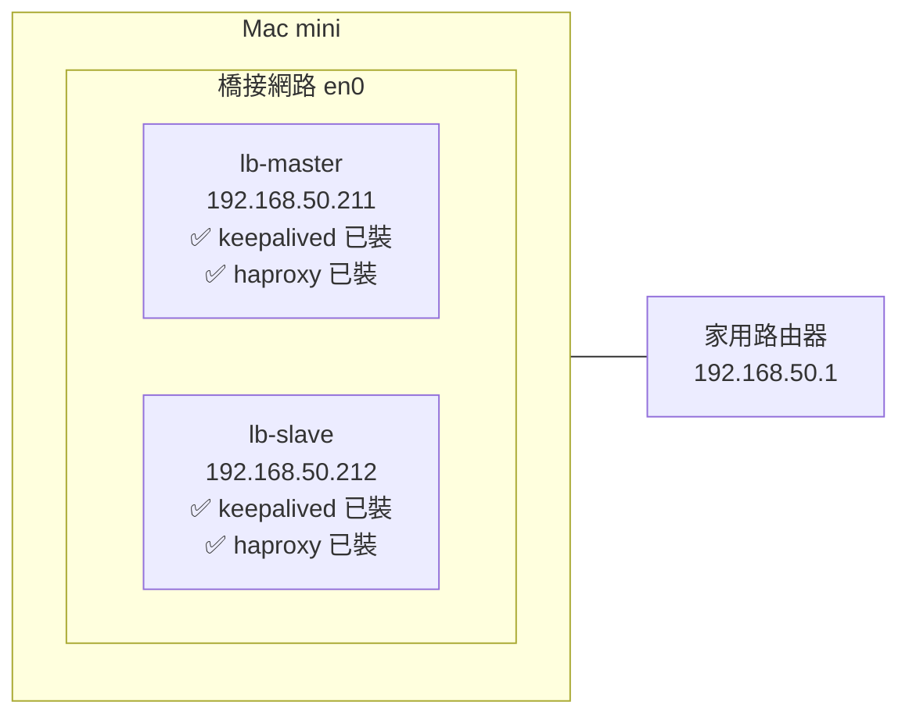

# VM 環境搭建

## 前置要求

| 項目 | 需求 |
|------|------|
| Mac mini | Apple Silicon 或 Intel 皆可 |
| Multipass | 已安裝（`brew install multipass`）|
| 家用路由器 | 能設定 DHCP 保留或支援靜態 IP |
| 網段 | `192.168.50.0/24`（你的家用網路）|

> **網路說明**：VMs 需要使用橋接模式（Bridged Network）才能取得與 Mac 同網段的 IP（192.168.50.x），這樣 VIP `192.168.50.250` 才能在家用網路上被存取。

---

## Step 1：確認 Mac mini 的網路介面

```bash
# 找出你的實體網路介面名稱
networksetup -listallhardwareports
```

輸出範例：
```
Hardware Port: Ethernet
Device: en0
...
Hardware Port: Wi-Fi
Device: en1
```

> 記下你的介面名稱（通常有線是 `en0`，Wi-Fi 是 `en1`）。

---

## Step 2：建立 Multipass 橋接網路

Multipass 在 macOS 需要指定網路介面才能做橋接。

```bash
# 查看 Multipass 可用的網路
multipass networks
```

輸出範例：
```
Name    Type       Description
en0     ethernet   Ethernet Adapter (en0)
en1     wifi       Wi-Fi (en1)
```

---

## Step 3：建立 lb-master VM

```bash
multipass launch 22.04 \
  --name lb-master \
  --cpus 1 \
  --memory 512M \
  --disk 5G \
  --network name=en0,mode=manual
```

> `mode=manual` 表示我們自己用 netplan 設定 IP，Multipass 不會自動分配。

---

## Step 4：建立 lb-slave VM

```bash
multipass launch 22.04 \
  --name lb-slave \
  --cpus 1 \
  --memory 512M \
  --disk 5G \
  --network name=en0,mode=manual
```

---

## Step 5：設定 lb-master 固定 IP

```bash
# 進入 lb-master
multipass shell lb-master
```

在 VM 內執行：

```bash
# 查看目前的網路介面
ip addr show
```

輸出範例（找到第二張網卡，通常是 ens4 或 enp0s2）：
```
1: lo: ...
2: ens3: ...  ← 這是 Multipass 預設的 NAT 網卡
3: ens4: ...  ← 這是我們加的橋接網卡（MAC 顯示但無 IP）
```

```bash
# 建立 netplan 設定
sudo nano /etc/netplan/60-static.yaml
```

貼入以下內容（`ens4` 請換成你實際看到的介面名稱）：

```yaml
network:
  version: 2
  ethernets:
    ens4:
      dhcp4: false
      addresses:
        - 192.168.50.211/24
      routes:
        - to: default
          via: 192.168.50.1
      nameservers:
        addresses:
          - 8.8.8.8
          - 1.1.1.1
```

套用設定：

```bash
sudo netplan apply

# 驗證
ip addr show ens4
# 應該看到 192.168.50.211/24
```

---

## Step 6：設定 lb-slave 固定 IP

```bash
# 在另一個終端進入 lb-slave
multipass shell lb-slave
```

在 VM 內執行：

```bash
sudo nano /etc/netplan/60-static.yaml
```

貼入（IP 改為 .212）：

```yaml
network:
  version: 2
  ethernets:
    ens4:
      dhcp4: false
      addresses:
        - 192.168.50.212/24
      routes:
        - to: default
          via: 192.168.50.1
      nameservers:
        addresses:
          - 8.8.8.8
          - 1.1.1.1
```

```bash
sudo netplan apply

ip addr show ens4
# 應該看到 192.168.50.212/24
```

---

## Step 7：驗證兩台 VM 互通

**從 lb-master ping lb-slave：**

```bash
# 在 lb-master 內
ping -c 3 192.168.50.212
```

**從 lb-slave ping lb-master：**

```bash
# 在 lb-slave 內
ping -c 3 192.168.50.211
```

**從 Mac mini ping 兩台 VM：**

```bash
# 在 Mac 終端
ping -c 3 192.168.50.211
ping -c 3 192.168.50.212
```

---

## Step 8：安裝 Keepalived 和 HAProxy

在**兩台 VM** 都執行以下步驟：

```bash
sudo apt-get update
sudo apt-get install -y keepalived haproxy
```

確認版本：

```bash
keepalived --version
# Keepalived v2.x.x

haproxy -v
# HAProxy version 2.x.x
```

---

## 環境狀態確認

完成後的狀態應如下：



下一步：[Keepalived 配置](./keepalived-config)
