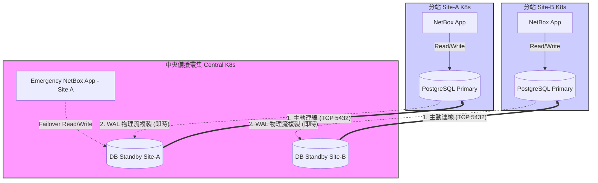

# NetBox 多叢集備份與災難復原架構 (Central-to-Site)

本指南專為 **「中央 (Central K8s) 控管多個分站 (Site K8s)」** 的架構所設計。在此情境下，每個 Site 皆獨立部署 NetBox，而中央叢集負責統一的資料備份、監控與異地災備 (DR)。

---

## 1. 核心架構前提

*   **中央叢集 (Central K8s)**：擁有存取各 Site K8s API 的權限，具備大容量儲存 (如 MinIO/Ceph) 或專屬資料庫。
*   **分站叢集 (Site K8s)**：獨立運行 NetBox 服務與 PostgreSQL 資料庫。
*   **設計目標**：在不影響分站效能的前提下，達成資料集中化與 RPO/RTO 的最佳平衡。

---

## 2. 關鍵績效指標：RPO 與 RTO

在討論備份方案前，必須先理解災難復原的兩大核心指標：

*   **RPO (Recovery Point Objective, 復原點目標)**：
    *   **定義**：災難發生時，企業**允許遺失多少時間的資料**。
    *   **範例**：若每 24 小時備份一次，RPO 就是 24 小時；若採用即時串流複製，RPO 則趨近於 0。
*   **RTO (Recovery Time Objective, 復原時間目標)**：
    *   **定義**：從災難發生到**服務恢復正常運作**所需的時間。
    *   **範例**：若重建環境需要 4 小時，還原資料庫需要 2 小時，則 RTO 為 6 小時。

---

## 3. 備份與災備方案比較表

| 方案類型 | 技術手段 | RPO (資料遺失) | RTO (恢復速度) | 優點 |
| :--- | :--- | :--- | :--- | :--- |
| **A. 分站推送 (Push)** | `pg_dump` to Central S3 | 中 (取決於排程) | 中 (需手動還原) | 權限隔離、網路容錯 |
| **B. WAL 增量倉庫** | pgBackRest | **極低** (可 PITR) | 快 (自動化還原) | 支援時間點還原、省頻寬 |
| **C. 異地串流溫備** | Streaming Replication | **趨近於零** | **極快** (溫備切換) | **災難接管首選方案** |

---

## 4. 方案詳解與實施架構 (User Role 友善方案)

在「具備應用部署權限，但無 Cluster-Admin 權限」的前提下，我們排除「中央拉取」與「邏輯複製」(經實測有 Sequence 不同步問題)，專注於以下可靠方案：

### A. 分站推送備份 (Decentralized Push - 最易實施)
在分站 NetBox 所在的 Namespace 部署一個 CronJob。
*   **機制**：
    1.  CronJob 在分站本地執行 `pg_dump`。
    2.  利用分站擁有的網路權限，將備份檔推送至中央叢集的 S3 (如 MinIO) 或其他儲存終端。
*   **安全性**：不需跨叢集 `kubeconfig`，分站只需持有中央儲存的 Access Key。

### B. pgBackRest 集中化倉庫 (推薦大規模使用)
在中央部署 pgBackRest Repo 服務。各分站資料庫 Pod 只需配置 `archive_command` 指向中央服務。

*   **運作原理**：
    1.  **WAL 歸檔 (WAL Archiving)**：分站資料庫將每次異動產生的 Write-Ahead Log (WAL) 檔案，即時推送到中央的 pgBackRest Repo (或指定的 S3 儲存)。
    2.  **增量/差異備份 (Incremental/Delta Backups)**：除了一開始的完整備份，後續的備份 pgBackRest 只會比對並傳輸修改過的資料塊 (Block-level)，極大程度節省了網路頻寬與備份時間。
    3.  **時間點還原 (PITR)**：因為擁有連續的 WAL 日誌，當災難發生時，您可以將資料庫還原到「過去的任意一秒鐘」，避免人為誤刪造成的無法挽回的損失。
*   **優勢**：pgBackRest 是在應用層運作，不需要 `kubectl exec` 權限，只需網路埠 (TLS) 連通即可。
*   **實施門檻**：⚠️ **較高**。預設的 NetBox/PostgreSQL 鏡像通常不含 pgBackRest 工具，需自行構建自定義鏡像或掛載 Sidecar 容器。

### C. 中央異地串流副本 (DR Hub / Warm Standby - 強烈推薦)
在中央部署分站的備援 Pod (Standby)。
*   **機制**：中央的 Standby Pod 主動連向分站的 Primary DB 拉取串流日誌。
*   **部署實務**：只需在中央部署普通的 StatefulSet，並在配置中填入分站資料庫的連線字串。
*   **優勢**：物理級同步，包含 Schema 與 Sequence，災難發生時一鍵 `promote` 即可接管，無需修復資料。

---

## 5. 方案 C (串流溫備) 多叢集架構與災難接管流程

### 常見疑問：中央一台 PostgreSQL 可以同時備份多個 Site 嗎？
**答案是不行。** 
因為「串流複製 (Streaming Replication)」是**物理資料塊級別 (Physical Block-level)** 的同步。一台 Standby 資料庫必須是一台 Primary 資料庫的完美二進制鏡像。
*   **正確架構**：在 Central K8s 叢集中，您需要為**每一個 Site 部署一個獨立的 PostgreSQL StatefulSet**（例如 `db-dr-site-a`, `db-dr-site-b`）。雖然是多個資料庫實例，但它們都運行在同一個 Central K8s 叢集與同一套儲存資源上，達到集中管理的目的。

### 5.1 資料流與連線流架構圖



### 5.2 從 Crash 到 Rollback 的完整生命週期

當 Site-A 發生毀滅性故障時，以下是標準的應變與復原(Rollback)流程：

#### 階段一：災難發生與緊急接管 (Failover)
1.  **Site-A 離線**：分站機房斷電或 K8s 叢集崩潰，NetBox 服務中斷。
2.  **中斷同步**：Central-DR 上的 `DB Standby Site-A` 會偵測到連線中斷，保留最後一刻的資料狀態。
3.  **提升為主庫 (Promote)**：
    *   在 Central-DR 執行指令：`kubectl exec db-dr-site-a-0 -- pg_ctl promote -D /bitnami/postgresql/data`
    *   此時 `DB Standby Site-A` 脫離唯讀模式，成為獨立的 Primary 庫。
4.  **啟動緊急 UI**：
    *   在 Central-DR 啟動一個預先設定好的 NetBox App Pod，將資料庫連線指向已提升的 `DB Standby Site-A`。
    *   更新公司內部 DNS (或修改 Load Balancer) 將 User 流量導向 Central-DR 的緊急 NetBox 服務。
    *   **結果**：服務在數分鐘內恢復，用戶可繼續正常寫入/讀取 NetBox 資料。

#### 階段二：分站重建與資料倒回 (Rollback / Failback)
當 Site-A 機房修復，我們需要將這段期間在 Central-DR 寫入的新資料「倒回」給 Site-A。

1.  **重建 Site-A 環境**：
    *   透過 IaC (Helm/GitLab) 在 Site-A 重新部署全新的 K8s 叢集與空殼 NetBox/PostgreSQL。
2.  **Central 匯出資料**：
    *   因為 Central 已經成為新的資料源頭，我們在 Central 執行 `pg_dump`，將包含災難期間新數據的資料庫完整匯出。
3.  **Site-A 匯入資料**：
    *   將 dump 檔傳輸至 Site-A，並使用 `pg_restore` 灌入 Site-A 剛建好的全新 PostgreSQL 中。
4.  **重置同步關係 (Resync)**：
    *   修改 Central-DR `DB Standby Site-A` 的設定，將其降級回 Standby 模式，並重新指向復活後的 Site-A Primary。
    *   Central-DR 會透過 `pg_basebackup` 重新拉取 Site-A 的基準資料，恢復原有的異地串流溫備架構。
5.  **DNS 切換回歸**：
    *   關閉 Central-DR 上的緊急 NetBox App。
    *   將 DNS 重新指向 Site-A，完成完整的災備生命週期 (Failover -> Failback)。

---

## 6. 附錄：關鍵指令參考


### 異地溫備提升 (Promote DR Pod)
```bash
# 當分站故障，在中央提升備援庫
kubectl -n dr-namespace exec netbox-postgresql-dr-site-a-0 -- \
  bash -c "pg_ctl promote -D /bitnami/postgresql/data"
```

### Velero 備份指定站點配置
```bash
velero backup create site-a-netbox-config \
  --include-namespaces netbox \
  --selector "app.kubernetes.io/instance=netbox"
```

---

## 7. 管理與驗證建議

1.  **分層儲存**：備份檔應至少保留一份於中央叢集的持久儲存，並同步一份至冷儲存。
2.  **定時演練**：每季度選定一個 Site 進行「中央接管演練」，確保 DR 流程有效。
3.  **監控指標**：在 Prometheus 中監控「備份成功率」與「流複製延遲時間 (Replication Lag)」。
