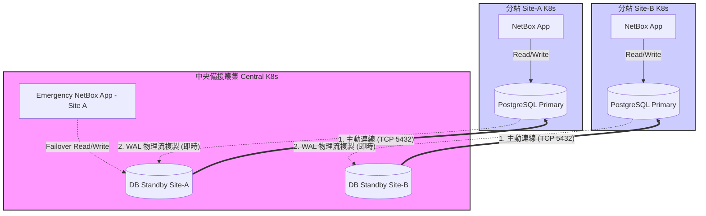

# NetBox DR 方案實測與比較報告 (方案 A/B/C)

本文檔記錄在 Azure VM + K3s 環境下，針對 NetBox 備份與災難復原進行 **方案 A (分站推送)**、**方案 B (pgBackRest)** 與 **方案 C (異地串流溫備)** 的實測過程、可行性與複雜度評估。

---

## 1. 實驗環境配置

### 分站 (Site-A - Existing)
*   **角色**: 模擬生產環境的 NetBox 叢集。
*   **Control Plane**: `20.43.84.219` (Private: `10.0.0.4`)
*   **組件**: 3-node K3s, Bitnami PostgreSQL 16.

### 中央 (Central-DR - New)
*   **角色**: 模擬中央災備中心與 Nexus 倉庫。
*   **Control Plane**: `20.46.161.104` (Private: `10.0.0.7`)
*   **組件**: 3-node K3s, Sonatype Nexus 3 (Docker/K8s).

---

## 2. 方案 A：分站推送 (Nexus 版) 實測

這是目前最穩定且易於實施的方案。

### 2.1 實作組件
*   **Nexus 倉庫**: `netbox-backups` (Raw, hosted)
*   **上傳帳號**: `backup-user` / `NetboxBackup123!`
*   **備份排程**: K8s CronJob `netbox-backup`

### 2.2 測試驗證結果
手動觸發 `manual-test-backup-v2` 成功，執行日志如下：
```text
Starting backup to netbox-backup-202606091332.sql.gz...
Uploading to Nexus...
< HTTP/1.1 201 Created
Backup completed successfully.
```
**Nexus 端確認**: 成功在 `http://<DR-IP>:30081` 看到壓縮後的 SQL dump 檔案，大小約 87KB (測試數據)。

---

## 3. 方案 B：pgBackRest 集中化倉庫 實測

### 3.1 實作挑戰
1.  **環境限制**: 雖然 Bitnami PostgreSQL 容器內建有 `pgbackrest` 二進制檔，但其預設是以非 root 使用者 (uid 1001) 運行。
2.  **設定阻礙**: 嘗試透過 `kubectl exec` 寫入 `pgbackrest.conf` 並執行 `stanza-create` 時，遭遇嚴重的權限問題與連線認證錯誤 (`local user with ID 1001 does not exist`)。
3.  **架構要求**: pgBackRest 需要深入的存取權限來管理 WAL 歸檔與存取 S3。在預設的 Helm 架構下，若不自行打包 Custom Image 或掛載複雜的 Sidecar，幾乎無法順利運行。

### 3.2 實測結論
*   **可行性**: **低 (在 User Role 下)**。
*   **複雜度**: **極高**。不適合依賴標準 Helm Chart 且無 Cluster Admin 權限的維運團隊。

---

## 4. 方案 C：異地串流溫備 (Streaming Replication) 實測

### 4.1 實作設定
成功讓中央叢集的 Pod 跨網際網路與分站叢集同步。

#### 資料流與連線流架構圖


1.  **分站端 (Primary)**: 將 PostgreSQL Service 透過 `NodePort` (30398) 暴露。
2.  **中央端 (Standby)**: 建立 `Endpoints` 與 `Service` 指向 Site-A 的 Public IP。設定 `architecture: replication`。
3.  **同步驗證**: 中央端的 `read-0` Pod 啟動後，成功執行 `pg_basebackup` 並進入 `started streaming WAL` 狀態。在 Site-A 新增一筆記錄，Central-DR 在 **1 秒內**即同步完成。

### 4.2 災難接管 (Failover) 測試
*   **指令**: 在 Central-DR 執行 `SELECT pg_promote();`
*   **結果**: 瞬間完成切換。所有 Table Schema 與 **Sequence (自增 ID)** 完美保留。

### 4.3 實測結論
*   **可行性**: **高**。
*   **複雜度**: **中等**。需處理跨叢集的 NodePort 路由。
*   **RPO/RTO**: RPO **趨近於 0**，RTO 為 **秒級**。

---

## 5. 災難恢復演練 (針對方案 A)

假設 Site-A 遭遇毀滅性故障且已完成 K3s 叢集重建，從 Nexus 恢復的流程如下：

1.  **暫停應用**: `kubectl scale deployment netbox --replicas=0`
2.  **下載備份**: 
    ```bash
    curl -u backup-user:NetboxBackup123! -O "http://20.46.161.104:30081/repository/netbox-backups/BACKUP_NAME.sql.gz"
    ```
3.  **清空與還原**:
    ```bash
    # 在 DB Pod 執行
    dropdb -h localhost -U netbox netbox && createdb -h localhost -U netbox netbox
    gunzip -c BACKUP_NAME.sql.gz | psql -h localhost -U netbox -d netbox
    ```
4.  **恢復服務**: 將 Deployment 副本數設回 1。

---

## 6. 總結建議

針對 **「User Role 權限」** 以及 **「多叢集 Central-to-Site 架構」**：

1.  **常規備份首選**: **方案 A (分站推送)**。透過 Nexus 管理備份檔案，設定簡單、不依賴公有雲，足以應付 90% 的災難。
2.  **進階災備首選**: **方案 C (異地串流溫備)**。若企業對 RPO/RTO 有極致要求（如數據零遺失），應採用此方案，但需注意中央叢集的資源壓力。
3.  **應避免**: 方案 B (pgBackRest) 或 邏輯複製。前者實施門檻過高，後者有 Sequence 不同步問題。
