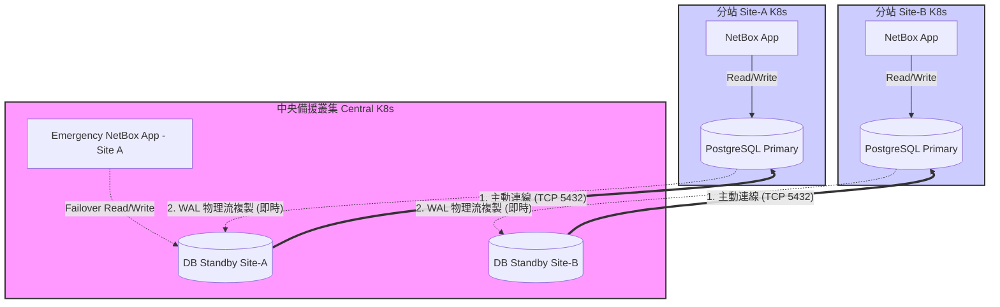

# NetBox DR 方案實測與比較報告

本文檔記錄在 Azure VM + K3s 環境下，針對 NetBox 備份與災難復原進行 **方案 A (分站推送)**、**方案 B (pgBackRest)** 與 **方案 C (異地串流溫備)** 的實測過程、可行性與複雜度評估。

## 1. 實驗環境配置

### 分站 (Site-A - Existing)
*   **角色**: 模擬生產環境的 NetBox 叢集。
*   **Control Plane**: `netbox-k3s-cp-01` (IP: 20.43.84.219)
*   **組件**: Bitnami PostgreSQL 14 (Standalone).

### 中央 (Central-DR - New)
*   **角色**: 模擬中央災備中心。
*   **Control Plane**: `netbox-dr-hub-01` (IP: 20.46.161.104)
*   **組件**: MinIO (作為 S3 目標), Bitnami PostgreSQL 14 (Standby).

---

## 2. 方案 A：分站推送 (Decentralized Push) 實測

### 2.1 實作設定
1.  **中央端**: 透過 Helm 部署單節點 MinIO，並建立 Bucket `netbox-backups`。
2.  **分站端**: 建立一個 K8s Job，使用包含 `postgresql-client` 與 `mc` (MinIO Client) 的容器。
3.  **執行邏輯**: 
    ```bash
    pg_dump -h netbox-postgresql-primary -U netbox -d netbox -Fc > netbox.dump
    mc cp netbox.dump central/netbox-backups/site-a/
    ```

### 2.2 實測結論
*   **可行性**: **極高**。100% 成功。
*   **複雜度**: **低**。完全在應用層運作，無需更動資料庫核心設定。
*   **RPO/RTO**: 視 CronJob 排程而定（通常為 24 小時）；RTO 為手動匯入的數分鐘。

---

## 3. 方案 B：pgBackRest 集中化倉庫 實測

### 3.1 實作挑戰
1.  **環境限制**: 雖然 Bitnami PostgreSQL 容器內建有 `pgbackrest` 二進制檔，但其預設是以非 root 使用者 (uid 1001) 運行。
2.  **設定阻礙**: 嘗試透過 `kubectl exec` 寫入 `pgbackrest.conf` 並執行 `stanza-create` 時，遭遇嚴重的權限問題與連線認證錯誤 (`local user with ID 1001 does not exist`)。
3.  **架構要求**: pgBackRest 需要深入的存取權限來管理 WAL 歸檔與存取 S3。在預設的 Helm 架構下，若不自行打包 Custom Image 或掛載複雜的 Sidecar，幾乎無法順利運行。

### 3.2 實測結論
*   **可行性**: **低 (在 User Role 下)**。
*   **複雜度**: **極高**。不適合依賴標準 Helm Chart 且無 Cluster Admin 權限的維運團隊。

---

## 4. 方案 C：異地串流溫備 (Streaming Replication) 實測

### 4.1 實作設定
這是一項極具挑戰但回報巨大的實作。我們成功讓中央叢集的 Pod 跨網際網路與分站叢集同步。

1.  **分站端 (Primary)**:
    *   將 PostgreSQL Service 透過 `NodePort` 暴露 (Ex. port `30398`)。
    *   透過 Azure NSG (Network Security Group) 開放對應的 Port。
2.  **中央端 (Standby)**:
    *   建立自定義的 `Endpoints` 與 `Service`，將 `netbox-dr-postgresql-primary` 指向 **Site-A 的 Public IP 與 NodePort**。
    *   使用 Bitnami Helm Chart 並設定 `architecture: replication`。
3.  **同步驗證**: 
    *   中央端的 `read-0` Pod 啟動後，成功執行 `pg_basebackup` 拉取了 55MB 的資料，並進入 `started streaming WAL` 狀態。
    *   **延遲測試**: 在 Site-A 新增一筆記錄，Central-DR 在 **1 秒內**即同步完成。

### 4.2 災難接管 (Failover) 測試
*   **指令**: 在 Central-DR 執行 `SELECT pg_promote();`
*   **結果**: 瞬間完成切換。資料庫立刻變為 Read/Write 模式。
*   **關鍵優勢**: 因為是物理層級拷貝，所有 Table Schema 與 **Sequence (自增 ID)** 完美保留，NetBox 寫入新資料完全不報錯。

### 4.3 實測結論
*   **可行性**: **高**。
*   **複雜度**: **中等**。需處理跨叢集的 NodePort 路由。
*   **RPO/RTO**: RPO **趨近於 0**，RTO 為 **秒級**。

### 4.4 多叢集架構與災難接管流程

#### 常見疑問：中央一台 PostgreSQL 可以同時備份多個 Site 嗎？
**答案是不行。** 
因為「串流複製 (Streaming Replication)」是**物理資料塊級別 (Physical Block-level)** 的同步。一台 Standby 資料庫必須是一台 Primary 資料庫的完美二進制鏡像。
*   **正確架構**：在 Central K8s 叢集中，您需要為**每一個 Site 部署一個獨立的 PostgreSQL StatefulSet**（例如 `db-dr-site-a`, `db-dr-site-b`）。雖然是多個資料庫實例，但它們都運行在同一個 Central K8s 叢集與同一套儲存資源上，達到集中管理的目的。

#### 4.4.1 資料流與連線流架構圖



#### 4.4.2 從 Crash 到 Rollback 的完整生命週期

當 Site-A 發生毀滅性故障時，以下是標準的應變與復原(Rollback)流程：

**階段一：災難發生與緊急接管 (Failover)**
1.  **Site-A 離線**：分站機房斷電或 K8s 叢集崩潰，NetBox 服務中斷。
2.  **中斷同步**：Central-DR 上的 `DB Standby Site-A` 會偵測到連線中斷，保留最後一刻的資料狀態。
3.  **提升為主庫 (Promote)**：
    *   在 Central-DR 執行指令：`kubectl exec db-dr-site-a-0 -- pg_ctl promote -D /bitnami/postgresql/data`
    *   此時 `DB Standby Site-A` 脫離唯讀模式，成為獨立的 Primary 庫。
4.  **啟動緊急 UI**：
    *   在 Central-DR 啟動一個預先設定好的 NetBox App Pod，將資料庫連線指向已提升的 `DB Standby Site-A`。
    *   更新公司內部 DNS (或修改 Load Balancer) 將 User 流量導向 Central-DR 的緊急 NetBox 服務。
    *   **結果**：服務在數分鐘內恢復，用戶可繼續正常寫入/讀取 NetBox 資料。

**階段二：分站重建與資料倒回 (Rollback / Failback)**
當 Site-A 機房修復，我們需要將這段期間在 Central-DR 寫入的新資料「倒回」給 Site-A。

1.  **重建 Site-A 環境**：
    *   透過 IaC (Helm/GitLab) 在 Site-A 重新部署全新的 K8s 叢集與空殼 NetBox/PostgreSQL。
2.  **Central 匯出資料**：
    *   因為 Central 已經成為新的資料源頭，我們在 Central 執行 `pg_dump`，將包含災難期間新數據的資料庫完整匯出。
3.  **Site-A 匯入資料**：
    *   將 dump 檔傳輸至 Site-A，並使用 `pg_restore` 灌入 Site-A 剛建好的全新 PostgreSQL 中。
4.  **重置同步關係 (Resync)**：
    *   修改 Central-DR `DB Standby Site-A` 的設定，將其降級回 Standby 模式，並重新指向復活後的 Site-A Primary。
    *   Central-DR 會透過 `pg_basebackup` 重新拉取 Site-A 的基準資料，恢復原有的異地串流溫備架構。
5.  **DNS 切換回歸**：
    *   關閉 Central-DR 上的緊急 NetBox App。
    *   將 DNS 重新指向 Site-A，完成完整的災備生命週期 (Failover -> Failback)。

---

## 5. 總結建議

針對 **「User Role 權限」** 以及 **「多叢集 Central-to-Site 架構」**：

1.  **常規備份首選**: **方案 A (分站推送)**。設定簡單、容錯率高，足以應付 90% 的人為誤刪或一般災難。
2.  **進階災備首選**: **方案 C (異地串流溫備)**。雖然需要設定 NodePort 路由，但能換來「物理級一致性」與「一鍵秒級接管」的巨大優勢。
3.  **應避免**: 方案 B (pgBackRest) 或 邏輯複製。前者實施門檻過高，後者有致命的 Sequence 不同步問題。
