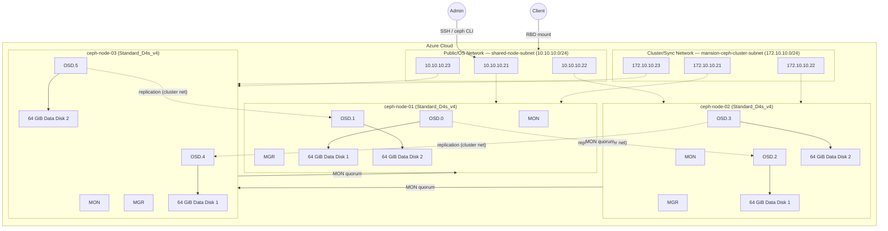

# Ceph 三節點架構：3-Node All-in-One Lab Baseline

> 分類：architecture  
> 架構決策：3 台對稱節點，每台承載 MON + MGR + OSD，並將 public / cluster network 分離

## 概述

使用三台 x86 VM 在 Azure 上架設 Ceph v19.2.2 Cluster。本文採用 **3-node all-in-one Ceph lab baseline** 架構：每台節點都同時承載 MON、MGR、OSD，並透過雙 NIC 分離 public network 與 cluster network，適合實驗測試環境。

---

## 架構圖



---

## 節點規格表

### 節點基本配置

| 節點名稱 | VM 規格 | vCPU | RAM | OS Disk | OSD Disks | Public IP (shared-node-subnet) | Cluster IP (mansion-ceph-cluster-subnet) |
|---------|---------|------|-----|---------|-----------|--------------------------------|----------------------------------|
| `ceph-node-01` | Standard_D4s_v4 | 4 | 16 GiB | 64 GiB | 64 GiB x2 | 10.10.10.21 | 172.10.10.21 |
| `ceph-node-02` | Standard_D4s_v4 | 4 | 16 GiB | 64 GiB | 64 GiB x2 | 10.10.10.22 | 172.10.10.22 |
| `ceph-node-03` | Standard_D4s_v4 | 4 | 16 GiB | 64 GiB | 64 GiB x2 | 10.10.10.23 | 172.10.10.23 |

> 💡 **設計考量：** Standard_D4s_v4 提供穩定 CPU 效能，避免 Burstable 系列對 MON 與 OSD 的效能影響

### 元件分配表

每台節點承載的 Ceph 元件相同：

| 元件類型 | 數量 | 功能 | 資源消耗 |
|---------|------|------|---------|
| MON | 1 | 維護 cluster map，參與 quorum | ~0.2–0.5 vCPU |
| MGR | 1 | Dashboard、監控、編排（主動/待命） | ~0.3–0.7 vCPU |
| OSD | 2 | 儲存資料與 replication | **~0.5–1.5 vCPU per OSD** |
| **合計** | | | **~2.0–4.5 vCPU per node** |

> ⚠️ OSD 是 Ceph 最消耗資源的元件，每個 OSD 需獨立磁碟與足夠 CPU/RAM

---

## 網路配置

### 雙網路分離

| 網路類型 | Subnet 名稱 | CIDR | 用途 | 流量特性 |
|---------|------------|------|------|---------|
| **Public Network（共用）** | `shared-node-subnet` | 10.10.10.0/24 | SSH、Ceph 管理、Client 存取、MON 通訊 | 管理流量、Client I/O |
| **Cluster Network（Ceph 專屬）** | `mansion-ceph-cluster-subnet` | 172.10.10.0/24 | OSD replication、backfill、recovery | 大量資料傳輸 |

> 💡 `shared-node-subnet` 由 KubeVirt lab 建立並共用，KubeVirt K8s 節點佔用 10.10.10.10-12，Ceph 節點使用 10.10.10.21-23。`mansion-ceph-cluster-subnet` 為 Ceph 專屬，由 Ceph Phase 0 在同一 `mansion-shared-vnet` 中建立。

### IP 分配表

| 節點 | Public/OS IP（shared-node-subnet） | Cluster/Sync IP（mansion-ceph-cluster-subnet） |
|------|-----------------------------------|---------------------------------------|
| `ceph-node-01` | 10.10.10.21 | 172.10.10.21 |
| `ceph-node-02` | 10.10.10.22 | 172.10.10.22 |
| `ceph-node-03` | 10.10.10.23 | 172.10.10.23 |

> 💡 **網路分離優勢：** 將 OSD replication 流量與管理/Client 流量隔離，避免 backfill/recovery 影響前端效能

---

## 儲存配置

### 磁碟配置

每台節點共 3 顆磁碟：

| 磁碟類型 | 大小 | 用途 | 備註 |
|---------|------|------|------|
| OS Disk | 64 GiB | 作業系統與 Ceph 軟體 | Premium SSD |
| OSD Data Disk 1 | 64 GiB | OSD 資料儲存 | 獨立磁碟 |
| OSD Data Disk 2 | 64 GiB | OSD 資料儲存 | 獨立磁碟 |

> ⚠️ **生產環境建議：** 使用更大容量 data disk（512GB–4TB），並考慮獨立 WAL/DB SSD

### OSD 配置

全 cluster 共 6 顆 OSD：

| OSD ID | 節點 | 對應磁碟 | 角色 |
|--------|------|---------|------|
| OSD.0 | ceph-node-01 | /dev/sdc | 資料儲存 |
| OSD.1 | ceph-node-01 | /dev/sdd | 資料儲存 |
| OSD.2 | ceph-node-02 | /dev/sdc | 資料儲存 |
| OSD.3 | ceph-node-02 | /dev/sdd | 資料儲存 |
| OSD.4 | ceph-node-03 | /dev/sdc | 資料儲存 |
| OSD.5 | ceph-node-03 | /dev/sdd | 資料儲存 |

---

## RBD Pool 基本配置

### Pool 參數表

建立預設 RBD pool `k8s_rbd_pool`：

| 參數 | 設定值 | 說明 |
|------|--------|------|
| Pool Name | `k8s_rbd_pool` | RBD block storage pool |
| `size` | 3 | 每個 object 複製 3 份 |
| `min_size` | 1 | 至少 1 份可用即可寫入（降級模式） |
| `pg_num` | 128 | Placement Group 數量 |
| `pgp_num` | 128 | PG for placement 數量 |
| Application | `rbd` | 啟用 RBD 應用 |

> 💡 **PG 數量計算：** 對於 6 顆 OSD、size=3 的 pool，128 PG 是合理起點（每 OSD 約分配 64 PG）

### Pool 建立指令

```bash
# 建立 pool
ceph osd pool create k8s_rbd_pool 128 128

# 設定 size 與 min_size
ceph osd pool set k8s_rbd_pool size 3
ceph osd pool set k8s_rbd_pool min_size 1

# 啟用 RBD 應用
ceph osd pool application enable k8s_rbd_pool rbd

# 初始化 RBD pool
rbd pool init k8s_rbd_pool
```

---

## Ceph 版本與設定

### 軟體版本

| 項目 | 版本 | 備註 |
|------|------|------|
| Ceph | v19.2.2 | Reef release |
| Cephadm | v19.2.2 | 容器化部署工具 |
| OS | Ubuntu 22.04 LTS | 建議使用 LTS 版本 |

### 核心設定

在 `/etc/ceph/ceph.conf` 或透過 `ceph config set` 設定：

```ini
[global]
# shared-node-subnet: 10.10.10.0/24 (KubeVirt K8s .10-.12, Ceph .21-.23)
public_network = 10.10.10.0/24
# mansion-ceph-cluster-subnet: 172.10.10.0/24 (Ceph dedicated)
cluster_network = 172.10.10.0/24
```

> ⚠️ **網路設定必須在 bootstrap 前確認正確**，事後修改較為複雜

---

## 架構特點與限制

### 優點

- ✅ **簡單對稱**：三台節點角色相同，易於理解與部署
- ✅ **網路分離**：public 與 cluster network 分離，效能更佳
- ✅ **基本高可用**：MON quorum 與 size=3 提供基本容錯能力
- ✅ **成本可控**：3 台 D4s_v4 適合 Lab 環境

### 限制

- ⚠️ **不適合生產**：All-in-One 配置單點故障影響範圍大
- ⚠️ **容量受限**：6 顆 64 GiB OSD 實際可用容量約 128 GiB（size=3）
- ⚠️ **未分離 WAL/DB**：未使用獨立 SSD 加速 metadata
- ⚠️ **無獨立 Admin 節點**：管理操作直接在 Ceph 節點進行

---

## Azure 成本估算

### Lab 環境月費（以美國東部為例）

| 資源類型 | 規格 | 數量 | 單價(約) | 月費(約) |
|---------|------|------|---------|---------|
| Compute | Standard_D4s_v4 | 3 | ~$140 | ~$420 |
| OS Disk | Premium SSD 64 GiB | 3 | ~$10 | ~$30 |
| Data Disk | Premium SSD 64 GiB | 6 | ~$10 | ~$60 |
| VNet / IP | Basic | — | ~$5 | ~$5 |
| **合計** | | | | **~$515/月** |

> 💡 **成本優化建議：** 使用 Standard SSD 可降低 disk 成本；使用更小 VM 可降低 compute 成本（但需評估效能影響）

---

## 參考資料

- [Ceph 官方文件](https://docs.ceph.com/)
- [Cephadm 部署指南](https://docs.ceph.com/en/latest/cephadm/)
- [Ceph Network Configuration](https://docs.ceph.com/en/latest/rados/configuration/network-config-ref/)
- [Azure Dsv4 Series](https://learn.microsoft.com/en-us/azure/virtual-machines/dv4-dsv4-series)
- [PG Calculator](https://old.ceph.com/pgcalc/)
