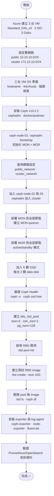

# Ceph 三節點架設流程

> 分類：flowchart  
> 架構決策：3-node All-in-One Lab Baseline，雙網路分離，從 Azure 建機到 RBD pool ready

## 架設流程圖



---

## 流程說明

| 步驟 | 動作 | 執行位置 | 說明 |
|------|------|---------|------|
| 1 | 申請 Azure VM (3台) | Azure Portal / CLI | Standard_D4s_v4 · 2 NIC · 1 OS disk + 2 data disks |
| 2 | 設定雙網路 | Azure VNet | 建立 2 個 subnet 並分配 NIC |
| 3 | OS 初始化 | 全部節點 | hostname、/etc/hosts、驗證網路與磁碟 |
| 4 | 安裝 Ceph | 全部節點 | cephadm、docker/podman |
| 5 | Bootstrap 第一台節點 | ceph-node-01 | `cephadm bootstrap` 建立初始 MON + MGR |
| 6 | 套用網路設定 | ceph-node-01 | 設定 public_network / cluster_network |
| 7 | 加入其他節點 | ceph-node-02, 03 | `ceph orch host add` 加入 cluster |
| 8 | 部署 MON | 全部節點 | 建立 3-node MON quorum |
| 9 | 部署 MGR | 全部節點 | active/standby MGR 高可用 |
| 10 | 加入 OSD | 全部節點 | `ceph orch daemon add osd` 每台 2 顆 |
| 11 | 驗證 Ceph Health | ceph-node-01 | `ceph -s` 確認 HEALTH_OK |
| 12 | 建立 k8s_rbd_pool | ceph-node-01 | `ceph osd pool create k8s_rbd_pool 128 128` |
| 13 | 啟用 RBD 應用 | ceph-node-01 | `ceph osd pool application enable k8s_rbd_pool rbd` |
| 14 | 建立測試 image | ceph-node-01 | `rbd create --size 10G k8s_rbd_pool/test-image` |
| 15 | 驗證 pool 與 image | ceph-node-01 | `rbd ls k8s_rbd_pool` · `ceph df` |
| 16 | 安裝可觀測性元件 | 全部節點 | `ceph-exporter`、`prometheus-node-exporter`、`fluent-bit` |
| 17 | 驗證資料流向 | Prometheus / OpenSearch | metrics 可查、logs 可查 |

---

## 階段性產出

### Phase 0 產出

完成 Azure 資源建立：

- ✅ 3 台 VM 可 SSH 登入
- ✅ 每台有 2 張 NIC（public + cluster）
- ✅ 每台有 3 顆磁碟（1 OS + 2 data）
- ✅ 網路安全群組允許 SSH 與 Ceph ports

### Phase 1 產出

完成 OS 準備：

- ✅ hostname 設定正確
- ✅ `/etc/hosts` 包含全部節點
- ✅ 雙網路互通（ping 10.10.10.2x 與 172.10.10.2x）
- ✅ 2 顆 data disk 存在且未格式化

### Phase 2 產出

完成 Ceph 安裝：

- ✅ Ceph v19.2.2 安裝完成
- ✅ cephadm、docker/podman 可用
- ✅ 準備好 bootstrap

### Phase 3 產出

完成 Ceph Cluster 建立：

- ✅ MON quorum (3 nodes)
- ✅ MGR active + standby
- ✅ 6 顆 OSD 全部 up + in
- ✅ `ceph -s` 顯示 HEALTH_OK

### Phase 4 產出

完成 RBD Pool 設定：

- ✅ k8s_rbd_pool 建立（size=3, min_size=1, pg_num=128）
- ✅ RBD 應用啟用
- ✅ 測試 image 可建立與列出
- ✅ `ceph df` 顯示 pool 容量正常

---

## 關鍵驗證指令

### 驗證網路

```bash
# 從 ceph-node-01 測試雙網路
ping -c 3 10.10.10.21    # shared-node-subnet (public network)
ping -c 3 172.10.10.21   # mansion-ceph-cluster-subnet (cluster network)
```

### 驗證磁碟

```bash
# 列出未使用的磁碟
lsblk
ceph-volume inventory
```

### 驗證 Ceph Health

```bash
# 檢查 cluster 狀態
ceph -s

# 檢查 OSD 樹狀結構
ceph osd tree

# 檢查 MON quorum
ceph mon stat
```

### 驗證 RBD Pool

```bash
# 列出 pool
ceph osd pool ls detail

# 檢查 k8s_rbd_pool 設定
ceph osd pool get k8s_rbd_pool size
ceph osd pool get k8s_rbd_pool min_size
ceph osd pool get k8s_rbd_pool pg_num

# 列出 RBD images
rbd ls k8s_rbd_pool

# 檢查 pool 使用量
ceph df
```

---

## 常見問題排除

### Bootstrap 失敗

| 問題 | 可能原因 | 解決方式 |
|------|---------|---------|
| Container 無法啟動 | docker/podman 未安裝 | 安裝 docker 或 podman |
| Network unreachable | public_network 設定錯誤 | 檢查 IP 與 subnet mask |
| Port already in use | 舊 container 未清理 | `cephadm rm-cluster --force` |

### OSD 無法加入

| 問題 | 可能原因 | 解決方式 |
|------|---------|---------|
| Device not available | 磁碟已被系統使用 | `wipefs -a /dev/sdX` 清除 |
| Permission denied | cephadm 權限不足 | 確認 sudo 可用 |
| No free devices | 磁碟未正確識別 | 檢查 `lsblk` 與 Azure disk attach |

### Pool 效能異常

| 問題 | 可能原因 | 解決方式 |
|------|---------|---------|
| PG 分布不均 | pg_num 過小 | 增加 pg_num（需謹慎） |
| Slow requests | cluster_network 未分離 | 檢查 cluster_network 設定 |
| Full OSD | 容量不足 | 刪除不需要的 images 或增加 OSD |

---

## 參考資料

- [Cephadm Bootstrap 指南](https://docs.ceph.com/en/latest/cephadm/install/#bootstrap-a-new-cluster)
- [Ceph OSD 管理](https://docs.ceph.com/en/latest/rados/operations/add-or-rm-osds/)
- [RBD Pool 設定](https://docs.ceph.com/en/latest/rados/operations/pools/)
- [Ceph Troubleshooting](https://docs.ceph.com/en/latest/rados/troubleshooting/)
