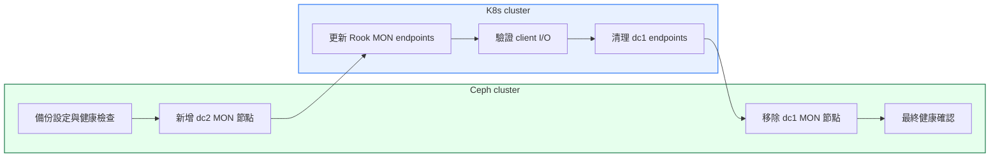

# MON Migration Runbook

本文件提供跨資料中心 Ceph 遷移的 **MON / control-plane 切換手冊**，聚焦於 quorum 驗證、Rook external mode client endpoint coordination、ceph-csi behavior，以及 KubeVirt / VM 在 MON endpoint 變更期間的驗證。

關於遷移策略的分析與決策依據，請參考 [Solutions Overview](../solutions/)。關於 OSD bulk data migration 的詳細步驟，請參考 [OSD Migration Runbook](../osd-migration/)。關於場景與架構概述，請參考 [主文件](../)。

## High-Level Flow



---

## 1. MON Migration Principles

### 核心原則

1. **Add-Before-Remove Strategy**
   - 先新增 dc2 MON 節點，擴大 quorum（暫時從 3 增至 4、5、6）
   - 驗證新 MON 節點在 quorum 中且穩定
   - 確認 client 端已使用新 endpoint 後，再移除 dc1 MON 節點

2. **Quorum Safety**
   - MON quorum 需多數決（3 個中至少 2 個，5 個中至少 3 個）
   - 新增 MON 時，quorum 容錯能力提升（暫時可容忍更多節點失效）
   - 移除 MON 前必須確認剩餘節點數仍能滿足 quorum 要求

3. **Client Endpoint Coordination**
   - Rook-Ceph external mode 透過 `rook-ceph-mon-endpoints` ConfigMap 與 Secret 傳遞 MON 地址
   - `rook-ceph-config` / `mon_host` 必須反映新 MON endpoint 集合
   - 切換策略：**先加後減，再提早切到 dc2-only**（先讓 client 吃到 dc1 + dc2，再於 Ceph 側移除前先清理 dc1 endpoints）
   - 兩者（`rook-ceph-mon-endpoints` 與 `rook-ceph-config` / `mon_host`）都應先完成 dc2-only 收斂，再執行 Ceph cluster 的 dc1 MON 移除
   - ceph-csi / librbd 通常能透過 Ceph 的 monmap gossip 學到新 MON；ConfigMap 變更則主要影響 pod 啟動或 reconnect 時讀取到的 `ceph.conf`
   - 若自動更新失效，則採用**分批重啟** CSI pods 而非全面重啟

4. **最小化業務影響**
   - MON failover 通常在數秒內完成，對 RBD I/O 的影響極小
   - KubeVirt VM 通常能透過 librbd 內建的 MON failover 機制自動恢復
   - 重點驗證：VM 在 MON endpoint 切換期間是否持續正常 I/O
   - Timeout 調整屬於環境特定的驗證項目，非預設強制要求

---

## 2. Rook-Ceph External Mode / KubeVirt Notes

### Rook-Ceph External Mode 連線架構

在本場景中，KubeVirt VM 透過以下路徑連線至 Ceph cluster：

```
KubeVirt VM (guest OS)
  ↓
virt-launcher pod (KubeVirt operator)
  ↓
ceph-csi (csi-rbdplugin DaemonSet)
  ↓
Rook-Ceph external mode (ConfigMap & Secret)
  ↓
Ceph MON endpoints (external Ceph cluster)
```

### Rook-Ceph External Mode ConfigMap / Secret

Rook external mode 使用以下兩個 Kubernetes resources 傳遞 Ceph cluster 連線資訊：

1. **`rook-ceph-mon-endpoints` ConfigMap**
   - 包含 MON endpoint 地址清單
   - 格式範例：`mon1=10.1.1.1:6789,mon2=10.1.1.2:6789,mon3=10.1.1.3:6789`
   - **更新策略**：先擴充為 **dc1 + dc2**，驗證 client 正常後，再收斂為 **dc2-only**

2. **`rook-ceph-config` ConfigMap**
   - 包含 `ceph.conf` 的 client-side 配置
   - 其中 `mon_host` 欄位必須反映新 MON endpoint 集合
   - **更新策略**：先擴充為 **dc1 + dc2**，驗證 client 正常後，再收斂為 **dc2-only**
   - **驗證重點**：確認 `mon_host` 先包含新 MON endpoint 集合，之後再收斂為僅剩 dc2

### ceph-csi Behavior

- **動態學習路徑**：`csi-rbdplugin` 內的 librbd client 通常會透過 Ceph 的 monmap gossip 學到新 MON endpoints
- **ConfigMap 角色**：`rook-ceph-mon-endpoints` / `rook-ceph-config` 主要影響 pod 啟動或 reconnect 時讀到的 `ceph.conf`
- **驗證方式**：檢查 `csi-rbdplugin` pod logs 與 pod 內連線行為，確認目前連線已穩定落在預期的 MON endpoint 集合
- **失效處置**：若自動更新失效，則採用**分批重啟** CSI pods（避免同時重啟所有 pods 造成短暫服務中斷）

### KubeVirt VM 影響評估

**MON endpoint 切換期間 VM 行為**：

1. **Short MON Failover Disturbance**
   - librbd（Ceph RBD client library）內建 MON failover 機制
   - 當 current MON 失效或地址變更時，librbd 會自動嘗試連線至其他 MON
   - 典型 failover 時間：數秒內完成

2. **I/O Continuity**
   - 只要至少一個 MON 可達，RBD I/O 能繼續正常運作
   - MON 主要負責 cluster map 發布與 auth，不參與 data path
   - **驗證重點**：VM 在 MON endpoint 切換期間是否持續正常 I/O

3. **Timeout Tuning (Optional)**
   - 若環境對 MON failover 延遲敏感（如關鍵交易系統），可考慮調整 `rbd_default_timeout`
   - **此為環境特定驗證項目，非預設強制要求**
   - 建議先執行 pilot test，觀察實際 failover behavior 再決定是否調整

### 監控重點

- **Ceph 層面**：
  - `ceph mon stat`：確認 MON quorum 狀態
  - `ceph -s`：確認 cluster health 與 MON election 狀態

- **Rook / ceph-csi 層面**：
  - 檢查 `rook-ceph-mon-endpoints` ConfigMap 是否已更新
  - 檢查 `rook-ceph-config` 的 `mon_host` 欄位
  - 檢視 `csi-rbdplugin` pod logs，確認 MON connection 正常

- **KubeVirt / VM 層面**：
  - VM guest OS 的 disk I/O latency（如透過 `iostat` 或應用監控）
  - KubeVirt virt-launcher pod 的 resource usage
  - 若有應用層 SLA，確認 latency 與 throughput 仍在可接受範圍

---

## 3. Detailed MON Migration Runbook

本節詳述 MON migration 的完整執行步驟，包含 Ceph 端 add-before-remove 與 client endpoint 提前切到 dc2-only 的 coordination checkpoints。

### Step 0: Pre-Migration Backup and Validation

**目標**：確保 MON quorum 健康、備份關鍵配置、記錄 baseline

#### 前置檢查清單

1. **Verify Current MON Quorum**
   ```bash
   ceph mon stat
   # 確認 3 個 dc1 MON 都在 quorum 中
   
   ceph quorum_status -f json-pretty
   # 記錄當前 quorum 成員清單
   ```

2. **Backup Rook-Ceph External Mode Configuration**
   ```bash
   export BACKUP_DATE=$(date +%Y%m%d)
   echo "Backup date: $BACKUP_DATE"

   # 備份 rook-ceph-mon-endpoints ConfigMap
   kubectl -n rook-ceph get configmap rook-ceph-mon-endpoints -o yaml > /backup/rook-ceph-mon-endpoints.${BACKUP_DATE}.yaml
    
   # 備份 rook-ceph-config ConfigMap
   kubectl -n rook-ceph get configmap rook-ceph-config -o yaml > /backup/rook-ceph-config.${BACKUP_DATE}.yaml
    
   # 備份 rook-ceph-mon Secret（包含 admin keyring）
   kubectl -n rook-ceph get secret rook-ceph-mon -o yaml > /backup/rook-ceph-mon-secret.${BACKUP_DATE}.yaml
   ```

3. **Record Current MON Endpoints**
   ```bash
   # 檢視當前 MON endpoint 配置
   kubectl -n rook-ceph get configmap rook-ceph-mon-endpoints -o jsonpath='{.data.data}'
   # 範例輸出：mon1=10.1.1.1:6789,mon2=10.1.1.2:6789,mon3=10.1.1.3:6789
   
   # 檢視 ceph.conf 的 mon_host
   kubectl -n rook-ceph get configmap rook-ceph-config -o jsonpath='{.data.ceph\.conf}' | grep mon_host
   ```

4. **Identify Client Workloads**
   ```bash
   # 列出 csi-rbdplugin pods
   kubectl -n rook-ceph get pods -l app=csi-rbdplugin
   
   # 列出使用 RBD PVC 的 KubeVirt VMs
   kubectl get vmi -A -o custom-columns=NAMESPACE:.metadata.namespace,NAME:.metadata.name,VOLUMES:.spec.volumes[*].persistentVolumeClaim.claimName
   ```

5. **Check MON Service Mode**
   ```bash
   ceph orch ls mon -f yaml
   # 若目前 MON service 仍由 cephadm placement spec 自動管理，
   # 先切成 unmanaged，避免 Step 1 / Step 7 的 daemon add/rm 被 reconciliation 覆寫

   ceph orch apply mon --unmanaged

   # 再次確認狀態
   ceph orch ls mon -f yaml
   ```

6. **Confirm dc2 MON Candidate Hosts Are Registered**
   ```bash
   ceph orch host ls
   # 確認 mon-dc2-01 / mon-dc2-02 / mon-dc2-03 已存在於 orchestrator host 清單，
   # 且已帶入正確 location metadata
   ```

#### Gate Criteria (進入 Step 1 前)

- ✅ MON quorum = 3/3 且 健康
- ✅ Rook external mode 配置已備份
- ✅ 當前 MON endpoint 清單已記錄
- ✅ Client workload inventory 已完成
- ✅ MON service 已切到 unmanaged，或已確認本次操作不會被 cephadm placement spec 覆寫
- ✅ dc2 MON 候選主機（mon-dc2-01 / 02 / 03）已在 cephadm orchestrator host 清單中，且 location metadata 正確

---

### Step 1: Add dc2 MONs to Cluster

**目標**：逐一新增 dc2 MON 節點，擴大 quorum 至 4、5、6 個成員

> **cephadm note**: 本 Step 假設 MON service 已先切到 `--unmanaged`；否則 `ceph orch daemon add mon ...` 可能被既有 placement spec 自動覆寫。

#### 執行步驟

1. **Add First dc2 MON (mon-dc2-01)**
    ```bash
    # 前提：mon-dc2-01 已在 host 上具備正確 location metadata
    ceph orch daemon add mon mon-dc2-01
   
   # 等待 MON daemon 啟動（約 30-60 秒）
   sleep 60
   
   # 驗證 MON 已加入 quorum
   ceph mon stat
   # 預期：quorum: 0,1,2,3 (4 MONs)
    
   ceph quorum_status -f json-pretty | grep -A 1 mon-dc2-01
   # 確認 mon-dc2-01 在 quorum 中

   ACTUAL=$(ceph quorum_status -f json-pretty | jq '.quorum | length')
   [ "$ACTUAL" -eq 4 ] || { echo "HALT: mon-dc2-01 did not join quorum ($ACTUAL != 4)"; exit 1; }
   ```

2. **Add Second dc2 MON (mon-dc2-02)**
    ```bash
    # 前提：mon-dc2-02 已在 host 上具備正確 location metadata
    ceph orch daemon add mon mon-dc2-02
   
   sleep 60
    
   ceph mon stat
   # 預期：quorum: 0,1,2,3,4 (5 MONs)

   ACTUAL=$(ceph quorum_status -f json-pretty | jq '.quorum | length')
   [ "$ACTUAL" -eq 5 ] || { echo "HALT: mon-dc2-02 did not join quorum ($ACTUAL != 5)"; exit 1; }
   ```

3. **Add Third dc2 MON (mon-dc2-03)**
    ```bash
    # 前提：mon-dc2-03 已在 host 上具備正確 location metadata
    ceph orch daemon add mon mon-dc2-03
   
   sleep 60
    
   ceph mon stat
   # 預期：quorum: 0,1,2,3,4,5 (6 MONs)

   ACTUAL=$(ceph quorum_status -f json-pretty | jq '.quorum | length')
   [ "$ACTUAL" -eq 6 ] || { echo "HALT: mon-dc2-03 did not join quorum ($ACTUAL != 6)"; exit 1; }
   ```

#### Gate Criteria (進入 Step 2 前)

- ✅ 6 個 MON（3 個 dc1 + 3 個 dc2）都在 quorum 中
- ✅ Cluster health = `HEALTH_OK`（或僅有已知的非關鍵 warning）
- ✅ 無 MON election 或 quorum 不穩定的跡象

---

### Step 2: Update rook-ceph-mon-endpoints (Add-Before-Remove)

**目標**：更新 Rook external mode ConfigMap，同時包含 dc1 + dc2 MON endpoints

> **Reconciliation risk note**: 在 Rook external mode 中，`rook-ceph-mon-endpoints` 與後續的 `rook-ceph-config` 可能會被 external-cluster import 的上游狀態重新調諧。若 `kubectl edit` 後變更很快被覆寫，請先確認 edits 是否能持久保留；若無法保留，應先更新 upstream 的 external-cluster import 來源，再繼續後續步驟。

#### 執行步驟

1. **Get New MON Endpoint Addresses**
   ```bash
   # 從 Ceph cluster 取得所有 MON 地址
   ceph mon dump | grep mon
   # 範例輸出：
   # 0: [v2:10.1.1.1:3300/0,v1:10.1.1.1:6789/0] mon.mon-dc1-01
   # 1: [v2:10.1.1.2:3300/0,v1:10.1.1.2:6789/0] mon.mon-dc1-02
   # 2: [v2:10.1.1.3:3300/0,v1:10.1.1.3:6789/0] mon.mon-dc1-03
   # 3: [v2:10.2.1.1:3300/0,v1:10.2.1.1:6789/0] mon.mon-dc2-01
   # 4: [v2:10.2.1.2:3300/0,v1:10.2.1.2:6789/0] mon.mon-dc2-02
   # 5: [v2:10.2.1.3:3300/0,v1:10.2.1.3:6789/0] mon.mon-dc2-03
   ```

2. **Update rook-ceph-mon-endpoints ConfigMap**
   ```bash
   # 編輯 ConfigMap，加入 dc2 MON endpoints（保留 dc1）
   kubectl -n rook-ceph edit configmap rook-ceph-mon-endpoints
   
   # 更新 data 欄位為（範例）：
   # data: mon1=10.1.1.1:6789,mon2=10.1.1.2:6789,mon3=10.1.1.3:6789,mon4=10.2.1.1:6789,mon5=10.2.1.2:6789,mon6=10.2.1.3:6789
   ```

3. **Verify ConfigMap Update**
   ```bash
   kubectl -n rook-ceph get configmap rook-ceph-mon-endpoints -o jsonpath='{.data.data}'
   # 確認包含 6 個 MON endpoints

   sleep 60

   kubectl -n rook-ceph get configmap rook-ceph-mon-endpoints -o jsonpath='{.data.data}'
   # 再次確認未被 reconcile 回舊內容；若已被覆寫，先修正 upstream import 來源再繼續
   ```

---

### Step 3: Verify rook-ceph-config and mon_host

**目標**：確認 `rook-ceph-config` 的 `mon_host` 欄位已更新

#### 執行步驟

1. **Check ceph.conf mon_host**
   ```bash
   kubectl -n rook-ceph get configmap rook-ceph-config -o jsonpath='{.data.ceph\.conf}' | grep mon_host
   # 確認 mon_host 包含 dc1 + dc2 MON 地址
   ```

2. **Update mon_host if Necessary**
   ```bash
   # 若 mon_host 未自動更新，手動編輯
   kubectl -n rook-ceph edit configmap rook-ceph-config
   
   # 更新 ceph.conf 中的 mon_host 為（範例）：
   # mon_host = 10.1.1.1:6789,10.1.1.2:6789,10.1.1.3:6789,10.2.1.1:6789,10.2.1.2:6789,10.2.1.3:6789
   ```

3. **Re-check mon_host After a Short Wait**
   ```bash
   sleep 60

   kubectl -n rook-ceph get configmap rook-ceph-config -o jsonpath='{.data.ceph\.conf}' | grep mon_host
   # 再次確認未被 reconcile 回舊內容；若已被覆寫，先修正 upstream import 來源再繼續
   ```

---

### Step 4: Check csi-rbdplugin and KubeVirt VM I/O

**目標**：驗證 ceph-csi 是否成功吸收新 MON endpoints，以及 KubeVirt VM I/O 是否持續正常

#### 執行步驟

1. **Observe csi-rbdplugin Logs**
   ```bash
   # 檢視 csi-rbdplugin pod logs
   kubectl -n rook-ceph logs -l app=csi-rbdplugin --tail=50 | grep -i mon
   
   # 尋找 MON connection 相關訊息，確認是否成功連線至新 MON endpoints
   ```

2. **Verify RBD Connection from csi-rbdplugin**
   ```bash
   # 進入其中一個 csi-rbdplugin pod
   kubectl -n rook-ceph exec -it <csi-rbdplugin-pod-name> -- bash
   
   # 在 pod 內執行 ceph status（需 admin keyring）
   ceph -s --conf=/etc/ceph/ceph.conf --keyring=/etc/ceph/keyring
   # 確認能正常連線至 Ceph cluster
   ```

3. **Test KubeVirt VM I/O**
   ```bash
   # 登入 KubeVirt VM，執行 I/O 測試
   virtctl console <vm-name> -n <namespace>
   
   # 在 VM guest OS 內執行（範例）
   dd if=/dev/zero of=/tmp/test.dat bs=1M count=100
   iostat -x 1 5
   # 確認 I/O latency 正常，無明顯延遲
   ```

4. **Monitor VM Application Metrics (Optional)**
   ```bash
   # 若有應用層監控，確認 SLA 指標正常
   # 例如：API response time, database query latency
   ```

#### Observation Results

- **csi-rbdplugin 自動吸收成功**：logs 顯示已連線至新 MON endpoints → 無需手動重啟，進入 Step 6
- **csi-rbdplugin 自動吸收失效**：logs 顯示仍使用舊 MON endpoints 或連線失敗 → 進入 Step 5（分批重啟）

---

### Step 5: Restart csi-rbdplugin in Batches (If Needed)

**目標**：若 csi-rbdplugin 未能自動吸收新 MON endpoints，則分批重啟 pods

#### 執行步驟

1. **Identify csi-rbdplugin Pods**
   ```bash
   kubectl -n rook-ceph get pods -l app=csi-rbdplugin -o wide
   # 記錄所有 csi-rbdplugin pod 名稱與所在 node
   ```

2. **Restart Pods in Batches**
   ```bash
   # 分批重啟，每次重啟 1/3 的 pods，間隔 30 秒觀察
   # Batch 1
   kubectl -n rook-ceph delete pod <csi-rbdplugin-pod-1>
   kubectl -n rook-ceph delete pod <csi-rbdplugin-pod-2>
   sleep 30
   
   # 驗證 Batch 1 重啟後的 pods 正常
   kubectl -n rook-ceph get pods -l app=csi-rbdplugin
   kubectl -n rook-ceph logs <csi-rbdplugin-pod-1> --tail=20 | grep -i mon
   
   # Batch 2
   kubectl -n rook-ceph delete pod <csi-rbdplugin-pod-3>
   kubectl -n rook-ceph delete pod <csi-rbdplugin-pod-4>
   sleep 30
   
   # Batch 3
   kubectl -n rook-ceph delete pod <csi-rbdplugin-pod-5>
   kubectl -n rook-ceph delete pod <csi-rbdplugin-pod-6>
   sleep 30
   ```

3. **Verify All Pods Use New MON Endpoints**
   ```bash
   kubectl -n rook-ceph logs -l app=csi-rbdplugin --tail=50 | grep -i mon
   # 確認所有 pods 已連線至新 MON endpoints
   ```

#### Gate Criteria (進入 Step 6 前)

- ✅ 所有 csi-rbdplugin pods 已使用新 MON endpoints
- ✅ KubeVirt VM I/O 持續正常
- ✅ 無應用層 SLA violation

---

### Step 6: Clean Up dc1 Endpoints from Rook External Mode

**目標**：在 Ceph 側移除 dc1 MON 前，先讓 client-side config 收斂為 dc2-only

> **Reconciliation risk note**: 在 Rook external mode 中，`rook-ceph-mon-endpoints` 與 `rook-ceph-config` 仍可能被 external-cluster import 的上游狀態重新調諧。若 Step 6 的 edits 無法持久保留，或短時間內又被覆寫回 dc1 + dc2，請先修正 upstream 的 external-cluster import 來源，再繼續 Step 7。

#### 執行步驟

1. **Update rook-ceph-mon-endpoints ConfigMap (Remove dc1 Endpoints)**
   ```bash
   # 編輯 ConfigMap，僅保留 dc2 MON endpoints
   kubectl -n rook-ceph edit configmap rook-ceph-mon-endpoints
   
   # 更新 data 欄位為（範例）：
   # data: mon4=10.2.1.1:6789,mon5=10.2.1.2:6789,mon6=10.2.1.3:6789
   ```

2. **Update rook-ceph-config mon_host**
   ```bash
   kubectl -n rook-ceph edit configmap rook-ceph-config
   
   # 更新 ceph.conf 中的 mon_host 為（範例）：
   # mon_host = 10.2.1.1:6789,10.2.1.2:6789,10.2.1.3:6789
   ```

3. **Verify ConfigMap Updates**
   ```bash
   kubectl -n rook-ceph get configmap rook-ceph-mon-endpoints -o jsonpath='{.data.data}'
   # 確認僅包含 3 個 dc2 MON endpoints
   
   kubectl -n rook-ceph get configmap rook-ceph-config -o jsonpath='{.data.ceph\.conf}' | grep mon_host
   # 確認 mon_host 僅包含 dc2 MON 地址
   ```

4. **Re-check ConfigMaps After a Short Wait**
   ```bash
   sleep 60

   kubectl -n rook-ceph get configmap rook-ceph-mon-endpoints -o jsonpath='{.data.data}'
   # 再次確認未被 reconcile 回 dc1 + dc2

   kubectl -n rook-ceph get configmap rook-ceph-config -o jsonpath='{.data.ceph\.conf}' | grep mon_host
   # 再次確認 mon_host 仍維持 dc2-only
   ```

5. **Re-verify csi-rbdplugin and VM I/O**
   ```bash
   kubectl -n rook-ceph logs -l app=csi-rbdplugin --tail=50 | grep -i mon
   # 確認 logs 已反映 dc2-only MON endpoints

   virtctl console <vm-name> -n <namespace>
   # 在 VM guest OS 內重做簡單 I/O 驗證
   dd if=/dev/zero of=/tmp/test2.dat bs=1M count=100
   iostat -x 1 5
   ```

#### Observation Results

- **csi-rbdplugin 已穩定使用 dc2-only endpoints**：且 ConfigMap 未被 reconcile 覆寫 → 進入 Step 7
- **csi-rbdplugin 仍使用舊 endpoints 或出現 reconnect 問題**：回到 Step 5，分批重啟後重新執行 Step 6
- **ConfigMap 被 reconcile 回舊內容**：先修正 external-cluster import 的上游來源，再重新執行 Step 6

#### Gate Criteria (進入 Step 7 前)

- ✅ `rook-ceph-mon-endpoints` 僅包含 dc2 MON endpoints
- ✅ `rook-ceph-config` / `mon_host` 僅包含 dc2 MON 地址
- ✅ csi-rbdplugin 已正常吸收 dc2-only endpoint 集合
- ✅ KubeVirt VM I/O 持續正常

---

### Step 7: Remove dc1 MONs from Cluster

**目標**：在 client-side 已切到 dc2-only 後，逐一移除 Ceph cluster 內的 dc1 MON 節點

#### 執行步驟

1. **Remove First dc1 MON (mon-dc1-01)**
   ```bash
   # 先從 monmap 移除，再移除 daemon
   ceph mon rm mon-dc1-01
   ceph orch daemon rm mon.mon-dc1-01 --force
   
   # 等待 MON daemon 停止（約 30-60 秒）
   sleep 60
   
   # 驗證 MON 已從 quorum 移除
   ceph mon stat
   # 預期：quorum: 1,2,3,4,5 (5 MONs)
    
   # 確認 cluster health 正常
   ceph -s

   ACTUAL=$(ceph quorum_status -f json-pretty | jq '.quorum | length')
   [ "$ACTUAL" -eq 5 ] || { echo "HALT: quorum count mismatch ($ACTUAL != 5)"; exit 1; }
   ```

2. **Remove Second dc1 MON (mon-dc1-02)**
    ```bash
    ceph mon rm mon-dc1-02
    ceph orch daemon rm mon.mon-dc1-02 --force
   
    sleep 60
    
    ceph mon stat
    # 預期：quorum: 2,3,4,5 (4 MONs)

    # 確認 cluster health 正常
    ceph -s

    ACTUAL=$(ceph quorum_status -f json-pretty | jq '.quorum | length')
    [ "$ACTUAL" -eq 4 ] || { echo "HALT: quorum count mismatch ($ACTUAL != 4)"; exit 1; }
    ```

3. **Remove Third dc1 MON (mon-dc1-03)**
    ```bash
    ceph mon rm mon-dc1-03
    ceph orch daemon rm mon.mon-dc1-03 --force
   
    sleep 60
    
    ceph mon stat
    # 預期：quorum: 3,4,5 (3 MONs, 全為 dc2)

    # 確認 cluster health 正常
    ceph -s

    ACTUAL=$(ceph quorum_status -f json-pretty | jq '.quorum | length')
    [ "$ACTUAL" -eq 3 ] || { echo "HALT: quorum count mismatch ($ACTUAL != 3)"; exit 1; }
    ```

4. **Remove dc1 MON Hosts from Cluster**
  ```bash
  # 前提：dc1 主機上的其他 daemon（如 OSD / MGR）已先完成移除或遷移
  for node in mon-dc1-{01..03}; do
    echo "=== $node ==="
    non_mon=$(ceph orch ps --hostname $node -f json | jq '[.[] | select(.daemon_type != "mon")] | length')
    if [ "$non_mon" -gt 0 ]; then
      echo "HALT: $node still has non-MON daemons. Complete the related runbook first."
      exit 1
    fi
  done

  for node in mon-dc1-{01..03}; do
    ceph orch host rm $node --force
  done
  ```

5. **Re-apply MON Placement on dc2 Hosts**
   ```bash
   # 將 MON service 恢復為 managed，並收斂到 dc2 三台主機
   ceph orch apply mon --placement="mon-dc2-01,mon-dc2-02,mon-dc2-03"

   # 驗證 service spec
   ceph orch ls mon -f yaml
   ceph orch ps --daemon_type mon
   # 確認 MON service 已由 placement spec 管理，且僅落在 dc2 hosts
   ```

#### Final Validation

- ✅ 僅剩 3 個 dc2 MON 在 quorum 中
- ✅ Cluster health = `HEALTH_OK`
- ✅ 所有 dc1 MON 節點已從 orchestrator 移除
- ✅ `rook-ceph-mon-endpoints` 與 `rook-ceph-config` / `mon_host` 已維持 dc2-only 配置
- ✅ ceph-csi 與 KubeVirt VM I/O 持續正常
- ✅ MON service 已恢復為 managed，且 placement 僅指向 dc2 hosts

> **Note**: 若需確保 csi-rbdplugin 完全切換至 dc2 MON endpoints，可再次分批重啟（參照 Step 5 的流程）

---

## 4. Gate Criteria and Rollback

### MON Migration Gate Criteria

每個 Step 必須滿足以下條件才能進入下一階段：

#### Quorum Health Gate

```bash
# 檢查 MON quorum 狀態
ceph mon stat | grep -q 'quorum' && echo "PASS: Quorum OK" || echo "FAIL"

# 檢查 quorum 成員數
ceph quorum_status -f json-pretty | jq '.quorum | length'
# 確認與預期的 MON 數量一致
```

#### Cluster Health Gate

```bash
# 必須為 HEALTH_OK 或 HEALTH_WARN（僅接受已知的非關鍵 warning）
ceph health detail

# 檢查無 MON election 異常
ceph -s | grep -i 'mon:' 
```

#### Client Endpoint Gate

```bash
# 檢查 rook-ceph-mon-endpoints 已更新
kubectl -n rook-ceph get configmap rook-ceph-mon-endpoints -o jsonpath='{.data.data}'

# 檢查 rook-ceph-config mon_host 已更新
kubectl -n rook-ceph get configmap rook-ceph-config -o jsonpath='{.data.ceph\.conf}' | grep mon_host
```

#### ceph-csi Health Gate

```bash
# 檢查 csi-rbdplugin pods 狀態
kubectl -n rook-ceph get pods -l app=csi-rbdplugin | grep -q 'Running' && echo "PASS" || echo "FAIL"

# 檢查 csi-rbdplugin logs 無連線錯誤
kubectl -n rook-ceph logs -l app=csi-rbdplugin --tail=50 | grep -i error
```

#### KubeVirt VM Health Gate

```bash
# 檢查 KubeVirt VM I/O 是否正常
# 依據實際監控系統執行（如 Prometheus query）

# 簡易測試：進入 VM 執行 dd 測試
virtctl console <vm-name> -n <namespace>
dd if=/dev/zero of=/tmp/test.dat bs=1M count=100
# 確認無 I/O 錯誤或明顯延遲
```

---

### Rollback Rules

#### 何時需要 Rollback

1. **Quorum 不穩定**：
   - 新增 dc2 MON 後，quorum 持續出現 election 或成員變動
   - MON daemon 無法正常啟動或持續 crash

2. **Client 連線失敗**：
   - ceph-csi 無法連線至新 MON endpoints
   - KubeVirt VM I/O 出現錯誤或明顯延遲（如 p99 > 100ms）

3. **網路問題**：
   - dc1 ↔ dc2 MON 網路中斷或延遲飆升
   - Cluster 出現 network partition 風險

4. **配置錯誤**：
   - Rook ConfigMap 更新失敗或格式錯誤
   - ceph-csi 無法讀取更新後的配置

---

### Rollback 步驟

#### Case 1: 剛加入 dc2 MON，尚未移除 dc1 MON

**操作**：將新加入的 dc2 MON 節點移除

```bash
# 假設在 Step 1，剛加入 dc2 MON
# 移除 dc2 MON 節點
ceph mon rm mon-dc2-01
ceph orch daemon rm mon.mon-dc2-01 --force
ceph mon rm mon-dc2-02
ceph orch daemon rm mon.mon-dc2-02 --force
ceph mon rm mon-dc2-03
ceph orch daemon rm mon.mon-dc2-03 --force

# 驗證 quorum 恢復為原始的 3 個 dc1 MON
ceph mon stat
# 預期：quorum: 0,1,2 (3 MONs, 全為 dc1)

# 使用 Step 0 記錄下來的 BACKUP_DATE
export BACKUP_DATE=<recorded-backup-date>

# 恢復 Rook ConfigMap（若已更新）
kubectl -n rook-ceph apply -f /backup/rook-ceph-mon-endpoints.${BACKUP_DATE}.yaml
kubectl -n rook-ceph apply -f /backup/rook-ceph-config.${BACKUP_DATE}.yaml

# 恢復 MON service 為 managed，並回到原始 dc1 placement
ceph orch apply mon --placement="mon-dc1-01,mon-dc1-02,mon-dc1-03"
ceph orch ls mon -f yaml
```

**結果**：恢復為原始的 dc1-only MON 配置

---

#### Case 2: 已移除部分 dc1 MON，需 rollback

**限制**：若已移除 dc1 MON，則需重新加入 dc1 MON 節點（若硬體仍可用）

**緩解措施**：
- 若 dc1 MON 節點仍可存取，可嘗試重新加入：
  ```bash
  # 重新加入 dc1 MON 節點
  # 前提：對應 host 已先具備正確 location metadata
  ceph orch daemon add mon mon-dc1-01
  ceph orch daemon add mon mon-dc1-02
  ceph orch daemon add mon mon-dc1-03
  
  # 驗證 quorum
  ceph mon stat
  ```

- 若 dc1 MON 節點已無法恢復，則：
  - **保持當前狀態**（dc2 部分 MON + dc1 部分 MON 混合模式）
  - 或**繼續前進**，完全切換至 dc2 MON

**建議**：Rollback 的最佳時機是在**每個 Step 的 gate criteria 檢查點之前**。一旦跨越 gate 進入下一 Step，rollback 難度與風險顯著增加。

---

### Rollback Decision Matrix

| Step | Rollback 難度 | 建議行動 |
|------|-------------|---------|
| Step 1（加入 dc2 MON） | ⭐ 簡單 | 直接移除 dc2 MON，恢復原狀 |
| Step 2-5（擴充並驗證 client endpoint） | ⭐⭐ 中等 | 恢復 Rook ConfigMap，重啟 csi-rbdplugin，必要時重新確認 ConfigMap 未被 reconcile |
| Step 6（先切到 dc2-only endpoint） | ⭐⭐ 中等 | 恢復 Rook ConfigMap 回 dc1 + dc2，重新驗證 client I/O |
| Step 7（移除 dc1 MON） | ⭐⭐⭐ 困難 | 若需 rollback，需重新加入 dc1 MON（若硬體仍可用）、恢復 endpoint 配置，並將 MON service 設回原始 placement |

---

## 相關連結

- **[← 回到主文件](../)**  
  返回 Ceph Cross-DC Migration 主題入口，查看場景說明與架構圖

- **[→ OSD Migration Runbook](../osd-migration/)**  
  前往 OSD runbook，執行 rack-by-rack 的資料搬遷、recovery 與移除流程

- **[→ Migration Strategy Comparison](../solutions/)**  
  回到策略比較頁，查看為何此場景建議先做 OSD migration，再處理 MON migration

---
