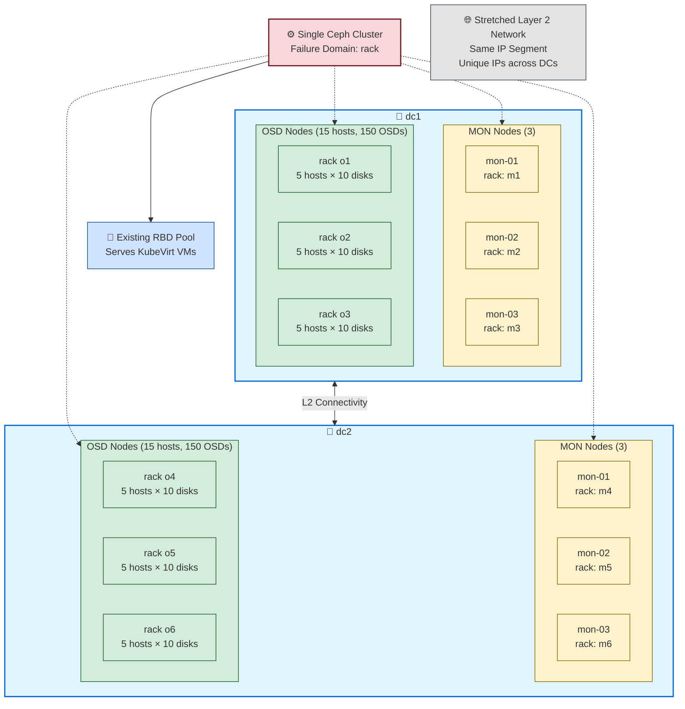

# Ceph Cross-DC Migration

跨資料中心 Ceph 遷移實戰筆記：從 dc1 線上 Ceph cluster 擴展至 dc2，透過 CRUSH 機制完成資料搬遷後再移除 dc1 節點。

---

## 1. Overview / Scenario

### 現況

- **dc1 現有 cluster**
  - 3 台 MON 節點，15 台 OSD 節點
  - 每台 OSD 節點有 10 顆 OSD disk
  - 現有 RBD pool 服務 KubeVirt 虛擬機

- **dc2 目標硬體**
  - 硬體規格與 dc1 相同：3 MON + 15 OSD 節點
  - 每台 OSD 節點有 10 顆 OSD disk

- **網路拓樸**
  - dc1 與 dc2 之間有 Layer 2 連通（stretched Layer 2）
  - Server OS 與 Ceph private network 使用相同的 IP segment
  - 所有 IP 位址在兩個 site 間都是唯一的（無衝突）

### Rack 命名規範

為確保操作時能清楚區分新舊節點，兩個 DC 採用不重複的 rack 命名：

- **dc1 racks**
  - OSD racks: `o1`, `o2`, `o3`
  - MON racks: `m1`, `m2`, `m3`

- **dc2 racks**
  - OSD racks: `o4`, `o5`, `o6`
  - MON racks: `m4`, `m5`, `m6`

**📝 說明**：MON rack 命名僅作為操作員識別參考，MON 節點不參與 CRUSH placement。

### 遷移策略：Option B

本文件採用 **Option B 單一 cluster 擴展模式**，而非第二 cluster 遷移：

1. 將 dc2 節點加入現有 cluster
2. 等待 CRUSH rebalance / data sync
3. 移除 dc1 節點

### CRUSH 設計原則

- **不分離 datacenter bucket**：CRUSH 模型保持單一邏輯 dc
- **Failure domain 維持 rack 級別**
- Rack 命名已採用不重複方式（見上方 Rack 命名規範），避免混淆新舊節點

---

## 2. Architecture Diagram

### Two-DC Server / Rack Topology



**圖說**：
- 單一 Ceph cluster 橫跨兩個資料中心（dc1 與 dc2）
- 每個 DC 各有 3 台 MON 節點與 15 台 OSD 節點
- OSD 節點分布於 3 個 racks，每個 rack 有 5 台 host，每台 host 有 10 顆 OSD disk
- 兩個 DC 透過 stretched Layer 2 網路連通，使用同一 IP segment，所有 IP 唯一
- Failure domain 為 rack 級別（不是 datacenter 級別）
- 現有 RBD pool 持續服務 KubeVirt VM

---

## 3. Best Practice Analysis

### 優勢

- **簡化遷移流程**：不需建立第二個 cluster 與 RBD image mirror
- **單一管理平面**：MON/MGR 保持統一，監控與告警系統不需重構
- **CRUSH 自動平衡**：新增節點後 Ceph 自動處理資料搬遷

### 取捨與限制

**⚠️ 重要誠實聲明**：

1. **單一邏輯 dc 模型犧牲了 datacenter-level 語意**
   - 不是最清晰的 dc-aware CRUSH 設計
   - 無法透過 `datacenter=dc1` 或 `datacenter=dc2` bucket 精確控管跨 dc 的副本分布
   - Datacenter-level placement 可見性與控制力較弱

2. **本案為何可接受此設計**
   - dc1/dc2 透過 stretched Layer 2 連通，網路延遲可控
   - 所有 IP 唯一，無位址衝突風險
   - 使用者明確選擇單一邏輯 dc 模型
   - Rack-level failure domain 對當前需求已足夠

3. **依賴性風險**
   - 對 Layer 2 stretched network 有強依賴
   - 若 dc 間連線中斷，cluster 可能進入降級狀態
   - 未來若需清楚的 dc-level 隔離，需重新設計 CRUSH map

### 關鍵風險

| 風險項目 | 影響 | 緩解措施 |
|---------|------|---------|
| 單一邏輯 dc 模型 | Datacenter-level 語意喪失 | 明確文件化，使用 rack 命名區分 dc1/dc2 |
| Layer 2 中斷 | Cluster 可能降級或 split-brain | 監控網路連通性，規劃 dc 間專線與備援 |
| Recovery 影響 client I/O | VM I/O latency 增加、stalls | 分批加入節點、監控 backfill rate、設定 maintenance window |
| Rack 命名錯誤 | 誤判節點位置、操作失誤 | 使用不重複的新 rack 名稱 (`o4-o6`, `m4-m6`) |
| 從不健康狀態開始遷移 | 資料遺失或遷移失敗 | 確認起始狀態：`HEALTH_OK`、無 nearfull、無 degraded PG |

---

## 4. Current and Target Rack Layout

### Current (dc1 only)

```
cluster
├─ MON Nodes (3 台)
│  ├─ host-mon-01  [rack=m1]
│  ├─ host-mon-02  [rack=m2]
│  └─ host-mon-03  [rack=m3]
│
└─ OSD Nodes (15 台，共 150 OSDs)
   ├─ rack o1: host-osd-01 ~ 05  [5 hosts × 10 disks = 50 OSDs]
   ├─ rack o2: host-osd-06 ~ 10  [5 hosts × 10 disks = 50 OSDs]
   └─ rack o3: host-osd-11 ~ 15  [5 hosts × 10 disks = 50 OSDs]
```

### Target (dc1 + dc2, before dc1 removal)

```
cluster
├─ MON Nodes (6 台)
│  ├─ dc1: mon-01~03  [racks m1, m2, m3]
│  └─ dc2: mon-01~03  [racks m4, m5, m6] ← 新增
│
└─ OSD Nodes (30 台，共 300 OSDs)
   ├─ dc1 (15 台，150 OSDs)
   │  ├─ rack o1: dc1-osd-01 ~ 05  [5 hosts × 10 disks = 50 OSDs]
   │  ├─ rack o2: dc1-osd-06 ~ 10  [5 hosts × 10 disks = 50 OSDs]
   │  └─ rack o3: dc1-osd-11 ~ 15  [5 hosts × 10 disks = 50 OSDs]
   │
   └─ dc2 (15 台，150 OSDs) ← 新增
      ├─ rack o4: dc2-osd-01 ~ 05  [5 hosts × 10 disks = 50 OSDs]
      ├─ rack o5: dc2-osd-06 ~ 10  [5 hosts × 10 disks = 50 OSDs]
      └─ rack o6: dc2-osd-11 ~ 15  [5 hosts × 10 disks = 50 OSDs]
```

### Final (dc2 only)

```
cluster
├─ MON Nodes (3 台)
│  └─ dc2: mon-01~03  [racks m4, m5, m6]
│
└─ OSD Nodes (15 台，共 150 OSDs)
   ├─ rack o4: dc2-osd-01 ~ 05  [5 hosts × 10 disks = 50 OSDs]
   ├─ rack o5: dc2-osd-06 ~ 10  [5 hosts × 10 disks = 50 OSDs]
   └─ rack o6: dc2-osd-11 ~ 15  [5 hosts × 10 disks = 50 OSDs]
```

---

## 5. Migration Principles

### 核心準則

1. **絕不同時替換所有 3 台 MON**
   - MON quorum 最少需要 2 台存活
   - 逐台加入 dc2 MON，每次加入後檢查 quorum 健康狀態

2. **小批次加入 dc2 OSD 節點**
   - 建議每批 2-3 台 OSD host
   - 不要一次加入全部 15 台

3. **等待 rebalance 完成後再進行下一步**
   - 監控 `ceph -s` 確認無 active recovery
   - 檢查 `ceph health detail` 無 warnings

4. **只在新 racks 承載資料後才 drain 舊節點**
   - 確認 dc2 OSD 已有資料寫入
   - 使用 `ceph osd df tree` 檢查新 OSD 使用率

5. **依賴 CRUSH placement 而非 image-by-image copy**
   - 不使用 `rbd export/import` 搬遷單一 image
   - 透過 `reweight`, `out`, `purge` 操作引導 CRUSH 重分布

### KubeVirt / RBD 注意事項

- **Storage backend 不需更換**：因為仍是同一個 cluster，RBD pool 名稱與連線資訊不變
- **監控 VM I/O latency**：backfill 期間可能影響 VM 效能
  - 使用 Prometheus 或 `ceph osd perf` 監控 I/O latency
  - 檢查 KubeVirt PVC events 與 guest OS 內的 I/O stalls
- **最終 dc1 退役需要維護窗口**
  - 即使資料已搬遷，移除 OSD 仍會觸發 recovery
  - 建議在低峰時段或維護窗口內執行

---

## 6. Detailed Runbook

### Phase A: Pre-Migration Validation

**目標**：確認 cluster 健康狀態與準備工作

```bash
# 1. 檢查 cluster 健康狀態
ceph -s
# 必須為 HEALTH_OK，無 degraded PGs，無 nearfull OSDs

# 2. 備份 CRUSH map
ceph osd getcrushmap -o crushmap.bin
crushtool -d crushmap.bin -o crushmap.txt
# 保存 crushmap.txt 備查

# 3. 記錄現有 MON quorum
ceph quorum_status | jq '.quorum_names'

# 4. 記錄現有 OSD 分布
ceph osd tree > osd-tree-before.txt
ceph osd df tree > osd-df-before.txt

# 5. 檢查 RBD pool 設定
ceph osd pool ls detail | grep -A 10 <your-rbd-pool-name>
# 確認 size, min_size, crush_rule

# 6. 驗證 dc2 網路連通性
# 從 dc1 MON 節點 ping dc2 節點的 cluster network IP
ping -c 3 <dc2-node-cluster-ip>

# 7. 確認 cephadm/ceph-admin SSH key 已部署到 dc2 節點
ssh -i /etc/ceph/ceph.pub ceph-admin@<dc2-node> hostname
```

**Gate Criteria**：
- ✅ `ceph -s` 顯示 `HEALTH_OK`
- ✅ 無 degraded 或 misplaced PGs
- ✅ 無 OSD nearfull 或 full
- ✅ dc1 ↔ dc2 網路雙向連通
- ✅ SSH key 已部署到所有 dc2 節點

---

### Phase B: Add dc2 MON Nodes

**目標**：逐台加入 dc2 MON 節點至 quorum

**原則**：每次加入 1 台 MON，檢查 quorum 後再加下一台

**📝 說明**：MON 節點不參與 CRUSH placement，因此不需要執行 `ceph osd crush` 指令。文件中提到的 MON rack labels (m4, m5, m6) 僅作為**操作員命名與分組參考**，幫助識別哪些 MON 位於 dc2，但並非 CRUSH map 操作。

```bash
# 1. 加入 dc2-mon-01
ceph orch host add dc2-mon-01 <dc2-mon-01-ip> --labels _admin,mon

# 2. 檢查 MON quorum
ceph quorum_status | jq '.quorum_names'
# 應看到 dc2-mon-01 已加入

# 3. 等待 5 分鐘，確認 MON 穩定
sleep 300
ceph -s

# 4. 加入 dc2-mon-02
ceph orch host add dc2-mon-02 <dc2-mon-02-ip> --labels _admin,mon

# 5. 再次檢查 quorum
ceph quorum_status | jq '.quorum_names'

# 6. 等待 5 分鐘
sleep 300
ceph -s

# 7. 加入 dc2-mon-03
ceph orch host add dc2-mon-03 <dc2-mon-03-ip> --labels _admin,mon

# 8. 最終 quorum 檢查
ceph quorum_status | jq '.quorum_names'
# 應看到 6 台 MON
```

**Gate Criteria**：
- ✅ 6 台 MON 全部在 quorum 中
- ✅ `ceph -s` 仍為 `HEALTH_OK`
- ✅ `ceph mon stat` 顯示 6 台 MON

---

### Phase C: Add dc2 OSD Racks to CRUSH

**目標**：建立 dc2 OSD rack buckets

```bash
# 建立 dc2 OSD racks
ceph osd crush add-bucket o4 rack
ceph osd crush add-bucket o5 rack
ceph osd crush add-bucket o6 rack

# 移動至 default root
ceph osd crush move o4 root=default
ceph osd crush move o5 root=default
ceph osd crush move o6 root=default

# 驗證 CRUSH tree
ceph osd tree
# 應看到 o4, o5, o6 racks 已建立但尚無 host
```

---

### Phase D: Add dc2 OSD Nodes (Batch 1)

**目標**：加入第一批 dc2 OSD 節點（建議 2-3 台）

**範例：加入 dc2-osd-01 到 dc2-osd-03**

```bash
# 1. 加入 dc2-osd-01 (屬於 rack o4)
ceph orch host add dc2-osd-01 <dc2-osd-01-ip> --labels osd
ceph osd crush move dc2-osd-01 rack=o4

# 2. 部署 OSDs（假設每台有 10 顆 disk）
ceph orch daemon add osd dc2-osd-01:/dev/sdb
ceph orch daemon add osd dc2-osd-01:/dev/sdc
# ... 依此類推部署 10 顆 OSD

# 3. 重複步驟加入 dc2-osd-02 與 dc2-osd-03
ceph orch host add dc2-osd-02 <dc2-osd-02-ip> --labels osd
ceph osd crush move dc2-osd-02 rack=o4
# 部署 OSDs...

ceph orch host add dc2-osd-03 <dc2-osd-03-ip> --labels osd
ceph osd crush move dc2-osd-03 rack=o4
# 部署 OSDs...

# 4. 監控 rebalance
watch -n 5 'ceph -s'
watch -n 5 'ceph osd df tree'

# 5. 等待 recovery 完成
# 持續監控直到無 active recovery，PG 狀態恢復 active+clean
```

**Gate Criteria**：
- ✅ 所有新 OSD 狀態為 `up` 與 `in`
- ✅ `ceph -s` 無 active recovery 或 backfill
- ✅ 所有 PGs 為 `active+clean`
- ✅ 新 OSD 已開始承載資料（`ceph osd df tree` 顯示使用率 > 0）

---

### Phase E: Add dc2 OSD Nodes (Remaining Batches)

**目標**：完成所有 dc2 OSD 節點加入（共 15 台）

**重複 Phase D 流程**，分批加入剩餘 12 台：

- **Batch 2**: dc2-osd-04 ~ 05 (rack o4 剩餘)
- **Batch 3**: dc2-osd-06 ~ 08 (rack o5)
- **Batch 4**: dc2-osd-09 ~ 10 (rack o5 剩餘)
- **Batch 5**: dc2-osd-11 ~ 13 (rack o6)
- **Batch 6**: dc2-osd-14 ~ 15 (rack o6 剩餘)

**每批次之間必須等待 recovery 完成**

```bash
# 監控指令
ceph -s
ceph health detail
ceph osd df tree
ceph pg stat

# 檢查 VM I/O impact
# 在 KubeVirt 端檢查 PVC events 與 VM metrics
kubectl get events -n <vm-namespace> | grep -i pv
```

**Gate Criteria**：
- ✅ 所有 30 台 OSD hosts 已加入 (dc1: 15, dc2: 15)
- ✅ Cluster 達到 `HEALTH_OK`
- ✅ 資料已平均分布至 dc2 racks (o4, o5, o6)

---

### Phase F: Remove dc1 OSD Nodes

**目標**：逐批移除 dc1 OSD 節點

**原則**：
- 分批移除，每批 2-3 台
- 每批移除後等待 recovery 完成
- 使用 `out` → `purge` → `rm` 三步驟

**範例：移除 dc1-osd-01**

```bash
# 1. 將 OSD 標記為 out
# 列出該 host 上的 OSD IDs
ceph osd tree | grep dc1-osd-01

# 假設 OSDs 為 osd.0 到 osd.9
for osd_id in {0..9}; do
  ceph osd out osd.$osd_id
done

# 2. 等待資料遷移完成
watch -n 5 'ceph -s'
# 等待該 host 上的 OSDs usage 降至 0

# 3. 停止 OSD daemon
for osd_id in {0..9}; do
  ceph orch daemon stop osd.$osd_id
done

# 4. Purge OSDs
for osd_id in {0..9}; do
  ceph osd purge osd.$osd_id --yes-i-really-mean-it
done

# 5. 移除 host
ceph orch host rm dc1-osd-01

# 6. 從 CRUSH map 移除 host
ceph osd crush rm dc1-osd-01
```

**重複以上步驟移除所有 dc1 OSD hosts**

**Gate Criteria**：
- ✅ 所有 dc1 OSD 已移除
- ✅ `ceph osd tree` 僅顯示 dc2 OSD hosts
- ✅ Cluster 恢復 `HEALTH_OK`

---

### Phase G: Remove dc1 MON Nodes

**目標**：逐台移除 dc1 MON 節點

**原則**：每次移除 1 台 MON，檢查 quorum 後再移下一台

```bash
# 1. 移除 dc1-mon-01
ceph orch host rm dc1-mon-01

# 2. 檢查 quorum
ceph quorum_status | jq '.quorum_names'
# 應看到 dc1-mon-01 已不在 quorum 中

# 3. 等待 5 分鐘
sleep 300
ceph -s

# 4. 移除 dc1-mon-02
ceph orch host rm dc1-mon-02
ceph quorum_status | jq '.quorum_names'
sleep 300
ceph -s

# 5. 移除 dc1-mon-03
ceph orch host rm dc1-mon-03
ceph quorum_status | jq '.quorum_names'
sleep 300
ceph -s

# 6. 最終驗證
ceph mon stat
# 應顯示 3 台 MON (僅 dc2)
```

**Gate Criteria**：
- ✅ 僅剩 dc2 的 3 台 MON 在 quorum 中
- ✅ `ceph -s` 顯示 `HEALTH_OK`
- ✅ `ceph orch host ls` 僅列出 dc2 hosts

---

### Phase H: Post-Migration Validation

**目標**：確認遷移完成且 cluster 健康

```bash
# 1. 檢查 cluster 狀態
ceph -s
ceph health detail

# 2. 驗證 CRUSH map
ceph osd tree
ceph osd df tree

# 3. 檢查 RBD pool
ceph osd pool ls detail | grep -A 10 <your-rbd-pool-name>

# 4. 驗證 RBD images 可正常存取
rbd ls <pool-name>
rbd info <pool-name>/<image-name>

# 5. KubeVirt VM 驗證
# 檢查所有 VM 仍正常運行
kubectl get vmi -A
# 測試 VM I/O 與網路連線

# 6. 備份新的 CRUSH map
ceph osd getcrushmap -o crushmap-dc2-only.bin
crushtool -d crushmap-dc2-only.bin -o crushmap-dc2-only.txt

# 7. 文件化最終配置
ceph osd tree > osd-tree-final.txt
ceph osd df tree > osd-df-final.txt
```

**Success Criteria**：
- ✅ `ceph -s` 顯示 `HEALTH_OK`
- ✅ 所有 PGs 為 `active+clean`
- ✅ RBD images 可正常讀寫
- ✅ KubeVirt VMs 運行正常，無 I/O 異常

---

## 7. Cutover Gates

每個 Phase 都有明確的 Gate Criteria，必須滿足後才能進入下一 Phase：

| Phase | Gate Criteria |
|-------|---------------|
| **A: Pre-Migration** | HEALTH_OK、無 degraded PGs、dc2 網路可達、SSH key 部署完成 |
| **B: Add MON** | 6 台 MON 全在 quorum、HEALTH_OK |
| **C: Add Racks** | CRUSH tree 正確顯示新 racks |
| **D: Add OSD Batch 1** | 新 OSD up+in、無 active recovery、新 OSD 有資料 |
| **E: Add OSD Batch 2-5** | 所有 15 台 dc2 OSD 已加入、資料平均分布、HEALTH_OK |
| **F: Remove dc1 OSD** | dc1 OSD 全部移除、HEALTH_OK |
| **G: Remove dc1 MON** | 僅剩 dc2 MON、HEALTH_OK |
| **H: Post-Migration** | 最終驗證通過、VMs 正常運行 |

**強制停止條件**：
- 任一 Phase 中出現 `HEALTH_ERR`
- PG 狀態為 `degraded` 或 `incomplete`
- OSD 出現 `full` 或 `nearfull` warnings
- MON quorum lost
- 客戶端 I/O 中斷超過可接受閾值

---

## 8. Rollback Rules

### Rollback Windows

| Phase | 可否 Rollback | Rollback 方法 |
|-------|--------------|---------------|
| **A-B (MON 加入)** | ✅ 可 | 移除新加入的 dc2 MON |
| **C-D (初期 OSD 加入)** | ✅ 可 | 移除 dc2 OSD，資料仍在 dc1 |
| **E (大量 OSD 加入)** | ⚠️ 困難 | 資料已分散，需等待 recovery，建議修復而非 rollback |
| **F (dc1 OSD 移除中)** | ⚠️ 困難 | 可嘗試重新加入已移除的 dc1 OSD，但風險高 |
| **G-H (dc1 完全移除)** | ❌ 不可 | 無 rollback 路徑，只能前進修復 |

### Rollback Phase B/C/D: 移除 dc2 新節點

```bash
# 1. 停止所有 dc2 OSD daemons
ceph orch ps --daemon-type osd | grep dc2- | awk '{print $1}' | xargs -I {} ceph orch daemon stop {}

# 2. Purge dc2 OSDs
# 列出所有 dc2 OSD IDs
ceph osd tree | grep dc2-osd | awk '{print $1}' | sed 's/osd\.//'

# 逐一 purge
for osd_id in <dc2-osd-ids>; do
  ceph osd purge osd.$osd_id --yes-i-really-mean-it
done

# 3. 移除 dc2 OSD hosts
ceph orch host rm dc2-osd-01
# ... 依此類推

# 4. 移除 dc2 MON
ceph orch host rm dc2-mon-01
ceph orch host rm dc2-mon-02
ceph orch host rm dc2-mon-03

# 5. 清理 CRUSH map (僅移除 OSD racks)
ceph osd crush rm o4
ceph osd crush rm o5
ceph osd crush rm o6
# 注意：m4/m5/m6 是 MON 的命名參考，不在 CRUSH map 中，無需移除

# 6. 驗證回復至 dc1-only 狀態
ceph osd tree
ceph mon stat
```

### Rollback Phase E/F: 修復而非回退

若在 Phase E/F 遇到問題，建議採取修復措施而非 rollback：

- **OSD 狀態異常**：排查硬碟、網路問題，修復後重新啟動 OSD
- **Recovery 過慢**：調整 backfill/recovery rate 參數
- **PG degraded**：檢查 OSD 日誌，修復故障 OSD
- **MON quorum 問題**：確保至少 2 台 MON 存活，重啟 MON daemon

```bash
# 調整 recovery rate (臨時加速)
ceph tell osd.* injectargs --osd-max-backfills 4
ceph tell osd.* injectargs --osd-recovery-max-active 8

# 或放慢避免影響 client I/O
ceph tell osd.* injectargs --osd-max-backfills 1
ceph tell osd.* injectargs --osd-recovery-max-active 2
```

---

## 9. Command Reference

### Cluster Status

```bash
# 整體狀態
ceph -s

# 詳細健康資訊
ceph health detail

# PG 統計
ceph pg stat
ceph pg dump

# OSD tree 與使用率
ceph osd tree
ceph osd df tree

# MON status
ceph mon stat
ceph quorum_status
```

### OSD Operations

```bash
# 列出所有 OSD
ceph osd ls

# 標記 OSD 為 out
ceph osd out osd.<id>

# 標記 OSD 為 in
ceph osd in osd.<id>

# Reweight OSD (降低權重以減少資料)
ceph osd reweight osd.<id> 0.5

# Purge OSD (完全移除)
ceph osd purge osd.<id> --yes-i-really-mean-it

# 檢查 OSD 效能
ceph osd perf
```

### CRUSH Operations

```bash
# 取得 CRUSH map
ceph osd getcrushmap -o crushmap.bin
crushtool -d crushmap.bin -o crushmap.txt

# 新增 bucket
ceph osd crush add-bucket <name> <type>
# type: root, datacenter, rack, host

# 移動 bucket
ceph osd crush move <name> <location>
# 例: ceph osd crush move dc2-osd-01 rack=o4

# 移除 bucket 或 OSD
ceph osd crush rm <name>

# 設定 CRUSH rule
ceph osd crush rule ls
ceph osd crush rule dump <rule-name>
```

### Host Management (cephadm)

```bash
# 列出所有 hosts
ceph orch host ls

# 加入 host
ceph orch host add <hostname> <ip> --labels <label1>,<label2>

# 移除 host
ceph orch host rm <hostname>

# 設定 host labels
ceph orch host label add <hostname> <label>
ceph orch host label rm <hostname> <label>
```

### OSD Deployment (cephadm)

```bash
# 列出可用磁碟
ceph orch device ls

# 部署單顆 OSD
ceph orch daemon add osd <hostname>:/dev/<device>

# 自動部署所有可用磁碟
ceph orch apply osd --all-available-devices

# 查看 OSD daemons
ceph orch ps --daemon-type osd

# 停止 OSD daemon
ceph orch daemon stop osd.<id>

# 刪除 OSD daemon
ceph orch daemon rm osd.<id> --force
```

### Recovery Tuning

```bash
# 查看當前設定
ceph config get osd osd_max_backfills
ceph config get osd osd_recovery_max_active

# 調整 backfill 並發數 (全域設定)
ceph config set osd osd_max_backfills 2
ceph config set osd osd_recovery_max_active 4

# 臨時調整 (重啟後失效)
ceph tell osd.* injectargs --osd-max-backfills 2
ceph tell osd.* injectargs --osd-recovery-max-active 4

# 設定 recovery sleep (減緩 recovery 避免影響 client)
ceph config set osd osd_recovery_sleep_hdd 0.1
ceph config set osd osd_recovery_sleep_ssd 0.05
```

### RBD Pool

```bash
# 列出 pools
ceph osd pool ls detail

# 檢查 pool 設定
ceph osd pool get <pool-name> size
ceph osd pool get <pool-name> min_size
ceph osd pool get <pool-name> crush_rule

# 列出 RBD images
rbd ls <pool-name>

# 檢查 image 資訊
rbd info <pool-name>/<image-name>

# 檢查 image 使用的 OSDs
rbd showmapped
rados -p <pool-name> ls
```

### MON Operations

```bash
# 檢查 MON map
ceph mon dump

# 檢查 quorum
ceph quorum_status

# 手動加入 MON (如果 cephadm 無法自動部署)
ceph mon add <mon-id> <ip>:<port>

# 移除 MON
ceph mon remove <mon-id>
```

---

## 總結

本文件提供 Ceph Cross-DC Migration 的完整實戰 runbook，採用 Option B 單一 cluster 擴展策略。核心要點：

1. **誠實面對設計取捨**：單一邏輯 dc 模型犧牲 datacenter-level 語意，但對本案場景可接受
2. **分階段執行**：MON 與 OSD 都採取小批次加入，每步驟都有明確 gate
3. **依賴 CRUSH rebalance**：而非手動 image copy
4. **監控 KubeVirt I/O**：backfill 期間持續監控 VM 效能
5. **明確 rollback 規則**：早期可 rollback，後期只能修復

---

**相關參考**
- [Ceph Official Documentation](https://docs.ceph.com/)
- [CRUSH Map Documentation](https://docs.ceph.com/en/latest/rados/operations/crush-map/)
- [cephadm Orchestrator](https://docs.ceph.com/en/latest/cephadm/)
