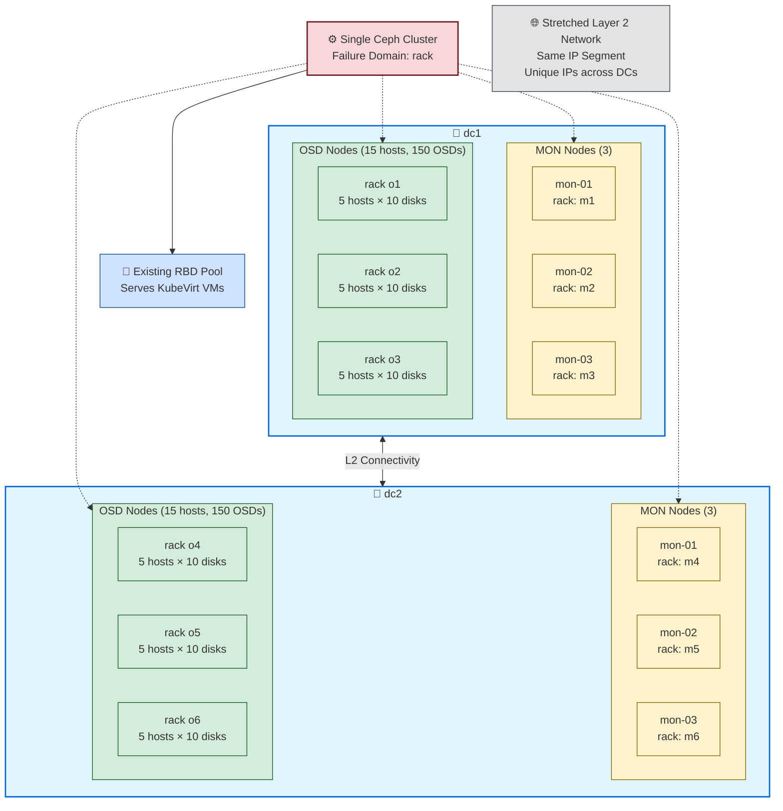

# Ceph Cross-DC Migration

跨資料中心 Ceph 遷移實戰筆記：從 dc1 線上 Ceph cluster 擴展至 dc2,透過 CRUSH 機制完成資料搬遷後再移除 dc1 節點。

---

## 1. Overview / Scenario

### 現況

- **dc1 現有 cluster**
  - 3 台 MON 節點，15 台 OSD 節點
  - 每台 OSD 節點有 10 顆 OSD disk
  - 現有 RBD pool 服務 KubeVirt 虛擬機

- **dc2 目標硬體**
  - 硬體規格與 dc1 相同：3 MON + 15 OSD 節點
  - 每台 OSD 節點有 10 顆 OSD disk

- **網路拓樸**
  - dc1 與 dc2 之間有 Layer 2 連通（stretched Layer 2）
  - Server OS 與 Ceph private network 使用相同的 IP segment
  - 所有 IP 位址在兩個 site 間都是唯一的（無衝突）

### Rack 命名規範

為確保操作時能清楚區分新舊節點，兩個 DC 採用不重複的 rack 命名：

- **dc1 racks**
  - OSD racks: `o1`, `o2`, `o3`
  - MON racks: `m1`, `m2`, `m3`

- **dc2 racks**
  - OSD racks: `o4`, `o5`, `o6`
  - MON racks: `m4`, `m5`, `m6`

**📝 說明**：MON rack 命名僅作為操作員識別參考，MON 節點不參與 CRUSH placement。

### 遷移策略：Option B

本文件採用 **Option B 單一 cluster 擴展模式**，而非第二 cluster 遷移：

1. 將 dc2 節點加入現有 cluster
2. 等待 CRUSH rebalance / data sync
3. 移除 dc1 節點

### CRUSH 設計原則

- **不分離 datacenter bucket**：CRUSH 模型保持單一邏輯 dc
- **Failure domain 維持 rack 級別**
- Rack 命名已採用不重複方式（見上方 Rack 命名規範），避免混淆新舊節點

---

## 2. Architecture Diagram

### Two-DC Server / Rack Topology

**圖說**：
- 單一 Ceph cluster 橫跨兩個資料中心（dc1 與 dc2）
- 每個 DC 各有 3 台 MON 節點與 15 台 OSD 節點
- OSD 節點分布於 3 個 racks，每個 rack 有 5 台 host，每台 host 有 10 顆 OSD disk
- 兩個 DC 透過 stretched Layer 2 網路連通，使用同一 IP segment，所有 IP 唯一
- Failure domain 為 rack 級別（不是 datacenter 級別）
- 現有 RBD pool 持續服務 KubeVirt VM

---

## 3. Reading Guide

本文件為跨資料中心 Ceph 遷移的主題入口。深入的解決方案分析與執行細節請參考：

### 📚 Solutions

深入探討遷移策略的比較與決策依據：

- **[Solutions Overview](solutions/)**
  - Option A vs Option B 比較
  - 設計取捨分析
  - 風險評估與緩解措施

### 📋 Detail Runbook

遷移執行的詳細步驟指南：

- **[Detail Runbook](detail_runbook/)**
  - 完整分階段執行步驟
  - 前置驗證與 gate criteria
  - Cutover 檢查點與 rollback 規則
  - 指令參考手冊

---

## 相關參考

- [Ceph Official Documentation](https://docs.ceph.com/)
- [CRUSH Map Documentation](https://docs.ceph.com/en/latest/rados/operations/crush-map/)
- [cephadm Orchestrator](https://docs.ceph.com/en/latest/cephadm/)
