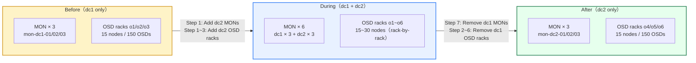

# Ceph Cross-DC Migration

跨資料中心 Ceph 遷移實戰筆記：從 dc1 線上 Ceph cluster 擴展至 dc2,透過 CRUSH 機制完成資料搬遷後再移除 dc1 節點。

---

## 1. Overview / Scenario

### 現況

- **dc1 現有 cluster**：3 台 MON、15 台 OSD nodes（每台 10 顆 OSD disks），現有 RBD pool 服務 KubeVirt 虛擬機
- **dc2 目標硬體**：3 台 MON、15 台 OSD nodes（每台 10 顆 OSD disks）
- **網路拓樸**：dc1 與 dc2 之間有 Layer 2 連通（stretched Layer 2），Server OS 與 Ceph private network 使用相同的 IP segment

### Topology Metadata

```text
datacenter dc1
└─ room r1
   ├─ rack m1 / m2 / m3
   └─ rack o1 / o2 / o3

datacenter dc2
└─ room r2
   ├─ rack m4 / m5 / m6
   └─ rack o4 / o5 / o6
```

---

## 2. Architecture Diagram



---

## 3. Reading Guide

本文件為跨資料中心 Ceph 遷移的主題入口。深入的解決方案分析與執行細節請參考：

### 📚 Solutions

深入探討遷移策略的比較與決策依據：

- **[Solutions Overview](solutions/)**
  - Option A vs Option B 比較
  - 設計取捨分析
  - 風險評估與緩解措施

### 📋 Runbooks

(建議順序：先 MON，後 OSD)

- **[MON Migration Runbook](detail_runbook/)**
  - quorum 重新定位 / monitor 拓樸變動
  - Rook external 模式協調
  - ceph-csi / KubeVirt 驗證步驟

- **[OSD Migration Runbook](osd-migration/)**
  - 以機櫃 (rack-by-rack) 為單位遷移
  - 觀察 recovery/backfill 進度並設定觀察門檻
  - RBD workload 影響評估與 gate criteria

---

## 相關參考

- [Ceph Official Documentation](https://docs.ceph.com/)
- [CRUSH Map Documentation](https://docs.ceph.com/en/latest/rados/operations/crush-map/)
- [cephadm Orchestrator](https://docs.ceph.com/en/latest/cephadm/)
