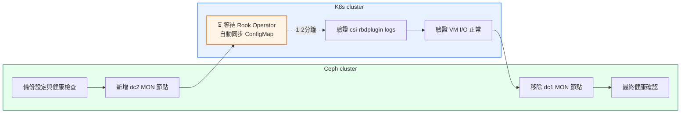

# MON Migration Runbook

本文件提供跨資料中心 Ceph 遷移的 **MON / control-plane 切換手冊**，聚焦於 quorum 驗證、Rook external mode client endpoint coordination、ceph-csi behavior，以及 KubeVirt / VM 在 MON endpoint 變更期間的驗證。

關於遷移策略的分析與決策依據，請參考 [Solutions Overview](../solutions/)。關於 OSD bulk data migration 的詳細步驟，請參考 [OSD Migration Runbook](../osd-migration/)。關於場景與架構概述，請參考 [主文件](../)。

## High-Level Flow



**預期耗時**：8-10 分鐘


### 核心原則

1. **Add-Before-Remove Strategy**
   - 先新增 dc2 MON 節點，擴大 quorum（暫時從 3 增至 4、5、6）
   - 驗證新 MON 節點在 quorum 中且穩定
   - 確認 client 端已使用新 endpoint 後，再移除 dc1 MON 節點

2. **Quorum Safety**
   - MON quorum 需多數決（3 個中至少 2 個，5 個中至少 3 個）
   - 新增 MON 時，quorum 容錯能力提升（暫時可容忍更多節點失效）
   - 移除 MON 前必須確認剩餘節點數仍能滿足 quorum 要求

3. **Client Endpoint Coordination**
   - Rook-Ceph external mode 透過 `rook-ceph-mon-endpoints` ConfigMap 與 Secret 傳遞 MON 地址
   - `rook-ceph-config` / `mon_host` 必須反映新 MON endpoint 集合
   - **Rook Operator Auto-Sync** (v1.14+): 當 Ceph cluster 的 MON 拓撲變更時，Rook operator 會自動更新 ConfigMaps，**無需手動編輯**
   - 切換策略：**先加後減，再提早切到 dc2-only**（先讓 client 吃到 dc1 + dc2，再於 Ceph 側移除前先清理 dc1 endpoints）
   - 兩者（`rook-ceph-mon-endpoints` 與 `rook-ceph-config` / `mon_host`）都應先完成 dc2-only 收斂，再執行 Ceph cluster 的 dc1 MON 移除
   - ceph-csi / librbd 通常能透過 Ceph 的 monmap gossip 學到新 MON；ConfigMap 變更則主要影響 pod 啟動或 reconnect 時讀取到的 `ceph.conf`
   - 若自動更新失效，則採用**分批重啟** CSI pods 而非全面重啟

4. **最小化業務影響**
   - MON failover 通常在數秒內完成，對 RBD I/O 的影響極小
   - KubeVirt VM 通常能透過 librbd 內建的 MON failover 機制自動恢復
   - 重點驗證：VM 在 MON endpoint 切換期間是否持續正常 I/O
   - Timeout 調整屬於環境特定的驗證項目，非預設強制要求

---

## 2. Rook-Ceph External Mode / KubeVirt Notes

### Rook-Ceph External Mode 連線架構

在本場景中，KubeVirt VM 透過以下路徑連線至 Ceph cluster：

```
KubeVirt VM (guest OS)
  ↓
virt-launcher pod (KubeVirt operator)
  ↓
ceph-csi (csi-rbdplugin DaemonSet)
  ↓
Rook-Ceph external mode (ConfigMap & Secret)
  ↓
Ceph MON endpoints (external Ceph cluster)
```

### Rook-Ceph External Mode ConfigMap / Secret

Rook external mode 使用以下兩個 Kubernetes resources 傳遞 Ceph cluster 連線資訊：

1. **`rook-ceph-mon-endpoints` ConfigMap**
   - 包含 MON endpoint 地址清單
   - 格式範例：`mon1=10.1.1.1:6789,mon2=10.1.1.2:6789,mon3=10.1.1.3:6789`
   - **更新策略**：先擴充為 **dc1 + dc2**，驗證 client 正常後，再收斂為 **dc2-only**

2. **`rook-ceph-config` ConfigMap**
   - 包含 `ceph.conf` 的 client-side 配置
   - 其中 `mon_host` 欄位必須反映新 MON endpoint 集合
   - **更新策略**：先擴充為 **dc1 + dc2**，驗證 client 正常後，再收斂為 **dc2-only**
   - **驗證重點**：確認 `mon_host` 先包含新 MON endpoint 集合，之後再收斂為僅剩 dc2

### ceph-csi Behavior

- **動態學習路徑**：`csi-rbdplugin` 內的 librbd client 通常會透過 Ceph 的 monmap gossip 學到新 MON endpoints
- **ConfigMap 角色**：`rook-ceph-mon-endpoints` / `rook-ceph-config` 主要影響 pod 啟動或 reconnect 時讀到的 `ceph.conf`
- **驗證方式**：檢查 `csi-rbdplugin` pod logs 與 pod 內連線行為，確認目前連線已穩定落在預期的 MON endpoint 集合
- **失效處置**：若自動更新失效，則採用**分批重啟** CSI pods（避免同時重啟所有 pods 造成短暫服務中斷）

### KubeVirt VM 影響評估

**MON endpoint 切換期間 VM 行為**：

1. **Short MON Failover Disturbance**
   - librbd（Ceph RBD client library）內建 MON failover 機制
   - 當 current MON 失效或地址變更時，librbd 會自動嘗試連線至其他 MON
   - 典型 failover 時間：數秒內完成

2. **I/O Continuity**
   - 只要至少一個 MON 可達，RBD I/O 能繼續正常運作
   - MON 主要負責 cluster map 發布與 auth，不參與 data path
   - **驗證重點**：VM 在 MON endpoint 切換期間是否持續正常 I/O

3. **Timeout Tuning (Optional)**
   - 若環境對 MON failover 延遲敏感（如關鍵交易系統），可考慮調整 `rbd_default_timeout`
   - **此為環境特定驗證項目，非預設強制要求**
   - 建議先執行 pilot test，觀察實際 failover behavior 再決定是否調整

### 監控重點

- **Ceph 層面**：
  - `ceph mon stat`：確認 MON quorum 狀態
  - `ceph -s`：確認 cluster health 與 MON election 狀態

- **Rook / ceph-csi 層面**：
  - 檢查 `rook-ceph-mon-endpoints` ConfigMap 是否已更新
  - 檢查 `rook-ceph-config` 的 `mon_host` 欄位
  - 檢視 `csi-rbdplugin` pod logs，確認 MON connection 正常

- **KubeVirt / VM 層面**：
  - VM guest OS 的 disk I/O latency（如透過 `iostat` 或應用監控）
  - KubeVirt virt-launcher pod 的 resource usage
  - 若有應用層 SLA，確認 latency 與 throughput 仍在可接受範圍

---

## 3. Detailed MON Migration Runbook

本節詳述 MON migration 的完整執行步驟，包含 Ceph 端 add-before-remove 與 client endpoint 提前切到 dc2-only 的 coordination checkpoints。

### 🔄 Change Flow

本 runbook 推薦使用以下流程進行 MON migration。此流程依賴 Rook operator v1.14+ 的自動同步功能，無需手動編輯 ConfigMaps。

#### 執行步驟

1. **Step 0**：執行前置檢查
2. **Step 1**：Ceph 端 host add 和 placement 配置（`ceph orch host add` + `ceph orch apply mon/mgr`）
3. **Step 2**：跳過手動 ConfigMap 編輯，等待 Rook operator 自動同步（1-2 分鐘）
4. **Step 4**：驗證 csi-rbdplugin logs 確認已連線至新 MON endpoints
5. **Step 4**：關鍵驗證 — 檢查 VM I/O 持續正常（fio 或應用層檢查）
6. **Step 7**：Ceph 端 remove dc1 MON 節點（`ceph orch apply mon/mgr` + `ceph orch host rm`）

**預期總耗時**：8-10 分鐘

> **環境需求**：
> - Rook operator 版本 ≥ v1.14
> - auto-sync 功能已啟用（預設為啟用）
>
> **若需完整手動控制**：
> - 若 Rook operator 未自動更新 ConfigMaps（logs 無相關記錄）或版本 < v1.14
> - 需要精細控制 client endpoint 切換時序
> - 環境複雜或有多個 Kubernetes cluster 連線至同一 Ceph cluster
> - 此時可執行手動 ConfigMap 更新進行介入

---

### Step 0: Pre-Migration Backup and Validation

**目標**：確保 MON quorum 健康、備份關鍵配置、記錄 baseline

| Precheck<br>（檢查項目 / 使用指令 / 原因） | Action<br>（節點 / 指令） | Postcheck<br>（預期結果 / Rollback 方式） |
|---|---|---|
| **MON Quorum 健康**<br>遷移前 cluster 必須 HEALTH_OK，確認 quorum 完整 | Ceph admin 節點<br>`ceph mon stat`<br>`ceph quorum_status -f json-pretty` | ✅ quorum = 3/3, HEALTH_OK<br>❌ 停止遷移，先修復 cluster health |
| **備份 Rook ConfigMap / Secret**<br>保留還原點，遷移失敗時可快速恢復 | K8s admin 節點<br>`export BACKUP_DATE=$(date +%Y%m%d)`<br>`kubectl -n rook-ceph get configmap rook-ceph-mon-endpoints -o yaml > /backup/rook-ceph-mon-endpoints.${BACKUP_DATE}.yaml`<br>`kubectl -n rook-ceph get configmap rook-ceph-config -o yaml > /backup/rook-ceph-config.${BACKUP_DATE}.yaml`<br>`kubectl -n rook-ceph get secret rook-ceph-mon -o yaml > /backup/rook-ceph-mon-secret.${BACKUP_DATE}.yaml` | ✅ 備份檔案存在且可讀<br>❌ 重新備份，勿繼續 |
| **記錄當前 MON endpoints**<br>作為後續對比與 rollback 基準 | K8s admin 節點<br>`kubectl -n rook-ceph get configmap rook-ceph-mon-endpoints -o jsonpath='{.data.data}'`<br>`kubectl -n rook-ceph get configmap rook-ceph-config -o jsonpath='{.data.ceph\.conf}' \| grep mon_host` | ✅ 記錄 dc1 endpoint 清單<br>❌ 檢查 rook-ceph namespace 是否正常 |
| **確認 dc2 MON 候選主機已就緒**<br>確保 cephadm 已可管理 dc2 節點，且 location metadata 正確 | Ceph admin 節點<br>`ceph orch host ls`<br>`ceph orch ls mon -f yaml` | ✅ mon-dc2-01/02/03 在 host 清單中，location metadata 正確<br>❌ 先完成 cephadm bootstrap 安裝 dc2 MON 節點 |
| **記錄 Client Workload 清單**<br>確認受影響的 csi-rbdplugin pods 與 KubeVirt VM | K8s admin 節點<br>`kubectl -n rook-ceph get pods -l app=csi-rbdplugin`<br>`kubectl get vmi -A` | ✅ Pod / VM 清單完整記錄<br>❌ 若有異常 pod：先調查後再繼續 |

---

### Step 1: Add dc2 MONs to Cluster

**目標**：將 dc2 MON 候選主機加入 orchestrator，並指定 MON/MGR 角色到所有 6 個節點

> **cephadm note**: 本 Step 分兩階段執行：
> 1. 使用 `ceph orch host add` 逐一將 dc2 節點（mon-dc2-01 / 02 / 03）加入 orchestrator host 清單
> 2. 使用 `ceph orch apply mon` 與 `ceph orch apply mgr` 指定完整 6 台節點的 placement

| Precheck<br>（檢查項目 / 使用指令 / 原因） | Action<br>（節點 / 指令） | Postcheck<br>（預期結果 / Rollback 方式） |
|---|---|---|
| **dc2 節點尚未在 orchestrator 清單中**<br>`ceph orch host ls` 確認，避免重複添加，IP / hostname 正確 | Ceph admin 節點<br>`ceph orch host add mon-dc2-01 192.168.1.14`<br>`ceph orch host add mon-dc2-02 192.168.1.15`<br>`ceph orch host add mon-dc2-03 192.168.1.16` | ✅ `ceph orch host ls` — 6 台節點全出現<br>❌ 檢查 SSH 連線與 cephadm 安裝狀態 |
| **6 台節點全在 host 清單中**<br>`ceph orch host ls` 確認，apply placement 前所有節點必須就緒 | Ceph admin 節點<br>`ceph orch apply mon --placement="mon-dc1-01 mon-dc1-02 mon-dc1-03 mon-dc2-01 mon-dc2-02 mon-dc2-03"`<br>`sleep 120`<br>`ceph orch apply mgr --placement="mon-dc1-01 mon-dc1-02 mon-dc1-03 mon-dc2-01 mon-dc2-02 mon-dc2-03"`<br>`sleep 60` | ✅ `ceph mon stat` — quorum = 6<br>✅ dc2 三台 MON 均在 quorum 中<br>❌ `ceph orch ps --hostname mon-dc2-XX` 檢查 daemon 狀態<br>❌ Rollback：`ceph orch apply mon --placement="mon-dc1-01 mon-dc1-02 mon-dc1-03"` |

---

### Step 2: Wait for Rook Operator Auto-Sync

**目標**：等待 Rook operator 自動同步 ConfigMaps 以反映新的 6 個 MON 拓撲

> **⚠️ Rook Operator Auto-Sync Note** (v1.14+):
> 當 Ceph cluster MON 拓撲變更後，`rook-ceph-mon-endpoints` 與 `rook-ceph-config` 的 `mon_host` 會**自動同步更新**。
> 先確認 operator logs 是否已自動更新；若已更新，跳過手動介入部分。

| Precheck<br>（檢查項目 / 使用指令 / 原因） | Action<br>（節點 / 指令） | Postcheck<br>（預期結果 / Rollback 方式） |
|---|---|---|
| **Step 1 quorum = 6 已確認**<br>Rook operator 在 MON 拓撲變更後 1-2 分鐘自動同步 ConfigMap | K8s admin 節點<br>等待 1-2 分鐘後<br>`kubectl logs -n rook-ceph deployment/rook-ceph-operator --tail=50 \| grep -i mon`<br>`kubectl -n rook-ceph get configmap rook-ceph-mon-endpoints -o jsonpath='{.data.data}'` | ✅ ConfigMap 包含 6 個 MON endpoints<br>❌ 手動執行：`kubectl -n rook-ceph edit configmap rook-ceph-mon-endpoints`（加入 dc2，保留 dc1） |
| **確認 rook-ceph-config mon_host 已更新**<br>csi-rbdplugin reconnect 時讀取 ceph.conf，mon_host 必須含 dc1 + dc2 | K8s admin 節點<br>`kubectl -n rook-ceph get configmap rook-ceph-config -o jsonpath='{.data.ceph\.conf}' \| grep mon_host` | ✅ mon_host 包含 dc1 + dc2 地址<br>❌ 手動執行：`kubectl -n rook-ceph edit configmap rook-ceph-config`（更新 mon_host） |

---

### Step 4: Check csi-rbdplugin and KubeVirt VM I/O

**目標**：驗證 ceph-csi 是否成功吸收新 MON endpoints，以及 KubeVirt VM I/O 是否持續正常

| Precheck<br>（檢查項目 / 使用指令 / 原因） | Action<br>（節點 / 指令） | Postcheck<br>（預期結果 / Rollback 方式） |
|---|---|---|
| **Rook ConfigMap 已更新（Step 2 gate 通過）**<br>確認 csi-rbdplugin 已吸收新 MON endpoints | K8s admin 節點<br>`kubectl -n rook-ceph logs -l app=csi-rbdplugin --tail=50 \| grep -i mon` | ✅ logs 顯示已連線至新 MON endpoints<br>❌ 分批重啟：`kubectl -n rook-ceph delete pod <pod>` 每批間隔 30s |
| **csi-rbdplugin 可連線至 Ceph cluster**<br>確認 client 端已可 reach dc2 MON | K8s admin 節點 → exec 進 csi-rbdplugin pod<br>`kubectl -n rook-ceph exec -it <csi-rbdplugin-pod> -- bash`<br>`ceph -s --conf=/etc/ceph/ceph.conf --keyring=/etc/ceph/keyring` | ✅ `ceph -s` 正常回傳，無連線錯誤<br>❌ 檢查 dc2 MON 網路連通性 |
| **VM I/O 正常（關鍵驗證）**<br>MON endpoint 切換期間 VM 不應有 I/O 中斷 | VM guest OS<br>`virtctl console <vm-name> -n <namespace>`<br>`dd if=/dev/zero of=/tmp/test.dat bs=1M count=100`<br>`iostat -x 1 5` | ✅ I/O 正常，無錯誤或明顯延遲<br>❌ 暫停遷移，執行 Rollback：<br>`ceph orch apply mon --placement="mon-dc1-01 mon-dc1-02 mon-dc1-03"`<br>`ceph orch apply mgr --placement="mon-dc1-01 mon-dc1-02 mon-dc1-03"`<br>（將 MON/MGR 收回 dc1-only，恢復原始狀態） |

---

### Step 7: Remove dc1 MONs from Cluster

**目標**：在 client-side 已切到 dc2-only 後，逐步移除 Ceph cluster 內的 dc1 MON 節點

**策略**：分三 Phase 逐個移除 dc1 MON（6→5→4→3），每 Phase 驗證 quorum 穩定後再進行下一步

| Precheck<br>（檢查項目 / 使用指令 / 原因） | Action<br>（節點 / 指令） | Postcheck<br>（預期結果 / Rollback 方式） |
|---|---|---|
| **csi-rbdplugin 已切到新 endpoints（Step 4 gate 通過）**<br>確認 client-side 已穩定，quorum 目前 = 6 | Ceph admin 節點<br>**Phase 1 — 移除 mon-dc1-01**<br>`ceph orch apply mon --placement="mon-dc1-02 mon-dc1-03 mon-dc2-01 mon-dc2-02 mon-dc2-03"`<br>`ceph orch apply mgr --placement="mon-dc1-02 mon-dc1-03 mon-dc2-01 mon-dc2-02 mon-dc2-03"`<br>`sleep 120` | ✅ `ceph mon stat` — quorum = 5<br>✅ `ceph health detail` — HEALTH_OK<br>❌ 若 quorum != 5：停止，重新套用 6 節點 placement |
| **Phase 1 quorum = 5 已確認**<br>`ceph mon stat` 驗證，確保穩定後再繼續 | Ceph admin 節點<br>**Phase 2 — 移除 mon-dc1-02**<br>`ceph orch apply mon --placement="mon-dc1-03 mon-dc2-01 mon-dc2-02 mon-dc2-03"`<br>`ceph orch apply mgr --placement="mon-dc1-03 mon-dc2-01 mon-dc2-02 mon-dc2-03"`<br>`sleep 120` | ✅ `ceph mon stat` — quorum = 4<br>✅ `ceph health detail` — HEALTH_OK<br>❌ 若失敗：重新套用 5 節點 placement |
| **Phase 2 quorum = 4 已確認**<br>`ceph mon stat` 驗證，確保穩定後再繼續 | Ceph admin 節點<br>**Phase 3 — 移除 mon-dc1-03（完全切至 dc2）**<br>`ceph orch apply mon --placement="mon-dc2-01 mon-dc2-02 mon-dc2-03"`<br>`ceph orch apply mgr --placement="mon-dc2-01 mon-dc2-02 mon-dc2-03"`<br>`sleep 120` | ✅ `ceph mon stat` — quorum = 3（全為 dc2）<br>✅ `ceph health detail` — HEALTH_OK<br>❌ 若失敗：重新套用 4 節點 placement |
| **quorum = 3 dc2 MON 已確認**<br>確認 dc1 節點無其他非 MON daemon（如 OSD / MGR） | Ceph admin 節點<br>確認無 non-MON daemon 後：<br>`ceph orch host rm mon-dc1-01`<br>`ceph orch host rm mon-dc1-02`<br>`ceph orch host rm mon-dc1-03` | ✅ `ceph orch host ls` — dc1 節點已移除<br>✅ `rook-ceph-mon-endpoints` 與 `mon_host` 已為 dc2-only<br>❌ 若有 non-MON daemon：先完成 OSD runbook 再執行 host rm |

---

## 4. Gate Criteria and Rollback

### MON Migration Gate Criteria

每個 Step 必須滿足以下條件才能進入下一階段：

#### Quorum Health Gate

```bash
# 檢查 MON quorum 狀態
ceph mon stat | grep -q 'quorum' && echo "PASS: Quorum OK" || echo "FAIL"

# 檢查 quorum 成員數
ceph quorum_status -f json-pretty | jq '.quorum | length'
# 確認與預期的 MON 數量一致
```

#### Cluster Health Gate

```bash
# 必須為 HEALTH_OK 或 HEALTH_WARN（僅接受已知的非關鍵 warning）
ceph health detail

# 檢查無 MON election 異常
ceph -s | grep -i 'mon:' 
```

#### Client Endpoint Gate

```bash
# 檢查 rook-ceph-mon-endpoints 已更新
kubectl -n rook-ceph get configmap rook-ceph-mon-endpoints -o jsonpath='{.data.data}'

# 檢查 rook-ceph-config mon_host 已更新
kubectl -n rook-ceph get configmap rook-ceph-config -o jsonpath='{.data.ceph\.conf}' | grep mon_host
```

#### ceph-csi Health Gate

```bash
# 檢查 csi-rbdplugin pods 狀態
kubectl -n rook-ceph get pods -l app=csi-rbdplugin | grep -q 'Running' && echo "PASS" || echo "FAIL"

# 檢查 csi-rbdplugin logs 無連線錯誤
kubectl -n rook-ceph logs -l app=csi-rbdplugin --tail=50 | grep -i error
```

#### KubeVirt VM Health Gate

```bash
# 檢查 KubeVirt VM I/O 是否正常
# 依據實際監控系統執行（如 Prometheus query）

# 簡易測試：進入 VM 執行 dd 測試
virtctl console <vm-name> -n <namespace>
dd if=/dev/zero of=/tmp/test.dat bs=1M count=100
# 確認無 I/O 錯誤或明顯延遲
```

---

### Rollback Rules

#### 何時需要 Rollback

1. **Quorum 不穩定**：
   - 新增 dc2 MON 後，quorum 持續出現 election 或成員變動
   - MON daemon 無法正常啟動或持續 crash

2. **Client 連線失敗**：
   - ceph-csi 無法連線至新 MON endpoints
   - KubeVirt VM I/O 出現錯誤或明顯延遲（如 p99 > 100ms）

3. **網路問題**：
   - dc1 ↔ dc2 MON 網路中斷或延遲飆升
   - Cluster 出現 network partition 風險

4. **配置錯誤**：
   - Rook ConfigMap 更新失敗或格式錯誤
   - ceph-csi 無法讀取更新後的配置

---

### Rollback 步驟

#### Case 1: 剛加入 dc2 MON，尚未移除 dc1 MON

**操作**：將新加入的 dc2 MON 節點移除

```bash
# 假設在 Step 1，剛加入 dc2 MON
# 移除 dc2 MON 節點
ceph mon rm mon-dc2-01
ceph orch daemon rm mon.mon-dc2-01 --force
ceph mon rm mon-dc2-02
ceph orch daemon rm mon.mon-dc2-02 --force
ceph mon rm mon-dc2-03
ceph orch daemon rm mon.mon-dc2-03 --force

# 驗證 quorum 恢復為原始的 3 個 dc1 MON
ceph mon stat
# 預期：quorum: 0,1,2 (3 MONs, 全為 dc1)

# 使用 Step 0 記錄下來的 BACKUP_DATE
export BACKUP_DATE=<recorded-backup-date>

# 恢復 Rook ConfigMap（若已更新）
kubectl -n rook-ceph apply -f /backup/rook-ceph-mon-endpoints.${BACKUP_DATE}.yaml
kubectl -n rook-ceph apply -f /backup/rook-ceph-config.${BACKUP_DATE}.yaml

# 恢復 MON service 為 managed，並回到原始 dc1 placement
ceph orch apply mon --placement="mon-dc1-01 mon-dc1-02 mon-dc1-03"
ceph orch ls mon -f yaml
```

**結果**：恢復為原始的 dc1-only MON 配置

---

#### Case 2: 已移除部分 dc1 MON，需 rollback

**限制**：若已移除 dc1 MON，則需重新加入 dc1 MON 節點（若硬體仍可用）

**緩解措施**：
- 若 dc1 MON 節點仍可存取，可嘗試重新加入：
  ```bash
  # 重新套用 dc1 MON placement
  # 前提：對應 host 已先具備正確 location metadata
  ceph orch apply mon --placement="mon-dc1-01 mon-dc1-02 mon-dc1-03"
  
  # 驗證 quorum
  ceph mon stat
  ```

- 若 dc1 MON 節點已無法恢復，則：
  - **保持當前狀態**（dc2 部分 MON + dc1 部分 MON 混合模式）
  - 或**繼續前進**，完全切換至 dc2 MON

**建議**：Rollback 的最佳時機是在**每個 Step 的 gate criteria 檢查點之前**。一旦跨越 gate 進入下一 Step，rollback 難度與風險顯著增加。

---

### Rollback Decision Matrix

| Step | Rollback 難度 | 建議行動 |
|------|-------------|---------|
| Step 1（加入 dc2 MON） | ⭐ 簡單 | 直接移除 dc2 MON，恢復原狀 |
| Step 2（等待 Rook operator 自動同步） | ⭐⭐ 中等 | 恢復 Rook ConfigMap，重啟 csi-rbdplugin，必要時重新確認 ConfigMap 未被 reconcile |
| Step 7（移除 dc1 MON） | ⭐⭐⭐ 困難 | 若需 rollback，需重新加入 dc1 MON（若硬體仍可用）、恢復 endpoint 配置，並將 MON service 設回原始 placement |

---

## 相關連結

- **[← 回到主文件](../)**  
  返回 Ceph Cross-DC Migration 主題入口，查看場景說明與架構圖

- **[→ OSD Migration Runbook](../osd-migration/)**  
  前往 OSD runbook，執行 rack-by-rack 的資料搬遷、recovery 與移除流程

- **[→ Migration Strategy Comparison](../solutions/)**  
  回到策略比較頁，查看為何此場景建議先做 OSD migration，再處理 MON migration

---
