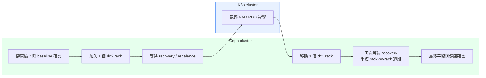

# OSD Migration Runbook

本頁為 OSD 資料平面遷移的實作手冊（runbook），專注於以 rack 為單位的 OSD 遷移作業流程與執行步驟。

- MON runbook（控制面）參考： [MON Runbook](../detail_runbook/)
- 遷移策略與分析： [Solutions Overview](../solutions/)
- 主文件（場景與架構概述）： [主文件](../)

## High-Level Flow



---

## Migration Principles

### 核心原則

1. **單一 Cluster 擴展模式**
   - 將 dc2 節點加入現有 cluster（而非建立第二 cluster）
   - 等待 CRUSH rebalance 完成資料搬遷
   - 最後移除 dc1 節點

2. **Rack-by-Rack 執行節奏**
   - 以 rack 為操作單位（每個 rack 包含 5 台 OSD 節點、50 個 OSDs）
   - 交替執行「加入 dc2 rack」→「等待 recovery」→「移除 dc1 rack」→「等待 recovery」
   - 總共 6 次操作週期（3 次加入 + 3 次移除）

3. **CRUSH 設計考量**
   - **不分離 datacenter bucket**：CRUSH 模型保持單一邏輯 dc
   - **Failure domain 維持 rack 級別**   
   - Rack 命名不重複（dc1: o1/o2/o3, dc2: o4/o5/o6），避免混淆新舊節點

4. **最小化業務影響**
   - 每次 recovery 週期長度適中（數小時至一天），問題容易定位
   - Cluster 規模最多增加 33%（從 15 台增至 20 台），硬體資源壓力溫和
   - 每個階段都有明確的 gate criteria，確保可安全進入下一階段

---

## KubeVirt / RBD Notes

### 現有 RBD Pool 配置

- **Pool 用途**：服務 KubeVirt 虛擬機的持久化儲存
- **Replication**：假設為 `size=3, min_size=1`（3 份副本，最少 1 份可用）
- **PG 數量**：依據 pool 大小與 OSD 數量計算（應符合 Ceph best practice）

### KubeVirt VM 影響評估

**遷移期間 VM 行為**：

1. **I/O 延遲可能增加**
   - Recovery 過程中，部分 PG 處於 `degraded` 或 `misplaced` 狀態
   - VM 的 block device I/O 會經歷額外的網路跳轉與 backfill traffic
   - **建議**：監控 VM 應用層面的延遲指標，必要時調整 recovery throttling

2. **資料可用性保證**
   - `min_size=1` 表示即使 3 個副本僅剩 1 個，cluster 仍繼續提供 I/O
   - 在 recovery 過程中，VM 不會遭遇 I/O 中斷（只要至少 1 個副本可存取）
   - **注意**：此設定下資料容錯能力有限，單次故障可能導致資料不可復原
   - CRUSH 保證每個 PG 的 replica 分布於不同 racks（failure domain），最大化容錯

3. **VM 遷移考量**
   - **無需遷移 VM**：Ceph RBD 遷移對 VM 透明，VM 持續運行於原 KubeVirt 節點
   - **可選操作**：若 VM 負載敏感，可於 cutover 前手動 live migrate 至低負載節點

### 監控重點

- **Ceph 層面**：
  - `ceph -s`：確認 health 狀態、PG 狀態分布
  - `ceph osd pool stats <pool>`：監控 recovery 進度與 I/O 統計
  - `ceph osd df tree`：檢查 OSD 使用率是否平衡

- **KubeVirt / VM 層面**：
  - VM guest OS 的 disk I/O latency（如透過 `iostat` 或應用監控）
  - KubeVirt virt-launcher pod 的 resource usage
  - 若有應用層 SLA，確認 latency 與 throughput 仍在可接受範圍

---

## Detailed Phase Runbook (OSD migration)

本節詳述 Rack-by-Rack OSD 遷移的完整執行步驟（含 Phase 0 至 Phase 6）。

### Phase 0: Pre-Migration Preparation

**目標**：確保 cluster 健康、備份關鍵配置、建立監控基線

#### 前置檢查清單

1. **Cluster Health Check**
   ```bash
   ceph -s
   # 必須為 HEALTH_OK，無 degraded/misplaced PGs
   
   ceph osd tree
   # 確認現有 dc1 的 rack 結構（o1, o2, o3）
   
   ceph osd df tree
   # 記錄 OSD 使用率基線
   ```

2. **Backup CRUSH Map**
   ```bash
   ceph osd getcrushmap -o /backup/crushmap.$(date +%Y%m%d).bin
   crushtool -d /backup/crushmap.$(date +%Y%m%d).bin -o /backup/crushmap.$(date +%Y%m%d).txt
   ```

3. **Verify MON Quorum**
   ```bash
   ceph mon stat
   # 確認 3 個 MON 都在 quorum 中
   ```

4. **Record Baseline Metrics**
   - 記錄當前 cluster 的 IOPS、throughput、latency 基線
   - 記錄 VM 應用層的效能基線（若有監控）

5. **Network Connectivity Test**
   ```bash
   # 從 dc1 節點測試到 dc2 節點的連通性
   ping -c 10 <dc2-node-ip>
   iperf3 -c <dc2-node-ip> -t 30
   # 確認 latency < 5ms，bandwidth 符合預期
   ```

#### Gate Criteria (進入 Phase 1 前)

- ✅ Cluster health = `HEALTH_OK`
- ✅ 所有 PGs 為 `active+clean`
- ✅ CRUSH map 已備份
- ✅ dc1 ↔ dc2 網路連通性驗證完成
- ✅ 監控系統已就緒，可追蹤 recovery 進度

---

### Phase 1: Add dc2 Rack o4 (First Batch)

**目標**：加入 dc2 第一個 rack（o4）的 5 台 OSD 節點

#### 執行步驟

1. **Add OSD Nodes to Cluster**
   ```bash
   # 使用 cephadm 加入 dc2 rack o4 的 5 台節點
   # dc2 節點位置資訊固定為 datacenter=dc2, room=r2
   # 假設節點名稱為 osd-dc2-o4-{01..05}

   for node in osd-dc2-o4-{01..05}; do
     ceph orch host add $node --labels osd --location datacenter=dc2 room=r2 rack=o4
   done

   # 驗證節點已加入
   ceph orch host ls | grep o4
   ```

   - dc2 範例使用 `datacenter=dc2 room=r2`（上方加入指令已示範）
   - dc1 節點的對應位置可視為 `datacenter=dc1 room=r1`（作為拓樸對照參考）
   - `datacenter` 與 `room` 用來補充拓樸資訊
   - failure domain 仍然是 `rack`（CRUSH failure domain 保持在 rack，無需變更設計）

2. **Deploy OSDs**
   ```bash
   # 手動指定每台節點的 disks
   # 範例：對每個節點的 10 顆 disk 執行
   ceph orch daemon add osd osd-dc2-o4-01:/dev/sdb
   ceph orch daemon add osd osd-dc2-o4-01:/dev/sdc
   # ... 重複直到所有 disks
    
   # 對其他 4 台節點重複相同操作
   ceph orch daemon add osd osd-dc2-o4-02:/dev/sdb
   ceph orch daemon add osd osd-dc2-o4-02:/dev/sdc
   # ... 以此類推
   ```

3. **Verify OSD Creation**
   ```bash
   ceph osd tree | grep o4
   # 確認 50 個新 OSDs 已 up 且 in
   
   ceph osd df tree | grep o4
   # 檢查新 OSDs 的狀態與初始 weight
   ```

4. **Monitor Recovery Progress**
   ```bash
   watch -n 5 'ceph -s'
   # 觀察 PGs 進入 remapped/backfilling 狀態
   
   ceph osd pool stats
   # 檢查 recovery rate 與 backfill throughput
   ```

#### Recovery Throttling (Optional)

若 recovery 對線上業務影響過大，可調整 throttling 參數：

```bash
# 降低 recovery 優先級
ceph tell osd.* config set osd_recovery_max_active 1
ceph tell osd.* config set osd_max_backfills 1

# 限制 recovery bandwidth
ceph tell osd.* config set osd_recovery_sleep_hdd 0.1
```

#### Gate Criteria (進入 Phase 2 前)

- ✅ 50 個新 OSDs (rack o4) 已 `up` 且 `in`
- ✅ Cluster health = `HEALTH_OK`，所有 PGs 恢復為 `active+clean`
- ✅ Recovery 完成（`ceph -s` 顯示 0 個 degraded/misplaced PGs）
- ✅ OSD 使用率已重新平衡（無單一 OSD 超載）
- ✅ VM I/O latency 恢復正常（若先前有異常）

**預估時間**：數小時至一天（視資料量與網路頻寬而定）

---

### Phase 2: Remove dc1 Rack o1 (First Batch)

**目標**：移除 dc1 第一個 rack（o1）的 5 台 OSD 節點

#### 執行步驟

1. **Mark OSDs Out**
   ```bash
   # 取得 rack o1 的所有 OSD IDs
   ceph osd crush ls o1 | sed 's/osd\.//' > /tmp/o1-osds.txt
   
   # 逐一標記 out（觸發 data migration）
   for osd_id in $(cat /tmp/o1-osds.txt); do
     ceph osd out osd.$osd_id
   done
   
   # 驗證
   ceph osd tree | grep o1
   # 應看到對應 OSDs 顯示 out
   ```

2. **Wait for Data Migration**
   ```bash
   watch -n 5 'ceph -s'
   # 等待所有 PGs 再次恢復為 active+clean
   # 使用更可靠的檢查：當 ceph -s 不包含 recovering/backfilling/degraded/misplaced 時視為完成
   while ceph -s | grep -Eq 'recovering|backfilling|degraded|misplaced'; do
     echo "Recovery in progress or PGs not clean:"
     ceph -s
     sleep 30
   done
   echo "PASS: All PGs active+clean and no recovery activity"
   ```

3. **Stop OSD Daemons**
   ```bash
   for osd_id in $(cat /tmp/o1-osds.txt); do
     ceph orch daemon stop osd.$osd_id
   done
   ```

4. **Purge OSDs from CRUSH**
   ```bash
   for osd_id in $(cat /tmp/o1-osds.txt); do
     ceph osd purge osd.$osd_id --yes-i-really-mean-it
   done
   
   # 驗證
   ceph osd tree | grep o1
   # 應不再顯示 rack o1 的 OSDs
   ```

5. **Remove Hosts from Cluster**
   ```bash
   for node in osd-dc1-o1-{01..05}; do
     ceph orch host rm $node --force
   done
   ```

#### Gate Criteria (進入 Phase 3 前)

- ✅ Rack o1 的 50 個 OSDs 已從 CRUSH map 移除
- ✅ Cluster health = `HEALTH_OK`，所有 PGs 恢復為 `active+clean`
- ✅ OSD 使用率已重新平衡（剩餘 OSDs 無超載）
- ✅ 物理節點已從 orchestrator 移除

**預估時間**：數小時至一天

---

### Phase 3–6: Repeat for remaining racks

Phase 3 (Add dc2 rack o5), Phase 4 (Remove dc1 rack o2), Phase 5 (Add dc2 rack o6), Phase 6 (Remove dc1 rack o3) follow the same patterns as Phase 1 and Phase 2. 在每一階段均應遵守相同的 Gate Criteria、監控流程與 Recovery Throttling 建議以保持 cluster 健康。

#### Final Validation (after Phase 6)

- ✅ 所有 dc1 racks (o1, o2, o3) 已完全移除
- ✅ 僅剩 dc2 racks (o4, o5, o6) 的 150 個 OSDs
- ✅ Cluster health = `HEALTH_OK`
- ✅ OSD 使用率平衡（無單一 OSD 超過 80%）

---

## Cutover Gates (OSD-focused)

每個 Phase 必須滿足以下條件才能進入下一階段（OSD migration 專用 gates）：

### Recovery Completion Gate

```bash
# 檢查 PG 狀態
ceph pg stat | grep -q 'active+clean' && echo "PASS: All PGs active+clean" || echo "FAIL"

# 檢查無 degraded PGs
ceph -s | grep -q 'degraded\|misplaced' && echo "FAIL: Degraded PGs exist" || echo "PASS"

# 檢查 recovery 完成
ceph -s | grep -q 'recovering\|backfilling' && echo "FAIL: Recovery in progress" || echo "PASS"
```

### Cluster Health Gate

```bash
# 必須為 HEALTH_OK 或 HEALTH_WARN（僅接受已知的非關鍵 warning）
ceph health detail
```

### OSD Balance Gate

```bash
# 檢查 OSD 使用率標準差（應 < 10%）
ceph osd df tree | awk '/osd\./ {print $7}' | \
  awk '{sum+=$1; sumsq+=$1*$1} END {print sqrt(sumsq/NR - (sum/NR)^2)}'
# 若標準差 > 10，考慮手動 reweight 或等待進一步 rebalance
```

---

## Rollback Rules (OSD)

### 何時需要 Rollback

1. **Recovery 失敗**：
   - PG 持續處於 `degraded` 超過預期時間（如 > 24 小時）
   - 出現大量 `incomplete` 或 `stale` PGs

2. **硬體故障**：
   - 新加入的 dc2 節點出現硬體問題（disk failure, network issue）
   - 無法在短時間內修復

3. **效能劣化**：
   - VM I/O latency 超過 SLA（如 p99 > 100ms）

4. **網路問題**：
   - dc1 ↔ dc2 網路中斷或延遲飆升

### Rollback 步驟

#### Case 1: 剛加入 dc2 rack，尚未移除 dc1 rack

**操作**：將新加入的 dc2 rack OSDs 標記 out 並移除

```bash
# 假設在 Phase 1，剛加入 rack o4
# 取得 rack o4 的所有 OSD IDs
ceph osd crush ls o4 | sed 's/osd\.//' > /tmp/o4-osds.txt

# 標記 out
for osd_id in $(cat /tmp/o4-osds.txt); do
  ceph osd out osd.$osd_id
done

# 等待資料搬回 dc1 racks
watch -n 5 'ceph -s'

# 移除 OSDs
for osd_id in $(cat /tmp/o4-osds.txt); do
  ceph osd purge osd.$osd_id --yes-i-really-mean-it
done

# 移除 hosts
for node in osd-dc2-o4-{01..05}; do
  ceph orch host rm $node --force
done
```

**結果**：恢復為原始的 dc1-only cluster 狀態

---

#### Case 2: 已移除部分 dc1 rack，需 rollback

**限制**：若已移除 dc1 rack o1，則無法完全 rollback（因資料已搬離且節點已移除）

**緩解措施**：
- 若 dc1 rack o1 的節點與 disks 仍可存取，可嘗試重新加入：
  ```bash
  # 重新加入 dc1 rack o1 節點
  for node in osd-dc1-o1-{01..05}; do
    ceph orch host add $node --labels osd --location rack=o1
  done
   
  # 手動重新加入 OSDs（需 disks 資料仍存在）
  ceph orch daemon add osd osd-dc1-o1-01:/dev/sdb
  ceph orch daemon add osd osd-dc1-o1-01:/dev/sdc
  # ... 重複所有 disks
  ```

- 若節點已無法恢復，則：
  - **保持當前狀態**（dc2 部分 racks + dc1 部分 racks 混合模式）
  - 等待 cluster health 穩定後，評估繼續遷移或維持混合模式

**建議**：Rollback 的最佳時機是在**每個 Phase 的 gate criteria 檢查點之前**。一旦跨越 gate 進入下一 Phase，rollback 難度與風險顯著增加。

---

## Recovery Throttling (commands)

```bash
# 降低 recovery 優先級（減少對線上業務影響）
ceph tell osd.* config set osd_recovery_max_active 1
ceph tell osd.* config set osd_max_backfills 1
ceph tell osd.* config set osd_recovery_sleep_hdd 0.1

# 恢復預設值（加速 recovery）
ceph tell osd.* config set osd_recovery_max_active 3
ceph tell osd.* config set osd_max_backfills 1
ceph tell osd.* config set osd_recovery_sleep_hdd 0
```

---

## 相關連結

- **[← 回到主文件](../)**
- **[← 遷移策略分析](../solutions/)**
- **[← MON runbook（控制面）](../detail_runbook/)**

---
