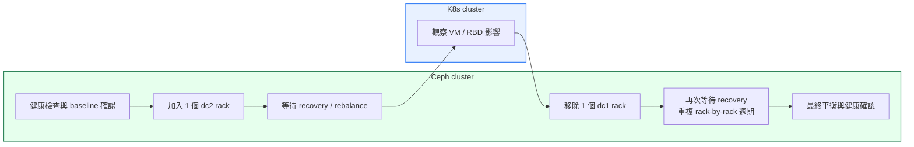

# OSD Migration Runbook

本頁為 OSD 資料平面遷移的實作手冊（runbook），專注於以 rack 為單位的 OSD 遷移作業流程與執行步驟。

- MON runbook（控制面）參考： [MON Runbook](../mon-migration/)
- 遷移策略與分析： [Solutions Overview](../solutions/)
- 主文件（場景與架構概述）： [主文件](../)

## High-Level Flow

---

## Migration Principles

### 核心原則

1. **單一 Cluster 擴展模式**
   - 將 dc2 節點加入現有 cluster（而非建立第二 cluster）
   - 等待 CRUSH rebalance 完成資料搬遷
   - 最後移除 dc1 節點

2. **Rack-by-Rack 執行節奏**
   - 以 rack 為操作單位（每個 rack 包含 5 台 OSD 節點、50 個 OSDs）
   - 交替執行「加入 dc2 rack」→「等待 recovery」→「移除 dc1 rack」→「等待 recovery」
   - 總共 6 次操作週期（3 次加入 + 3 次移除）

3. **CRUSH 設計考量**
   - **不分離 datacenter bucket**：CRUSH 模型保持單一邏輯 dc
   - **Failure domain 維持 rack 級別**   
   - Rack 命名不重複（dc1: o1/o2/o3, dc2: o4/o5/o6），避免混淆新舊節點

4. **最小化業務影響**
   - 每次 recovery 週期長度適中（數小時至一天），問題容易定位
   - Cluster 規模最多增加 33%（從 15 台增至 20 台），硬體資源壓力溫和
   - 每個階段都有明確的 gate criteria，確保可安全進入下一階段

---

## KubeVirt / RBD Notes

### 現有 RBD Pool 配置

- **Pool 用途**：服務 KubeVirt 虛擬機的持久化儲存
- **Replication**：假設為 `size=3, min_size=1`（3 份副本，最少 1 份可用）
- **PG 數量**：依據 pool 大小與 OSD 數量計算（應符合 Ceph best practice）

### KubeVirt VM 影響評估

**遷移期間 VM 行為**：

1. **I/O 延遲可能增加**
   - Recovery 過程中，部分 PG 處於 `degraded` 或 `misplaced` 狀態
   - VM 的 block device I/O 會經歷額外的網路跳轉與 backfill traffic
   - **建議**：監控 VM 應用層面的延遲指標，必要時調整 recovery throttling

2. **資料可用性保證**
   - `min_size=1` 表示即使 3 個副本僅剩 1 個，cluster 仍繼續提供 I/O
   - 在 recovery 過程中，VM 不會遭遇 I/O 中斷（只要至少 1 個副本可存取）
   - **注意**：此設定下資料容錯能力有限，單次故障可能導致資料不可復原
   - CRUSH 保證每個 PG 的 replica 分布於不同 racks（failure domain），最大化容錯

3. **VM 遷移考量**
   - **無需遷移 VM**：Ceph RBD 遷移對 VM 透明，VM 持續運行於原 KubeVirt 節點
   - **可選操作**：若 VM 負載敏感，可於 cutover 前手動 live migrate 至低負載節點

### 監控重點

- **Ceph 層面**：
  - `ceph -s`：確認 health 狀態、PG 狀態分布
  - `ceph osd pool stats <pool>`：監控 recovery 進度與 I/O 統計
  - `ceph osd df tree`：檢查 OSD 使用率是否平衡

- **KubeVirt / VM 層面**：
  - VM guest OS 的 disk I/O latency（如透過 `iostat` 或應用監控）
  - KubeVirt virt-launcher pod 的 resource usage
  - 若有應用層 SLA，確認 latency 與 throughput 仍在可接受範圍

---

## Detailed Phase Runbook (OSD migration)

本節詳述 Rack-by-Rack OSD 遷移的完整執行步驟（含 Phase 0 至 Phase 6）。

### Phase 0: Pre-Migration Preparation

**目標**：確保 cluster 健康、備份關鍵配置、建立監控基線

| Precheck （檢查項目 / 使用指令 / 原因） | Action （節點 / 指令） | Postcheck （預期結果 / Rollback 方式） |
|---|---|---|
| **遷移前 cluster 必須 HEALTH_OK** 確認無 degraded/misplaced PGs，記錄 dc1 rack 結構與 OSD 使用率基線 | Ceph admin 節點 `ceph -s` `ceph osd tree` `ceph osd df tree` | ✅ HEALTH_OK，所有 PGs active+clean ❌ 停止遷移，先修復 cluster health |
| **備份 CRUSH Map** 保留還原點，遷移失敗時可快速 rollback | Ceph admin 節點 `export BACKUP_DATE=$(date +%Y%m%d)` `ceph osd getcrushmap -o /backup/crushmap.${BACKUP_DATE}.bin` `crushtool -d /backup/crushmap.${BACKUP_DATE}.bin -o /backup/crushmap.${BACKUP_DATE}.txt` | ✅ 備份檔案存在且可讀 ❌ 重新備份，勿繼續 |
| **確認 MON Quorum 健康** OSD 遷移期間 MON 必須穩定 | Ceph admin 節點 `ceph mon stat` | ✅ 3 個 MON 均在 quorum 中 ❌ 先執行 MON runbook 修復 quorum |
| **dc1 ↔ dc2 網路連通性驗證** 確認跨 DC 網路 latency / bandwidth 符合需求，避免 recovery 過慢 | Ceph admin 節點 `ping -c 10 <dc2-node-ip>` `iperf3 -c <dc2-node-ip> -t 30` | ✅ latency < 5ms，bandwidth 符合預期 ❌ 先解決網路問題再繼續 |

---

### Phase 1: Add dc2 Rack o4 (First Batch)

**目標**：加入 dc2 第一個 rack（o4）的 5 台 OSD 節點（共 50 個 OSDs）

| Precheck （檢查項目 / 使用指令 / 原因） | Action （節點 / 指令） | Postcheck （預期結果 / Rollback 方式） |
|---|---|---|
| **Phase 0 gate 通過，cluster HEALTH_OK** 確認 dc2 o4 節點 SSH 可達且 cephadm 已安裝 | Ceph admin 節點 `for node in osd-dc2-o4-{01..05}; do` `  ceph orch host add $node --labels osd --location datacenter=dc2 room=r2 rack=o4` `done` `ceph orch host ls \| grep o4` | ✅ 5 台節點出現在 host 清單，location metadata 正確 ❌ 檢查 SSH 連線與 cephadm 安裝狀態 |
| **5 台節點已在 host 清單中** 確認節點就緒後再 deploy OSDs | Ceph admin 節點 `ceph orch daemon add osd osd-dc2-o4-01:/dev/sdb` `ceph orch daemon add osd osd-dc2-o4-01:/dev/sdc` `# 重複每台節點的所有 disks（每節點 10 顆）` | ✅ `ceph osd tree \| grep o4` 顯示 50 個 OSD up+in ❌ `ceph orch ps --hostname osd-dc2-o4-XX` 檢查 daemon 狀態 |
| **50 個 OSDs up+in 已確認** 等待 CRUSH rebalance 完成，確認資料已均衡分布 | Ceph admin 節點 `watch -n 5 'ceph -s'` `ceph osd pool stats` （建議）Client I/O 優先（mClock）： `ceph config set osd osd_mclock_profile high_client_ops` `ceph config rm osd osd_recovery_max_active` `ceph config rm osd osd_max_backfills` | ✅ 所有 PGs active+clean，0 degraded/misplaced ✅ VM I/O latency 正常 ✅ `ceph config get osd osd_mclock_profile` = `high_client_ops` ❌ 若 recovery > 24h：檢查 OSD 狀態與網路 |

**預估時間**：數小時至一天（視資料量與網路頻寬而定）

---

### Phase 2: Remove dc1 Rack o1 (First Batch)

**目標**：移除 dc1 第一個 rack（o1）的 5 台 OSD 節點

**策略**：依 Ceph 官方建議，先 `host drain` 排空主機上所有 daemons，再觀察 OSD removal 狀態，最後移除主機

| Precheck （檢查項目 / 使用指令 / 原因） | Action （節點 / 指令） | Postcheck （預期結果 / Rollback 方式） |
|---|---|---|
| **Phase 1 gate 通過（PGs active+clean）** 確認 dc2 o4 rack 資料已穩定，再開始排空 dc1 o1 | Ceph admin 節點 **步驟一：drain 整個 OSD host** `for node in osd-dc1-o1-{01..05}; do` `  ceph orch host drain $node --zap-osd-devices` `done` | ✅ `ceph orch host drain` 已把 host 加上 `_no_schedule` ✅ OSD removal 已進入排程 ❌ 若 drain 失敗：先 `ceph orch ps <host>` 檢查殘留 daemon |
| **Host 已進入 drain 狀態** 等待 host 上所有 OSD / daemon 完成移除，確認 PGs 回填完成 | Ceph admin 節點 **步驟二：監看 OSD removal 與 host daemon 清空** `ceph orch osd rm status` `ceph orch ps osd-dc1-o1-01` `while ceph -s \| grep -Eq 'recovering\|backfilling\|degraded\|misplaced'; do` `  echo "Recovery in progress..."; ceph -s; sleep 30` `done` | ✅ `ceph orch osd rm status` 顯示 done / waiting for purge 或 empty ✅ `ceph orch ps <host>` 無殘留 daemon ❌ 若回填過慢：可檢查 throttling 與網路 |
| **PGs active+clean，host 上已無 daemon** 安全移除主機與 CRUSH bucket | Ceph admin 節點 **步驟三：移除主機** `for node in osd-dc1-o1-{01..05}; do` `  ceph orch host rm $node --rm-crush-entry` `done` | ✅ `ceph orch host ls` 中 o1 節點已消失 ✅ `ceph -s` HEALTH_OK，PGs active+clean ❌ 若 host rm 失敗：先確認是否仍有 daemon / OSD 未清除 |

**預估時間**：數小時至一天

---

### Phase 3–6: Repeat for Remaining Racks

| Phase | 動作 | 模式 |
|-------|------|------|
| Phase 3 | Add dc2 rack o5 | 同 Phase 1 |
| Phase 4 | Remove dc1 rack o2 | 同 Phase 2 |
| Phase 5 | Add dc2 rack o6 | 同 Phase 1 |
| Phase 6 | Remove dc1 rack o3 | 同 Phase 2 |

每個 Phase 均遵守相同的 Gate Criteria、監控流程與 mClock（high_client_ops）建議。

#### Final Validation（after Phase 6）

| Precheck （檢查項目 / 使用指令 / 原因） | Action （節點 / 指令） | Postcheck （預期結果 / Rollback 方式） |
|---|---|---|
| **所有 dc1 racks 已移除，dc2 racks 存在** 最終確認遷移完整性 | Ceph admin 節點 `ceph osd tree` `ceph osd df tree` `ceph -s` | ✅ 僅剩 dc2 racks (o4, o5, o6) 的 150 個 OSDs ✅ HEALTH_OK，所有 PGs active+clean ✅ OSD 使用率平衡（無單一 OSD 超過 80%） |

---

## 相關連結

- **[← 回到主文件](../)**
- **[← 遷移策略分析](../solutions/)**
- **[← MON runbook（控制面）](../mon-migration/)**

---
