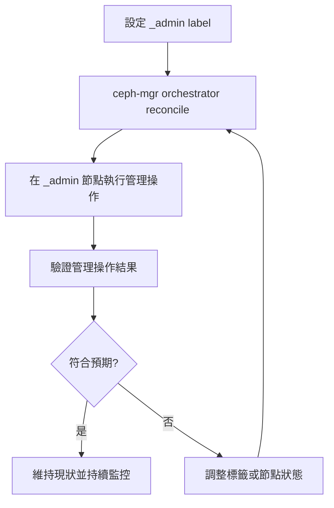

# Ceph `_admin` Label

## 架構觀點：`_admin` 的意義

`_admin` 是 Ceph orchestrator 的主機標籤，用來標記「可安全執行管理指令」的節點。被標記的節點通常會持有管理所需的 `ceph.conf` 與 `client.admin` keyring，方便執行 `ceph` / `cephadm shell` 類操作。

它**不會**改變資料平面（data path）上的 I/O 路徑，也不會直接影響 PG 映射或 OSD 讀寫流量；其作用範圍主要是管理平面（control/management plane）。

## `_admin` 與設定檔案及金鑰的完整範圍

當節點被標記為 `_admin` 後，cephadm 會在該節點上自動部署與維護多個重要檔案與設定。以下詳述完整的範圍：

### 配置檔案 (`/etc/ceph/ceph.conf`)
- **作用**：定義 Ceph 集群的全局設定（monitor 地址、日誌等級、網路參數等）
- **與 `_admin` 的關係**：
  - `_admin` 標籤標記的節點會由 `cephadm` 自動維護一份最新的 `ceph.conf`
  - 執行 `ceph` / `cephadm shell` 等管理命令時，工具會讀取此檔案以連接到 monitor 節點
  - 當集群配置變更時，此檔案會由 orchestrator 自動同步

### 管理員金鑰 (`ceph.client.admin.keyring`)
- **作用**：包含 `client.admin` 身份的認證憑證，擁有完全的集群管理權限
- **與 `_admin` 的關係**：
  - `_admin` 標籤標記的節點會由 `cephadm` 自動部署並維護此金鑰檔案
  - 只有持有此金鑰的節點，才能執行 `ceph config set`、`ceph osd rm` 等需要 `admin` 權限的操作
  - `cephadm shell` 進入容器時，會使用此金鑰進行身份驗證

### SSH 公鑰 (`/etc/ceph/ceph.pub`)
- **作用**：Ceph 集群用於跨節點 SSH 通訊的公鑰
- **與 `_admin` 的關係**：
  - `_admin` 標籤標記的節點會持有此公鑰副本
  - 此公鑰需要被加入到所有其他節點的 `~/.ssh/authorized_keys` 中，才能讓 cephadm 進行無密碼 SSH 管理
  - 確保 orchestrator 可從 `_admin` 節點安全地操控其他節點的 daemon

### 範圍說明：什麼不受 `_admin` 影響
- **日誌設定** (`log_file`, `debug` 等) — 由各 daemon 的 spec 控制，不受 `_admin` 影響
- **MON/OSD 角色** — 由其他標籤或 service spec 定義
- **審計設定** — 由集群全局配置控制
- **其他客戶端金鑰** (`ceph.client.read-only.keyring` 等) — 通常不會被部署到 `_admin` 節點

### 完整關係與部署流程
```
_admin 標籤標記
     ↓
cephadm orchestrator reconcile
     ↓
cephadm 自動在該節點:
 ├─ 部署/維護 /etc/ceph/ceph.conf
 ├─ 部署/維護 /etc/ceph/ceph.client.admin.keyring
 ├─ 部署/維護 /etc/ceph/ceph.pub (SSH 公鑰)
 └─ 確保三個檔案保持最新同步
     ↓
使用者可在該節點執行管理命令
 ├─ ceph -s (讀 ceph.conf + 使用 client.admin keyring)
 ├─ ceph config set ... (需要 admin 權限)
 ├─ cephadm shell (載入金鑰與配置進容器)
 └─ 從該節點對其他主機進行 SSH 操作（透過 ceph.pub）
```

### Reconcile 流程中的檔案清理
- 當移除 `_admin` 標籤後，orchestrator 在下一個 reconcile 週期會：
  - 刪除 `/etc/ceph/ceph.conf`
  - 刪除 `/etc/ceph/ceph.client.admin.keyring`
  - 保留 `/etc/ceph/ceph.pub`（因為仍需要用於 SSH 連線）

## 架構觀點：ceph-mgr / orchestrator 互動

在 cephadm 架構下，ceph-mgr 的 orchestrator 模組會持續對照期望狀態與實際狀態。當主機標籤（含 `_admin`）異動後，orchestrator 會進入 reconcile 流程，重新評估哪些節點可承接管理操作，並同步後續的管理任務分派與檢查。

具體來說，當標籤異動時：
1. **新增 `_admin` 標籤**：
   - Orchestrator 掃描到新的 `_admin` 標籤
   - 自動部署 `/etc/ceph/ceph.conf`、`ceph.client.admin.keyring`、`ceph.pub` 到該節點
   - 後續的管理操作（如配置變更、OSD 操作等）會優先在 `_admin` 節點執行或發起

2. **移除 `_admin` 標籤**：
   - Orchestrator 掃描到標籤移除
   - 刪除 `/etc/ceph/ceph.conf` 和 `ceph.client.admin.keyring`
   - 保留 `ceph.pub`（仍需用於其他管理操作的 SSH 連線）
   - 該節點退出管理節點角色

## `_admin` 標籤流程圖



## 指令序列：檢查 labels

```bash
ceph orch host ls --format yaml
# 或僅看特定主機
ceph orch host ls --host-pattern <hostname> --format yaml
```

## 指令序列：新增 `_admin` label

```bash
ceph orch host label add <hostname> _admin
```

## 指令序列：驗證行為

```bash
# 1) 確認 label 已生效
ceph orch host ls --host-pattern <hostname> --format yaml

# 2) 從該節點驗證管理指令可執行
ceph -s
ceph health detail
```

## 指令序列：移除 `_admin`（rollback）

```bash
ceph orch host label rm <hostname> _admin

# rollback 後再次確認
ceph orch host ls --host-pattern <hostname> --format yaml
```

## 風險與最佳實務

- 避免將 `_admin` 只綁在單一節點；至少保留多個可管理節點，降低節點故障時的操作風險。
- 變更 label 前先確認目前維運流程是否依賴該節點（例如自動化腳本、SRE jump host 路徑）。
- 將 label 變更納入變更管理與審計紀錄，並先準備 rollback 指令。
- 調整 `_admin` 後，應立即驗證 `ceph -s` 與常用管理指令，確保管理面可用性。
