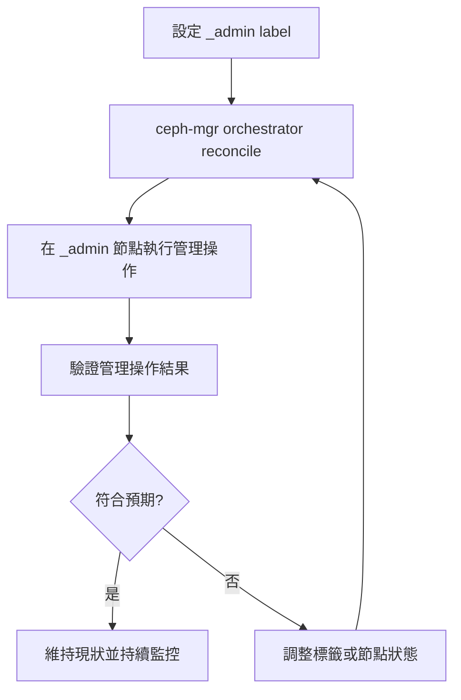

# Ceph `_admin` Label

## 架構觀點：`_admin` 的意義

`_admin` 是 Ceph orchestrator 的主機標籤，用來標記「可安全執行管理指令」的節點。被標記的節點通常會持有管理所需的 `ceph.conf` 與 `client.admin` keyring，方便執行 `ceph` / `cephadm shell` 類操作。

它**不會**改變資料平面（data path）上的 I/O 路徑，也不會直接影響 PG 映射或 OSD 讀寫流量；其作用範圍主要是管理平面（control/management plane）。

## 架構觀點：ceph-mgr / orchestrator 互動

在 cephadm 架構下，ceph-mgr 的 orchestrator 模組會持續對照期望狀態與實際狀態。當主機標籤（含 `_admin`）異動後，orchestrator 會進入 reconcile 流程，重新評估哪些節點可承接管理操作，並同步後續的管理任務分派與檢查。

## `_admin` 標籤流程圖



## 指令序列：檢查 labels

```bash
ceph orch host ls --format yaml
# 或僅看特定主機
ceph orch host ls --host-pattern <hostname> --format yaml
```

## 指令序列：新增 `_admin` label

```bash
ceph orch host label add <hostname> _admin
```

## 指令序列：驗證行為

```bash
# 1) 確認 label 已生效
ceph orch host ls --host-pattern <hostname> --format yaml

# 2) 從該節點驗證管理指令可執行
ceph -s
ceph health detail
```

## 指令序列：移除 `_admin`（rollback）

```bash
ceph orch host label rm <hostname> _admin

# rollback 後再次確認
ceph orch host ls --host-pattern <hostname> --format yaml
```

## 風險與最佳實務

- 避免將 `_admin` 只綁在單一節點；至少保留多個可管理節點，降低節點故障時的操作風險。
- 變更 label 前先確認目前維運流程是否依賴該節點（例如自動化腳本、SRE jump host 路徑）。
- 將 label 變更納入變更管理與審計紀錄，並先準備 rollback 指令。
- 調整 `_admin` 後，應立即驗證 `ceph -s` 與常用管理指令，確保管理面可用性。
